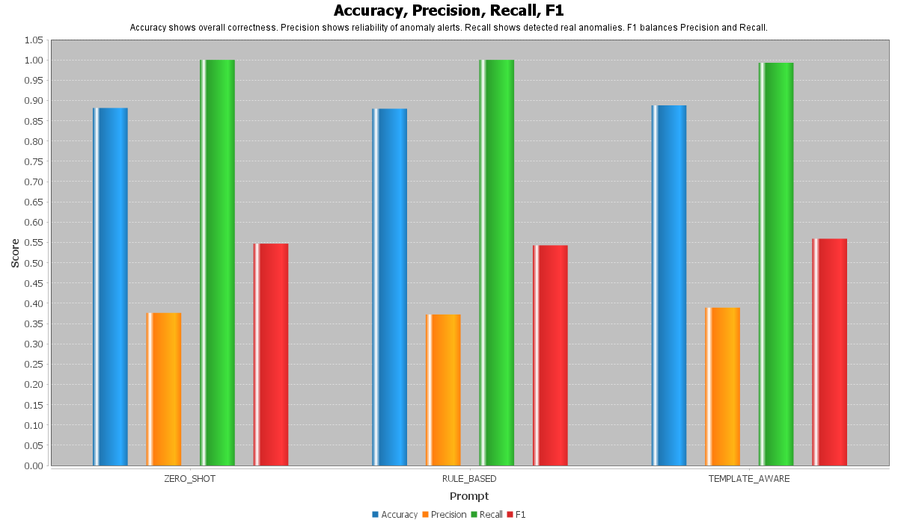
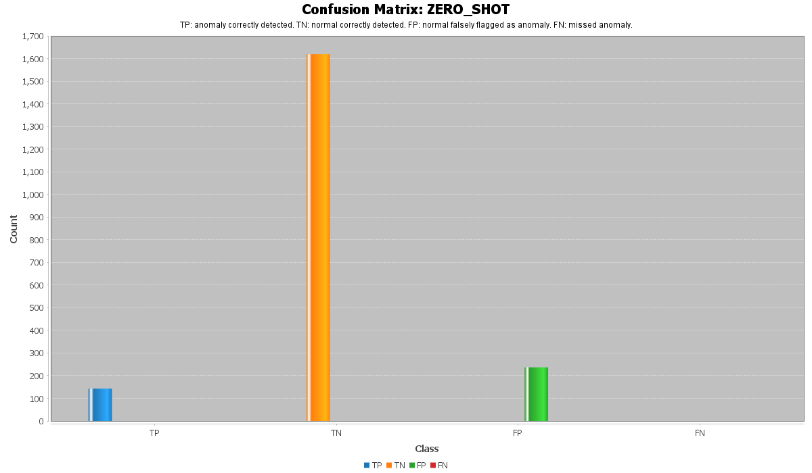
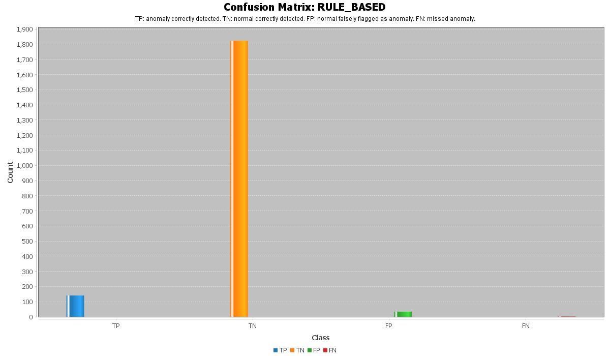
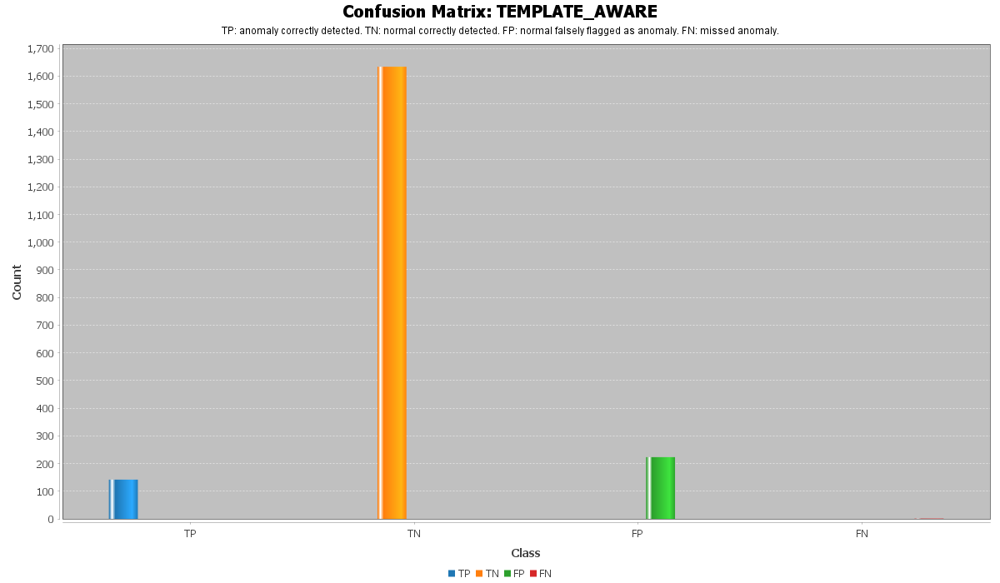
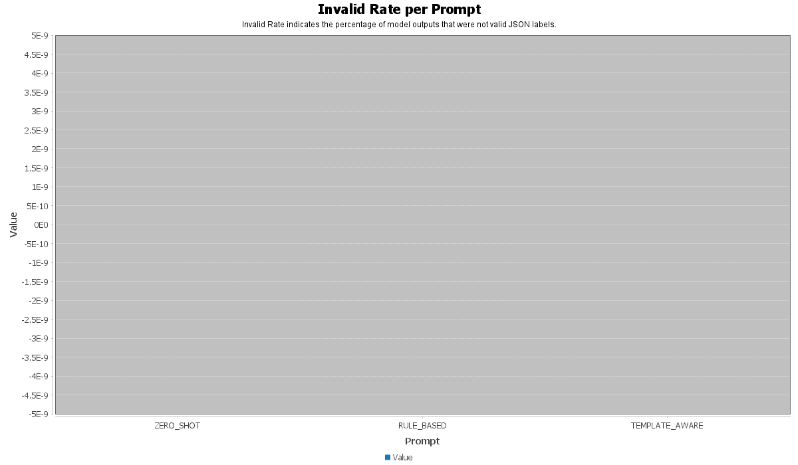
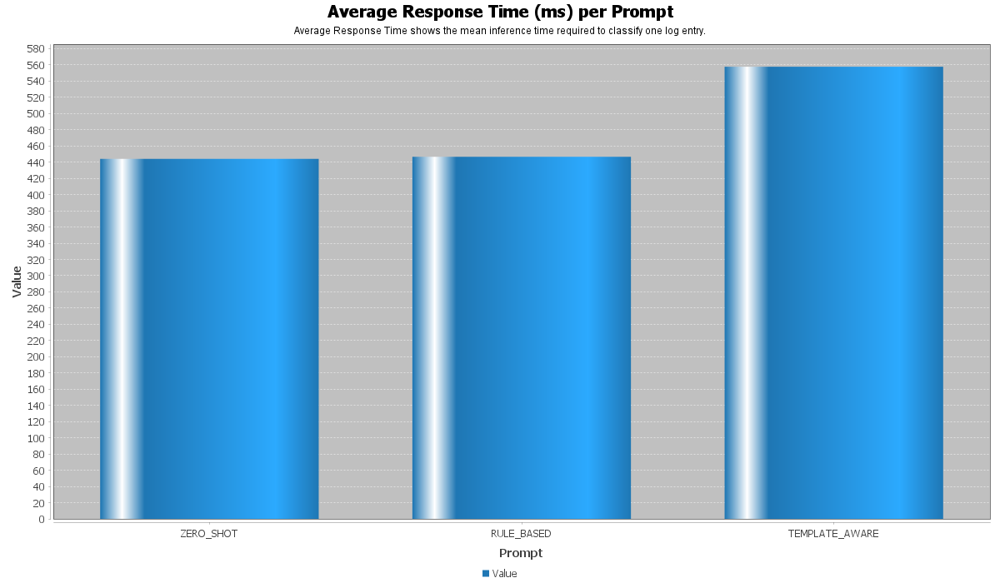

# LLMLogAnalyzer

**Improving Anomaly Detection in System Logs Based on Large Language Models Using Prompt Engineering**

LLMLogAnalyzer is a Java Spring Boot project developed as part of a Master's degree project.
The main goal of this project is to investigate how Large Language Models (LLMs) can be used for anomaly detection in system logs, especially when the model is guided with different prompt engineering strategies.

This project focuses on the **BGL (Blue Gene/L)** system log dataset and compares multiple prompting approaches for binary log classification:

* `0` = Normal log
* `1` = Anomalous log

The experiments in this repository were performed using the **Qwen2.5 7B** model through a local Ollama setup.

---

## Project Objective

Traditional log anomaly detection methods often rely on handcrafted rules, statistical features, or supervised machine learning models. However, large language models can understand the semantic meaning of log messages and may detect anomalies based on the actual system impact described in the log text.

The objective of this project is to evaluate whether prompt engineering can improve LLM-based anomaly detection in system logs.

The project compares three prompt strategies:

1. **Zero-Shot Prompt**
2. **Rule-Based Prompt**
3. **Template-Aware Prompt**

Each strategy gives the model a different level of domain knowledge about BGL logs.

---

## Dataset

This project uses the **BGL (Blue Gene/L)** log dataset.

BGL logs are generated by a Blue Gene/L supercomputer system and contain both normal and anomalous system events.
Each log entry is classified into one of two classes:

* **Normal**: the log does not indicate a critical system failure.
* **Anomaly**: the log indicates a real failure, crash, unrecoverable error, communication failure, or another serious system impact.

In this project, the model receives a raw log message and must return only one JSON label:

```json
{"label":"0"}
```

or

```json
{"label":"1"}
```

---

## Model Used

The experiments were performed using:

```text
Qwen2.5 7B
```

The model was run locally using Ollama.

Example configuration:

```properties
model.api.ollama.url=http://localhost:11434/api/chat
model.api.ollama.model-name=qwen2.5:7b
```

The model was configured to produce short and deterministic outputs so that the response could be parsed reliably as a JSON classification result.

---

## Prompt Engineering Strategies

### 1. Zero-Shot Prompt

The zero-shot prompt gives the model the classification task without using detailed BGL-specific templates.

The model is told to classify each log entry as normal or anomalous based only on the message content.
This approach tests the general reasoning ability of the LLM.

The zero-shot prompt includes general anomaly indicators such as:

* unrecoverable errors
* memory error interrupts
* storage interrupts
* kernel or runtime panic
* node crash
* hardware, power, thermal, or link failure
* job termination caused by system failure

It also tells the model that severity words such as `ERROR` or `FATAL` are not enough by themselves.

---

### 2. Rule-Based Prompt

The rule-based prompt gives the model a more structured decision process.

It defines a decision order:

1. Check for direct anomaly indicators.
2. Check for direct normal indicators.
3. Use a fallback rule based on real system impact.

This prompt is more restrictive than the zero-shot prompt and is designed to reduce false positives caused by misleading words such as `ERROR`, `FATAL`, or `INTERRUPT`.

For example, the prompt tells the model that some messages may look dangerous but are actually normal in the BGL dataset, such as:

* register dumps
* instruction address messages
* corrected errors
* missing file messages
* permission errors
* diagnostic output

This makes the model more conservative when classifying logs as anomalies.

---

### 3. Template-Aware Prompt

The template-aware prompt uses known BGL-style message patterns as domain knowledge.

This prompt is designed to simulate a more informed classifier that understands common BGL log templates.
It separates known anomaly-like patterns from known normal-like patterns.

Examples of anomaly patterns include:

* `data TLB error interrupt`
* `data storage interrupt`
* `failed to read message prefix on control stream`
* `uncorrected memory error`
* `kernel panic`
* `link failure`
* `node crash`

Examples of normal patterns include:

* instruction address dumps
* data address dumps
* machine state register messages
* corrected ECC or DDR errors
* missing file or permission errors without system failure
* diagnostic or configuration messages

This strategy gives the model the most domain-specific guidance among the three prompts.

---

## System Architecture

The project is implemented using **Spring Boot** and follows a modular structure.

```text
src/main/java/masoud/dabbaghi/llmloganalyzer
│
├── config
│   ├── ChartRunner.java
│   ├── OpenAIConfig.java
│   └── WebClientConfiguration.java
│
├── controller
│   └── BglController.java
│
├── dto
│   └── LogBglEntryDto.java
│
├── entity
│
├── evaluation
│   ├── ClassificationResult.java
│   ├── EvaluationMetrics.java
│   ├── EvaluationMetricsService.java
│   ├── LogEvaluation.java
│   ├── LogEvaluationRepository.java
│   └── LogEvaluationService.java
│
├── service
│   ├── BglParser.java
│   ├── CallModelAi.java
│   ├── ModelClassificationResponse.java
│   ├── PromptExperiment.java
│   ├── PromptGenerator.java
│   └── PromptSpec.java
│
└── visualization
    └── EvaluationChartService.java
```

---

## Main Components

### BglParser

Responsible for reading and parsing BGL log entries from the dataset file.

### PromptGenerator

Contains the different prompt templates used in the experiments:

* Zero-Shot Prompt
* Rule-Based Prompt
* Template-Aware Prompt

### CallModelAi

Sends the generated prompt and log entry to the local LLM API and receives the model response.

### EvaluationMetricsService

Calculates evaluation metrics such as:

* Accuracy
* Precision
* Recall
* F1-score
* True Positive
* True Negative
* False Positive
* False Negative
* Invalid response rate
* Average response time

### EvaluationChartService

Generates the result charts used for comparing the prompt strategies.

---

## Technologies Used

* Java 17
* Spring Boot
* Maven
* MongoDB
* Ollama
* Qwen2.5 7B
* JFreeChart
* Spring WebFlux
* Spring Data MongoDB

---

## How to Run

### 1. Clone the Repository

```bash
git clone https://github.com/masoudd2159/LLMLogAnalyzer.git
cd LLMLogAnalyzer
```

### 2. Install and Run Ollama

Install Ollama from the official website, then pull the Qwen2.5 7B model:

```bash
ollama pull qwen2.5:7b
```

Run Ollama locally:

```bash
ollama serve
```

### 3. Configure the Application

Edit:

```text
src/main/resources/application.properties
```

Example configuration:

```properties
spring.application.name=LLMLogAnalyzer
server.port=8081

spring.data.mongodb.host=127.0.0.1
spring.data.mongodb.port=27017
spring.data.mongodb.database=LLMLogAnalyzer

model.api.ollama.url=http://localhost:11434/api/chat
model.api.ollama.model-name=qwen2.5:7b

bgl.location=D:/Programming/Thesis/Dataset/BGL/BGL_2k.log
hdfs.location=D:/Programming/Thesis/Dataset/HDFS_v1/HDFS.log
```

Update the dataset paths based on your local machine.

### 4. Run MongoDB

Make sure MongoDB is running locally:

```bash
mongod
```

### 5. Run the Project

```bash
mvn spring-boot:run
```

---

## Evaluation Metrics

The project evaluates each prompt strategy using the following metrics:

| Metric        | Description                                                    |
| ------------- | -------------------------------------------------------------- |
| Accuracy      | Percentage of all correctly classified logs                    |
| Precision     | Percentage of predicted anomalies that were actually anomalies |
| Recall        | Percentage of real anomalies correctly detected                |
| F1-score      | Harmonic mean of precision and recall                          |
| TP            | Anomalies correctly detected                                   |
| TN            | Normal logs correctly detected                                 |
| FP            | Normal logs incorrectly classified as anomalies                |
| FN            | Anomalies missed by the model                                  |
| Invalid Rate  | Percentage of model outputs that were not valid JSON labels    |
| Response Time | Average inference time for one log entry                       |

---

# Experimental Results

The following charts show the experimental results of the three prompt engineering strategies used in this project:

* Zero-Shot Prompt
* Rule-Based Prompt
* Template-Aware Prompt

All experiments were performed using the **Qwen2.5 7B** model.

---

## 1. Metrics Comparison



This chart compares the main evaluation metrics for the three prompt strategies.

The compared metrics include:

* Accuracy
* Precision
* Recall
* F1-score

The purpose of this chart is to show how different prompt designs affect the final classification performance of the model.

The **Zero-Shot** prompt gives the model only general classification instructions. Because of this, the model can understand many log messages, but it may classify some normal logs as anomalies when they contain alarming words such as `ERROR`, `FATAL`, or `INTERRUPT`.

The **Rule-Based** prompt improves the classification process by giving the model explicit rules for deciding whether a log is normal or anomalous. This helps the model avoid simple keyword-based decisions.

The **Template-Aware** prompt gives the model additional domain knowledge about BGL log patterns. This helps the model better understand which log templates usually represent real anomalies and which ones are normal system messages.

Overall, this chart shows that prompt engineering has a direct effect on the quality of LLM-based log anomaly detection. More structured prompts can improve the model's reliability, especially by reducing incorrect anomaly predictions.

---

## 2. Confusion Matrix — Zero-Shot Prompt



This confusion matrix shows the classification results of the **Zero-Shot** prompt.

In this prompt strategy, the model receives only general instructions and does not receive detailed BGL-specific rules or templates.

The confusion matrix contains four values:

* **True Positive (TP):** anomalous logs correctly classified as anomalies
* **True Negative (TN):** normal logs correctly classified as normal
* **False Positive (FP):** normal logs incorrectly classified as anomalies
* **False Negative (FN):** anomalous logs incorrectly classified as normal

The Zero-Shot prompt is useful as a baseline because it shows the natural reasoning ability of the Qwen2.5 7B model without strong domain guidance.

However, this approach can produce more false positives. This happens because the model may rely too much on severe-looking words in the log message. For example, some BGL logs may contain technical terms such as `error`, `interrupt`, or `warning`, but they do not always indicate a real system failure.

Therefore, the Zero-Shot result shows that LLMs can understand log messages to some extent, but they need better prompt guidance for more reliable anomaly detection.

---

## 3. Confusion Matrix — Rule-Based Prompt



This confusion matrix shows the classification results of the **Rule-Based** prompt.

The Rule-Based prompt provides the model with a clear decision process. It explains which types of logs should be classified as anomalies and which types should be classified as normal.

This prompt focuses on real system impact instead of simple keyword matching.

For example, the model is instructed to classify a log as anomalous only when it clearly indicates serious problems such as:

* unrecoverable hardware failure
* uncorrected memory error
* communication failure
* node crash
* kernel panic
* job termination caused by system failure

At the same time, the model is told that some logs should remain normal, such as:

* corrected errors
* diagnostic messages
* register dumps
* missing file messages without system failure
* permission messages without critical impact

Compared to the Zero-Shot prompt, the Rule-Based prompt usually provides better control over the model's decision-making. It reduces false positives because the model becomes more conservative and does not classify a log as anomalous only because it contains dangerous-looking words.

This result shows that adding explicit classification rules to the prompt can improve LLM-based anomaly detection.

---

## 4. Confusion Matrix — Template-Aware Prompt



This confusion matrix shows the classification results of the **Template-Aware** prompt.

The Template-Aware prompt is the most domain-specific strategy in this project. It gives the model examples of BGL-style log templates and explains which patterns are usually related to anomalies and which patterns are usually normal.

This is important because system logs often contain repeated templates. Some templates may look dangerous but are normal in the dataset, while some other templates clearly indicate serious system failures.

The Template-Aware prompt helps the model recognize patterns such as:

* `data TLB error interrupt`
* `data storage interrupt`
* `uncorrected memory error`
* `kernel panic`
* `link failure`
* `node crash`

as stronger anomaly indicators.

It also helps the model avoid misclassifying normal BGL patterns such as:

* instruction address messages
* data address messages
* register dumps
* corrected ECC errors
* diagnostic messages
* configuration messages

The result shows that using template-level knowledge can make the model more stable and more suitable for log anomaly detection.

This prompt strategy is especially useful when the dataset has known recurring log patterns, because the model can make decisions based on both semantic meaning and domain-specific templates.

---

## 5. Invalid Response Rate



This chart shows the invalid response rate for each prompt strategy.

An invalid response means that the model did not return the expected output format.

The expected output format in this project is:

```json
{"label":"0"}
```

or:

```json
{"label":"1"}
```

This metric is important because the system automatically parses the model response. If the model returns extra text, explanations, or an incorrect JSON format, the response becomes invalid and cannot be used directly for evaluation.

The result shows that the prompts successfully controlled the model output format.

A low or zero invalid response rate means that the model responses are reliable for automatic processing. This is very important in real-world systems because the output of the LLM must be parsed without manual correction.

This result also shows that strict output instructions inside the prompt are effective for forcing the model to return a clean JSON classification result.

---

## 6. Average Response Time



This chart compares the average response time of the model for each prompt strategy.

Response time is an important metric because LLM-based classification can be slower than traditional machine learning methods.

The Zero-Shot prompt usually has the shortest response time because it contains fewer instructions and less context.

The Rule-Based prompt is longer than the Zero-Shot prompt, so the model needs to process more input tokens. This can slightly increase the response time.

The Template-Aware prompt is usually the longest prompt because it contains domain-specific BGL patterns and additional classification guidance. As a result, it may have the highest response time.

This chart shows an important trade-off:

* Shorter prompts are faster.
* More detailed prompts can improve classification quality.
* Template-aware prompts provide better domain knowledge but may increase inference time.

For real-world usage, this trade-off should be considered carefully. If speed is the main priority, a shorter prompt may be better. If accuracy and reducing false positives are more important, rule-based or template-aware prompts may be more suitable.

---

## Final Result Analysis

The experimental results show that prompt engineering can improve anomaly detection in system logs using Large Language Models.

The **Zero-Shot** prompt is useful as a baseline and shows that Qwen2.5 7B can classify many logs without training. However, it may produce more false positives because it does not have enough BGL-specific knowledge.

The **Rule-Based** prompt improves the result by giving the model clear decision rules. This makes the model more conservative and reduces incorrect anomaly predictions.

The **Template-Aware** prompt adds domain-specific knowledge about BGL log patterns. This helps the model understand recurring log templates and improves classification stability.

The invalid response rate result shows that the output format was successfully controlled using prompt design.

The response time result shows that better prompts may require more processing time. Therefore, there is a trade-off between performance and speed.

Overall, the results support the main idea of this project:
**Large Language Models can be used for log anomaly detection, and prompt engineering can significantly improve their reliability.**

## Overall Analysis

The experimental results show that prompt engineering can improve LLM-based anomaly detection in system logs.

The zero-shot prompt demonstrates that Qwen2.5 7B can understand many log messages without task-specific training. However, it is more likely to produce false positives because it does not have enough information about BGL-specific normal patterns.

The rule-based prompt improves the results by giving the model explicit decision rules.
This reduces false positives and makes the model more stable.

The template-aware prompt provides the most domain-specific information by including known BGL-style patterns.
Its performance is close to the rule-based strategy, showing that domain knowledge can help the model classify logs more reliably.

The invalid response rate is zero, which means the JSON output format was successfully controlled through prompt design.

The response time chart shows that more detailed prompts increase inference time. Therefore, there is a practical trade-off between prompt complexity and classification speed.

---

## Conclusion

This project demonstrates that Large Language Models can be used for system log anomaly detection without traditional model training.

The results show that prompt engineering has a significant effect on classification quality.
A simple zero-shot prompt can classify many logs correctly, but structured and domain-aware prompts provide better reliability.

The main conclusion is that LLM-based log anomaly detection becomes more effective when the prompt includes:

* clear output format instructions
* strict anomaly definitions
* normal log examples
* domain-specific log patterns
* rules that prevent classification based only on keywords

This makes prompt engineering an important technique for applying LLMs to log analysis and anomaly detection.

---

## Author

**Masoud Dabbaghi**

Master's Degree Project
Topic: Improving Anomaly Detection in System Logs Based on Large Language Models Using Prompt Engineering
