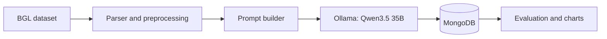
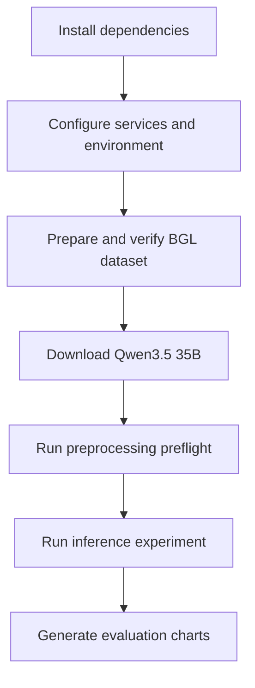

# LLMLogAnalyzer

LLMLogAnalyzer is a reproducible Spring Boot research pipeline for line-level anomaly detection on Blue Gene/L (BGL) supercomputer logs. The official model for this branch is **`qwen3.5:35b`**, executed locally with Ollama and without fine-tuning.

The research objective is to measure whether prompt engineering, semantic log-template normalization, deterministic guard rules, and validated template reuse can produce accurate and auditable binary anomaly predictions from a pretrained LLM. Ground-truth labels are removed before a record reaches the model. Line-level predictions, invalid outputs, timing, token use, configuration, model digest, dataset checksum, and evaluation metrics are retained for thesis analysis.

The BGL dataset is a labeled collection of Blue Gene/L HPC logs published through Loghub. A `-` label means normal; every other source label is treated as anomalous. The full Loghub release contains 4,747,963 lines and is approximately 709 MiB unpacked. See the [Loghub repository](https://github.com/logpai/loghub) and [archived dataset release](https://zenodo.org/records/8196385).


```mermaid
flowchart LR
    A[BGL dataset] --> B[Parser and preprocessing]
    B --> C[Prompt builder]
    C --> D[Ollama: Qwen3.5 35B]
    D --> E[(MongoDB)]
    E --> F[Evaluation and charts]
```

The model must return only:

```json
{
  "prediction": "normal|anomaly",
  "confidence": 0.0,
  "reason": "short explanation",
  "category": "hardware|software|network|storage|job|diagnostic|environment|unknown"
}
```

## 1. System Requirements

Supported and tested deployment target:

- Ubuntu 22.04 or 24.04 LTS, 64-bit; other modern Linux distributions can work with distribution-specific package commands.
- OpenJDK 17. The Maven Wrapper is included, so a separate Maven installation is unnecessary.
- Python 3, `pip`, and `venv` for the documented auxiliary environment; the inference application itself is Java.
- At least 32 GB system RAM; 48 GB or more is recommended for CPU inference and MongoDB together.
- At least 60 GB free storage: the Ollama model is about 24 GB, the dataset is about 0.7 GB unpacked, and MongoDB results can consume several additional gigabytes.
- Optional NVIDIA or AMD GPU. About 32 GB VRAM is recommended for full GPU residency; smaller GPUs can use partial CPU offload at lower throughput.

CPU-only execution is supported but a full BGL run with a 35B model can take a long time. Record the hardware metadata stored in `bgl_experiment_runs` when comparing runtimes.

## 2. Install System Dependencies

Run on a fresh Ubuntu installation:

```bash
sudo apt update
sudo apt install -y git openjdk-17-jdk python3 python3-pip python3-venv curl wget unzip gnupg ca-certificates

java -version
python3 --version
git --version
```

Java must report version 17 or newer. Builds target Java 17 bytecode.

## 3. MongoDB Installation

These commands install MongoDB Community 8.0 from MongoDB's official repository on Ubuntu 22.04 or 24.04. They follow the [official Ubuntu installation guide](https://www.mongodb.com/docs/v8.0/tutorial/install-mongodb-on-ubuntu/).

```bash
sudo apt install -y gnupg curl
curl -fsSL https://pgp.mongodb.com/server-8.0.asc | \
  sudo gpg -o /usr/share/keyrings/mongodb-server-8.0.gpg --dearmor

. /etc/os-release
echo "deb [ arch=amd64,arm64 signed-by=/usr/share/keyrings/mongodb-server-8.0.gpg ] https://repo.mongodb.org/apt/ubuntu ${VERSION_CODENAME}/mongodb-org/8.0 multiverse" | \
  sudo tee /etc/apt/sources.list.d/mongodb-org-8.0.list

sudo apt update
sudo apt install -y mongodb-org
sudo systemctl start mongod
sudo systemctl enable mongod
sudo systemctl status mongod --no-pager
mongosh --eval 'db.runCommand({ ping: 1 })'
```

The default connection is `mongodb://127.0.0.1:27017/LLMLogAnalyzer`. No manual schema creation is required. Spring Data creates indexes and MongoDB creates these collections on first write:

- `bgl_experiment_runs`: one document per run, including model/version, generation options, prompt/version, timestamps, dataset SHA-256, host data, counters, and duration.
- `log_evaluations`: one document per parsed input line, including ground truth, prediction, validation state, raw model output, token counts, response time, and `runId`.

## 4. Ollama Installation

Install Ollama using its [official Linux installer](https://docs.ollama.com/linux), start it, and pull the required model:

```bash
curl -fsSL https://ollama.com/install.sh | sh
sudo systemctl enable ollama
sudo systemctl start ollama

ollama --version
ollama pull qwen3.5:35b
ollama list
ollama show qwen3.5:35b
curl -fsS http://127.0.0.1:11434/api/tags
```

`qwen3.5:35b` is mandatory for official runs. Ollama lists this tag as a roughly 24 GB model with a much larger maximum context capability than this project needs; see the [Ollama Qwen3.5 model page](https://ollama.com/library/qwen3.5). At run start the application queries `/api/tags` and stores the exact local manifest digest as `modelVersion` and `modelDigest`.

## 5. Clone Repository

Clone this migration branch directly:

```bash
git clone --branch Qwen3.5-35B --single-branch https://github.com/masoudd2159/LLMLogAnalyzer.git
cd LLMLogAnalyzer
chmod +x mvnw
git status --short --branch
```

The final command should show branch `Qwen3.5-35B` and no local changes.

## 6. Python Environment Setup

The main pipeline uses Java 17. The Python environment is intentionally dependency-free, but is provided for reproducible auxiliary checks and future analysis scripts:

```bash
python3 -m venv venv
source venv/bin/activate
python -m pip install --upgrade pip
pip install -r requirements.txt
```

Build the Java application and run the test suite:

```bash
./mvnw clean test
```

## 7. BGL Dataset Setup

BGL contains timestamped RAS and system messages from the Blue Gene/L supercomputer. The project requires the original labeled `BGL.log`, not a pre-parsed CSV or the 2,000-line sample.

Download the versioned Loghub archive from Zenodo, verify the publisher-provided MD5 checksum, and extract it into the expected path:

```bash
mkdir -p data/BGL
wget -O /tmp/BGL.zip 'https://zenodo.org/records/8196385/files/BGL.zip?download=1'
echo '4452953c470f2d95fcb32d5f6e733f7a  /tmp/BGL.zip' | md5sum --check -
unzip -j -o /tmp/BGL.zip -d data/BGL
test -s data/BGL/BGL.log
wc -l data/BGL/BGL.log
sha256sum data/BGL/BGL.log
```

Expected layout:

```text
LLMLogAnalyzer/
├── data/
│   └── BGL/
│       └── BGL.log
├── results/                 # generated locally
├── src/
├── pom.xml
└── mvnw
```

The default `BGL_DATASET_PATH=data/BGL/BGL.log` points to this file. Dataset files are ignored by Git. Keep the generated SHA-256 report with the thesis artifacts so every evaluation can identify its exact input.

## 8. Configuration

Copy the documented environment template, load it, and record the exact Git revision:

```bash
cp .env.example .env
set -a
source .env
set +a
export GIT_COMMIT="$(git rev-parse HEAD)"
```

Important variables:

| Variable | Official/default value | Purpose |
|---|---:|---|
| `MODEL_NAME` | `qwen3.5:35b` | Required Ollama model |
| `MODEL_VERSION` | `AUTO` | Resolve local model digest from Ollama; an exact digest may be supplied |
| `TEMPERATURE` | `0` | Deterministic greedy sampling |
| `TOP_P` | `0.9` | Frozen experiment setting; temperature zero keeps decoding deterministic |
| `SEED` | `42` | Fixed Ollama seed |
| `FORMAT` | `json` | Enables the enforced JSON Schema payload |
| `THINKING` | `false` | Suppresses separate reasoning output |
| `NUM_CTX` | `8192` | Input and output context budget |
| `NUM_PREDICT` | `160` | Maximum structured-response tokens |
| `OLLAMA_BASE_URL` | `http://127.0.0.1:11434` | Ollama server |
| `OLLAMA_CONNECT_TIMEOUT` | `10s` | TCP connection timeout |
| `OLLAMA_RESPONSE_TIMEOUT` | `15m` | Whole-response/read timeout for cold 35B inference |
| `OLLAMA_MAX_ATTEMPTS` | `3` | Initial request plus transient retries |
| `MONGODB_URI` | `mongodb://127.0.0.1:27017/LLMLogAnalyzer` | Database connection and name |
| `BGL_DATASET_PATH` | `data/BGL/BGL.log` | Original labeled BGL file |
| `GIT_COMMIT` | must be exported | Exact source revision stored with the run |

The official runner fails fast if the model name, deterministic parameters, thinking mode, context size, output format, dataset path, or Git commit is not reproducible. Transient network errors, HTTP 429, and Ollama 5xx responses use exponential backoff. Invalid semantic output is not retried because doing so would bias the experiment; it is persisted as `INVALID`, counted, and excluded from valid-prediction metrics.

### Why `NUM_CTX=8192`

Each inference contains one system prompt, one normalized BGL template, and one label-free concrete example. Even the longer prompt-only variant fits well below 8,192 tokens. A 256K window is unnecessary for line-level classification and would increase KV-cache memory. The client conservatively estimates the request size before sending it, reserves 160 output tokens, and persists Ollama's actual `prompt_eval_count` and `eval_count` for every direct model call.

### Prompt and response controls

The Qwen-specific prompt defines the task, labels, evidence threshold, category vocabulary, and exact four-field JSON contract. Ollama receives the same contract as a JSON Schema with `additionalProperties=false`; streaming is disabled because the response is short and structured. `think=false` ensures the benchmark evaluates the classification response instead of uncontrolled chain-of-thought generation. The parser accepts valid JSON with whitespace or Markdown fences, but rejects truncated JSON, missing/extra fields, invalid predictions, out-of-range confidence, unsupported categories, and overlong reasons.

## 9. Running The Application


```mermaid
flowchart TD
    A[Install dependencies] --> B[Configure services and environment]
    B --> C[Prepare and verify BGL dataset]
    C --> D[Download Qwen3.5 35B]
    D --> E[Run preprocessing preflight]
    E --> F[Run inference experiment]
    F --> G[Generate evaluation charts]
```

Run the following from the repository root in one shell.

### 1. Start MongoDB

```bash
sudo systemctl start mongod
mongosh --quiet --eval 'db.runCommand({ ping: 1 })'
```

### 2. Start Ollama and verify the model

```bash
sudo systemctl start ollama
ollama list | grep 'qwen3.5:35b'
curl -fsS http://127.0.0.1:11434/api/tags >/dev/null
```

### 3. Activate the environment and configuration

```bash
source venv/bin/activate
set -a
source .env
set +a
export GIT_COMMIT="$(git rev-parse HEAD)"
```

### 4. Run preprocessing/dataset preflight

This parses every line without calling Ollama, counts source labels and parse failures, computes SHA-256, and writes `results/bgl_preprocessing_report.json`.

```bash
./mvnw spring-boot:run \
  -Dspring-boot.run.profiles=preprocess \
  -Dspring-boot.run.arguments=--spring.main.web-application-type=none
```

Inspect the report and resolve parser errors before inference:

```bash
python -m json.tool results/bgl_preprocessing_report.json
```

### 5. Run inference

```bash
./mvnw spring-boot:run \
  -Dspring-boot.run.profiles=experiment \
  -Dspring-boot.run.arguments=--spring.main.web-application-type=none
```

This command is intentionally one-shot. It resolves the model digest, creates a unique `runId`, clears the in-memory template cache, processes the full dataset, writes MongoDB documents in batches, marks the run `COMPLETED` or `FAILED`, and exits. Progress is logged every 1,000 parsed lines.

An alternative HTTP entry point is available for supervised runs:

```bash
./mvnw spring-boot:run
curl --request POST http://127.0.0.1:8081/api/bgl/runs
```

The HTTP request stays open until the experiment completes; the one-shot profile is preferable for thesis runs.

### 6. Run evaluation

The default scope selects the latest completed run, preventing accidental mixing across experiments:

```bash
./mvnw spring-boot:run \
  -Dspring-boot.run.profiles=charts \
  -Dspring-boot.run.arguments=--spring.main.web-application-type=none
```

To regenerate charts for one explicit run:

```bash
export RUN_ID="$(mongosh --quiet --eval 'db.getSiblingDB("LLMLogAnalyzer").bgl_experiment_runs.find({status:"COMPLETED"}).sort({finishedAt:-1}).limit(1).forEach(r=>print(r._id))')"
./mvnw spring-boot:run \
  -Dspring-boot.run.profiles=charts \
  -Dspring-boot.run.arguments=--spring.main.web-application-type=none
```

## 10. Expected Output

After preprocessing:

- `results/bgl_preprocessing_report.json`: absolute dataset path, file size, SHA-256, timestamp, raw/parsed/error counts, and normal/anomaly label counts.

After inference:

- `bgl_experiment_runs`: a completed or failed run document with the frozen configuration and execution counters.
- `log_evaluations`: valid predictions and separately queryable invalid predictions (`aiResult: "INVALID"`, `validModelOutput: false`).
- Application logs: run ID, prompt version, model name, progress, cache sources, guard decisions, invalid/non-cacheable counts, and final throughput.

After evaluation, `results/` contains:

- `final_metrics.png`
- `final_confusion_matrix.png`
- `final_invalid_rate.png`
- `final_response_time.png`
- `final_decision_sources.png`
- `final_template_cache_size.png`
- direct-decision metrics and confusion-matrix charts for a run-scoped evaluation

Metrics use MongoDB-side aggregation. Accuracy, precision, recall, and F1 use only valid predictions; invalid count and invalid rate are reported separately.

## 11. Troubleshooting

### Ollama model missing

Symptom: `Required Ollama model 'qwen3.5:35b' is unavailable` or HTTP 404.

```bash
ollama pull qwen3.5:35b
ollama list
curl -fsS http://127.0.0.1:11434/api/tags
```

### MongoDB failure

```bash
sudo systemctl status mongod --no-pager
sudo systemctl restart mongod
sudo journalctl -u mongod -n 100 --no-pager
mongosh --eval 'db.runCommand({ ping: 1 })'
```

If authentication or a remote server is used, set the complete URI in `MONGODB_URI`.

### Dependency or build errors

```bash
java -version
./mvnw -version
./mvnw clean test
```

Use a JDK, not a JRE. The project targets Java 17 and pins a Lombok release compatible with current JDKs.

### Dataset path errors

```bash
test -r "$BGL_DATASET_PATH"
ls -lh "$BGL_DATASET_PATH"
wc -l "$BGL_DATASET_PATH"
```

Run commands from the repository root or set `BGL_DATASET_PATH` to an absolute path.

### Invalid JSON

Query examples:

```bash
mongosh --quiet --eval 'db.getSiblingDB("LLMLogAnalyzer").log_evaluations.countDocuments({aiResult:"INVALID"})'
mongosh --quiet --eval 'db.getSiblingDB("LLMLogAnalyzer").log_evaluations.find({aiResult:"INVALID"},{runId:1,rawModelOutput:1,modelValidationError:1}).limit(5).pretty()'
```

Do not silently relabel invalid output. Confirm `FORMAT=json`, `THINKING=false`, the required model, and the prompt version stored in the run.

### Timeout errors

The default 15-minute response timeout allows cold loading and CPU-offloaded 35B inference. Check Ollama logs and hardware use before increasing it:

```bash
sudo journalctl -u ollama -n 100 --no-pager
ollama ps
```

If one legitimate request exceeds the limit, set `OLLAMA_RESPONSE_TIMEOUT=30m` and record that deviation; official generation parameters must remain frozen.

### Port conflicts

```bash
sudo ss -ltnp | grep -E ':(11434|27017|8081)\b'
```

Change `SERVER_PORT` for the application. Change `OLLAMA_BASE_URL` or `MONGODB_URI` only when the corresponding service is deliberately bound elsewhere.

## Reproducibility checklist

Before accepting a thesis run, verify:

1. `git status --short` is empty and `GIT_COMMIT` equals `git rev-parse HEAD`.
2. MongoDB and Ollama health checks pass.
3. `ollama list` contains exactly the required tag and the run records its digest.
4. The dataset archive checksum passes and the preflight report has the expected file identity and parser coverage.
5. `./mvnw clean test` passes.
6. The run is `COMPLETED`; invalid outputs are reported separately.
7. Charts are generated using the intended `runId`.
8. Archive the Git commit, `.env` values without secrets, preflight report, run document, evaluation export, charts, Ollama version, and model digest together.

## Implementation map

- `OllamaProperties`: centralized model, generation, context, timeout, and retry configuration.
- `CallModelAi`: non-streaming chat request, explicit `think=false`, JSON Schema, context guard, transient retry policy, model-digest lookup, and strict response validation.
- `PromptGenerator`: versioned Qwen3.5 BGL prompts and output contract.
- `BglDatasetPreflightService`: dataset parser coverage and SHA-256 report without inference.
- `BglParser`: label isolation, template normalization, cache/guard/LLM routing, batched persistence, and run metadata.
- `EvaluationMetricsService`: run-scoped MongoDB aggregation with invalid predictions separated.
- `EvaluationChartService`: thesis-ready metrics and diagnostic charts.

No fine-tuning, training, remote inference API, or hidden ground-truth access is used.
