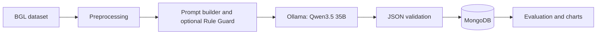
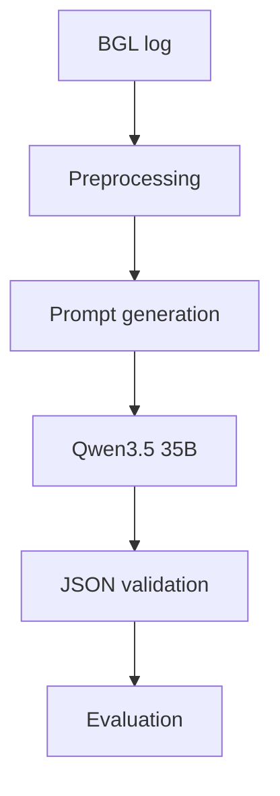
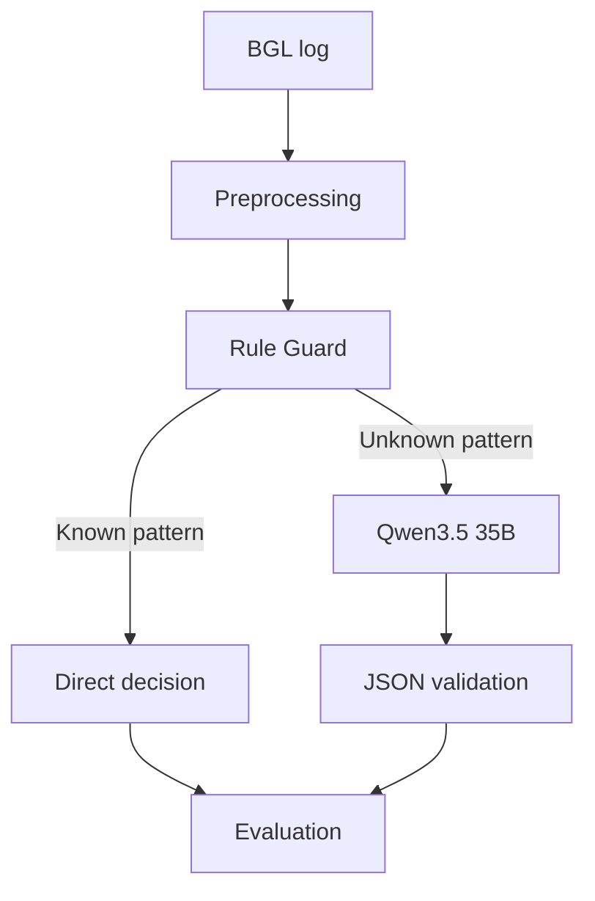
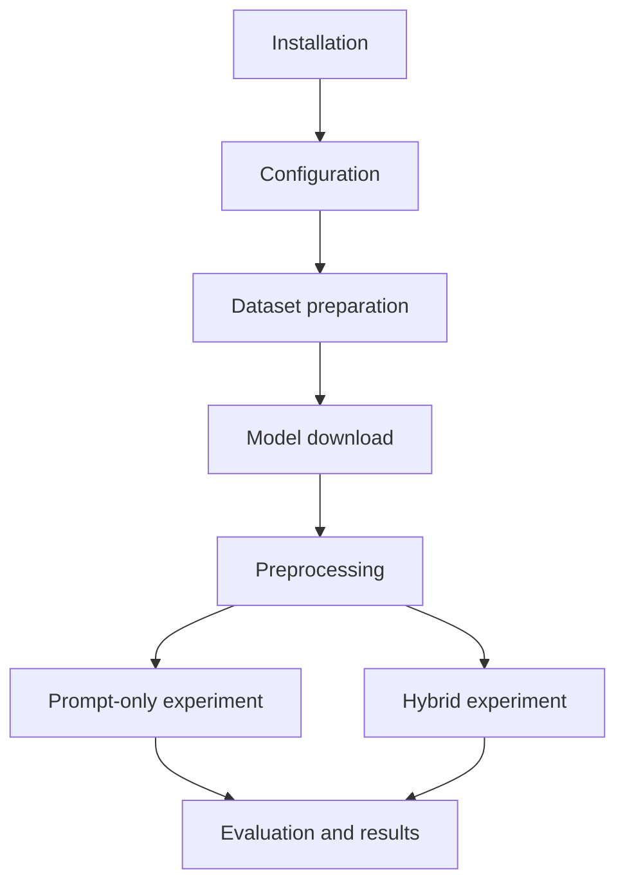

# LLMLogAnalyzer

## Overview

LLMLogAnalyzer is a reproducible research pipeline for line-level log anomaly detection with a Large Language Model (LLM). The target dataset is the Blue Gene/L (BGL) high-performance-computing log dataset. Each BGL record is independently evaluated and assigned one of two labels: **normal** or **anomaly**.

The official model for this branch is **Qwen3.5:35B**, identified by the Ollama tag **`qwen3.5:35b`**. It runs locally through Ollama as a frozen pretrained model: the project performs inference only and does not fine-tune or update model weights.

The scientific objective is to compare two—and only two—classification approaches under the same dataset, model, prompt family, output schema, and evaluation pipeline:

1. Prompt-only LLM.
2. Hybrid Rule Guard + LLM.

Ground-truth labels are removed before prompt construction, so the model cannot see the answer. Predictions, invalid responses, decision source, timing, token usage, frozen configuration, model digest, prompt version, dataset checksum, and evaluation metrics are retained for thesis analysis.


```mermaid
flowchart LR
    A[BGL dataset] --> B[Preprocessing]
    B --> C[Prompt builder and optional Rule Guard]
    C --> D[Ollama: Qwen3.5 35B]
    D --> E[JSON validation]
    E --> F[(MongoDB)]
    F --> G[Evaluation and charts]
```

For every direct LLM inference, the model must return only this JSON object:

```json
{
  "prediction": "normal|anomaly",
  "confidence": 0.0,
  "reason": "short explanation",
  "category": "hardware|software|network|storage|job|diagnostic|environment|unknown"
}
```

## Research Methodology

The experiment contains exactly two paths. They use the same BGL parser, template normalization, Qwen3.5:35B configuration, JSON validator, persistence layer, and metrics. The only experimental switch is whether the deterministic BGL Rule Guard is enabled.

### 1. Prompt-only LLM

Set `BGL_TEMPLATE_GUARD=false`.

In this mode, the deterministic Rule Guard is disabled. A previously unseen normalized log template is converted into the existing versioned prompt and sent directly to Qwen3.5:35B. No external rule-based decision is applied before the model response; the classification decision comes from the validated LLM output. The stored internal identifier `PROMPT_ONLY_GUARD_RULES_EMBEDDED` indicates that domain guidance remains inside the existing prompt; it does not enable the external Rule Guard.


```mermaid
flowchart TD
    A[BGL log] --> B[Preprocessing]
    B --> C[Prompt generation]
    C --> D[Qwen3.5 35B]
    D --> E[JSON validation]
    E --> F[Evaluation]
```

This path measures the anomaly-detection capability of the frozen LLM when deterministic domain decision logic is not executed externally.

### 2. Hybrid Rule Guard + LLM

Set `BGL_TEMPLATE_GUARD=true`.

In this mode, the deterministic BGL Rule Guard is enabled. Known high-confidence patterns are classified directly by the rule engine. A pattern that the guard cannot confidently classify is converted into the configured versioned Qwen prompt and forwarded to Qwen3.5:35B. The complete system therefore combines deterministic domain knowledge with the LLM fallback path.


```mermaid
flowchart TD
    A[BGL log] --> B[Preprocessing]
    B --> C[Rule Guard]
    C -->|Known pattern| D[Direct decision]
    C -->|Unknown pattern| E[Qwen3.5 35B]
    E --> F[JSON validation]
    D --> G[Evaluation]
    F --> G
```

This path evaluates the benefit of combining deterministic BGL domain knowledge with an LLM.

The template cache is a shared execution optimization, not an additional experiment or classifier. It is cleared at the start of each run and reuses only a previously validated decision for the same normalized template. Keep `BGL_TEMPLATE_CACHE` identical when comparing the two approaches. The stored `decisionSource` and aggregate counters distinguish Rule Guard, direct LLM, and cache reuse inside each run.

## Qwen3.5:35B Configuration

All official experiments use the following frozen inference configuration:

| Setting | Value |
|---|---:|
| Model | `qwen3.5:35b` |
| Runtime | Ollama |
| `temperature` | `0` |
| `top_p` | `0.9` |
| `seed` | `42` |
| `format` | `json` |
| `thinking` | `false` |
| `num_ctx` | `8192` |

No fine-tuning is performed, model parameters remain frozen, and both experimental paths use identical model settings. `temperature=0` and a fixed seed support repeatable decoding; `format=json` and `thinking=false` keep the observable response limited to the classification contract. The 8,192-token context is sufficient for the versioned prompt plus one normalized BGL record and its concrete example, without allocating an unnecessarily large KV cache.

## 1. System Requirements

Supported and tested deployment target:

- Ubuntu 22.04 or 24.04 LTS, 64-bit; other modern Linux distributions can work with distribution-specific package commands.
- OpenJDK 17. The Maven Wrapper is included, so a separate Maven installation is unnecessary.
- Python 3, `pip`, and `venv` for the documented auxiliary environment; the inference application itself is Java.
- At least 32 GB system RAM; 48 GB or more is recommended for CPU inference and MongoDB together.
- At least 60 GB free storage: the Ollama model is about 24 GB, the dataset is about 0.7 GB unpacked, and MongoDB results can consume several additional gigabytes.
- Optional NVIDIA or AMD GPU. About 32 GB VRAM is recommended for full GPU residency; smaller GPUs can use partial CPU offload at lower throughput.

CPU-only execution is supported but a full BGL run with a 35B model can take a long time. Record the hardware metadata stored in `bgl_experiment_runs` when comparing runtimes.

## 2. Install System Dependencies

Run on a fresh Ubuntu installation:

```bash
sudo apt update
sudo apt install -y git openjdk-17-jdk python3 python3-pip python3-venv curl wget unzip gnupg ca-certificates

java -version
python3 --version
git --version
```

Java must report version 17 or newer. Builds target Java 17 bytecode.

## 3. MongoDB Installation

These commands install MongoDB Community 8.0 from MongoDB's official repository on Ubuntu 22.04 or 24.04. They follow the [official Ubuntu installation guide](https://www.mongodb.com/docs/v8.0/tutorial/install-mongodb-on-ubuntu/).

```bash
sudo apt install -y gnupg curl
curl -fsSL https://pgp.mongodb.com/server-8.0.asc | \
  sudo gpg -o /usr/share/keyrings/mongodb-server-8.0.gpg --dearmor

. /etc/os-release
echo "deb [ arch=amd64,arm64 signed-by=/usr/share/keyrings/mongodb-server-8.0.gpg ] https://repo.mongodb.org/apt/ubuntu ${VERSION_CODENAME}/mongodb-org/8.0 multiverse" | \
  sudo tee /etc/apt/sources.list.d/mongodb-org-8.0.list

sudo apt update
sudo apt install -y mongodb-org
sudo systemctl start mongod
sudo systemctl enable mongod
sudo systemctl status mongod --no-pager
mongosh --eval 'db.runCommand({ ping: 1 })'
```

The default connection is `mongodb://127.0.0.1:27017/LLMLogAnalyzer`. No manual schema creation is required. Spring Data creates indexes and MongoDB creates these collections on first write:

- `bgl_experiment_runs`: one document per run, including model/version, generation options, prompt/version, timestamps, dataset SHA-256, host data, counters, and duration.
- `log_evaluations`: one document per parsed input line, including ground truth, prediction, validation state, raw model output, token counts, response time, and `runId`.

## 4. Ollama Installation

Install Ollama using its [official Linux installer](https://docs.ollama.com/linux), start it, and pull the required model:

```bash
curl -fsSL https://ollama.com/install.sh | sh
sudo systemctl enable ollama
sudo systemctl start ollama

ollama --version
ollama pull qwen3.5:35b
ollama list
ollama show qwen3.5:35b
curl -fsS http://127.0.0.1:11434/api/tags
```

`qwen3.5:35b` is mandatory for official runs. Ollama lists this tag as a roughly 24 GB model with a much larger maximum context capability than this project needs; see the [Ollama Qwen3.5 model page](https://ollama.com/library/qwen3.5). At run start the application queries `/api/tags` and stores the exact local manifest digest as `modelVersion` and `modelDigest`.

## 5. Clone Repository

Clone this migration branch directly:

```bash
git clone --branch Qwen3.5-35B --single-branch https://github.com/masoudd2159/LLMLogAnalyzer.git
cd LLMLogAnalyzer
chmod +x mvnw
git status --short --branch
```

The final command should show branch `Qwen3.5-35B` and no local changes.

## 6. Python Environment Setup

The main pipeline uses Java 17. The Python environment is intentionally dependency-free, but is provided for reproducible auxiliary checks and future analysis scripts:

```bash
python3 -m venv venv
source venv/bin/activate
python -m pip install --upgrade pip
pip install -r requirements.txt
```

Verify the Maven Wrapper, download the pinned Java dependencies, build the application, and run the test suite:

```bash
./mvnw -version
./mvnw dependency:go-offline
./mvnw clean test
```

## 7. BGL Dataset Setup

BGL is a labeled collection of reliability, availability, and serviceability (RAS) and system messages produced by the Blue Gene/L supercomputer. It is useful for anomaly-detection research because it contains real operational events, repeated message templates, component identifiers, timestamps, and source-provided normal/anomaly labels at large scale. In the original format, a `-` label denotes a normal record; every other source label is mapped to anomaly by this application.

The full Loghub release contains 4,747,963 lines and is approximately 709 MiB unpacked. The project requires the original labeled `BGL.log`, not a pre-parsed CSV or the 2,000-line sample. See the [Loghub repository](https://github.com/logpai/loghub) and [archived dataset release](https://zenodo.org/records/8196385).

Download the versioned Loghub archive from Zenodo, verify the publisher-provided MD5 checksum, and extract it into the expected path:

```bash
mkdir -p data/BGL
wget -O /tmp/BGL.zip 'https://zenodo.org/records/8196385/files/BGL.zip?download=1'
echo '4452953c470f2d95fcb32d5f6e733f7a  /tmp/BGL.zip' | md5sum --check -
unzip -j -o /tmp/BGL.zip -d data/BGL
test -s data/BGL/BGL.log
wc -l data/BGL/BGL.log
sha256sum data/BGL/BGL.log
```

Expected layout:

```text
LLMLogAnalyzer/
├── data/
│   └── BGL/
│       └── BGL.log
├── results/                 # generated locally
├── src/
├── pom.xml
└── mvnw
```

The application reads this file sequentially from `BGL_DATASET_PATH`, parses the source label and log fields, removes the ground-truth label before prompt construction, and normalizes variable fields into a reusable semantic template. Dataset files are ignored by Git. The default `BGL_DATASET_PATH=data/BGL/BGL.log` points to the layout above. Keep the generated SHA-256 preflight report with the thesis artifacts so every evaluation can identify its exact input.

## 8. Configuration

Copy the documented environment template, load it, and record the exact Git revision:

```bash
cp .env.example .env
set -a
source .env
set +a
export GIT_COMMIT="$(git rev-parse HEAD)"
```

Important variables:

| Variable | Official/default value | Purpose |
|---|---:|---|
| `MODEL_NAME` | `qwen3.5:35b` | Required Ollama model |
| `MODEL_VERSION` | `AUTO` | Resolve local model digest from Ollama; an exact digest may be supplied |
| `TEMPERATURE` | `0` | Deterministic greedy sampling |
| `TOP_P` | `0.9` | Frozen experiment setting; temperature zero keeps decoding deterministic |
| `SEED` | `42` | Fixed Ollama seed |
| `FORMAT` | `json` | Enables the enforced JSON Schema payload |
| `THINKING` | `false` | Suppresses separate reasoning output |
| `NUM_CTX` | `8192` | Input and output context budget |
| `NUM_PREDICT` | `160` | Maximum structured-response tokens |
| `OLLAMA_BASE_URL` | `http://127.0.0.1:11434` | Ollama server |
| `OLLAMA_CONNECT_TIMEOUT` | `10s` | TCP connection timeout |
| `OLLAMA_RESPONSE_TIMEOUT` | `15m` | Whole-response/read timeout for cold 35B inference |
| `OLLAMA_MAX_ATTEMPTS` | `3` | Initial request plus transient retries |
| `MONGODB_URI` | `mongodb://127.0.0.1:27017/LLMLogAnalyzer` | Database connection and name |
| `BGL_DATASET_PATH` | `data/BGL/BGL.log` | Original labeled BGL file |
| `BGL_TEMPLATE_GUARD` | `true` | `false` = Prompt-only LLM; `true` = Hybrid Rule Guard + LLM |
| `BGL_TEMPLATE_CACHE` | `true` | Shared validated-template reuse; keep equal across compared runs |
| `GIT_COMMIT` | must be exported | Exact source revision stored with the run |

`BGL_TEMPLATE_GUARD` is the only flag that selects between the two thesis approaches. Do not change the other frozen model settings between runs. The official runner fails fast if the model name, deterministic parameters, thinking mode, context size, output format, dataset path, or Git commit is not reproducible. Transient network errors, HTTP 429, and Ollama 5xx responses use exponential backoff. Invalid semantic output is not retried because doing so would bias the experiment; it is persisted as `INVALID`, counted, and excluded from valid-prediction metrics.

### Why `NUM_CTX=8192`

Each inference contains one system prompt, one normalized BGL template, and one label-free concrete example. Even the longer prompt-only variant fits well below 8,192 tokens. A 256K window is unnecessary for line-level classification and would increase KV-cache memory. The client conservatively estimates the request size before sending it, reserves 160 output tokens, and persists Ollama's actual `prompt_eval_count` and `eval_count` for every direct model call.

### Prompt and response controls

The Qwen-specific prompt defines the task, labels, evidence threshold, category vocabulary, and exact four-field JSON contract. Ollama receives the same contract as a JSON Schema with `additionalProperties=false`; streaming is disabled because the response is short and structured. `think=false` ensures the benchmark evaluates the classification response instead of uncontrolled chain-of-thought generation. The parser accepts valid JSON with whitespace or Markdown fences, but rejects truncated JSON, missing/extra fields, invalid predictions, out-of-range confidence, unsupported categories, and overlong reasons.

## 9. Running The Application


```mermaid
flowchart TD
    A[Installation] --> B[Configuration]
    B --> C[Dataset preparation]
    C --> D[Model download]
    D --> E[Preprocessing]
    E --> F[Prompt-only experiment]
    E --> G[Hybrid experiment]
    F --> H[Evaluation and results]
    G --> H
```

Run the following from the repository root in one Bash shell. Run preprocessing once, then run the two experiment paths separately. Do not change the model settings or cache setting between them.

### 1. Start services and load the configuration

```bash
sudo systemctl start mongod
mongosh --quiet --eval 'db.runCommand({ ping: 1 })'

sudo systemctl start ollama
ollama list | grep 'qwen3.5:35b'
curl -fsS http://127.0.0.1:11434/api/tags >/dev/null

source venv/bin/activate
set -a
source .env
set +a
export GIT_COMMIT="$(git rev-parse HEAD)"
```

### 2. Run preprocessing

This parses every line without calling Ollama, counts source labels and parse failures, computes SHA-256, and writes `results/bgl_preprocessing_report.json`.

```bash
./mvnw spring-boot:run \
  -Dspring-boot.run.profiles=preprocess \
  -Dspring-boot.run.arguments=--spring.main.web-application-type=none
```

Inspect the report and resolve parser errors before inference:

```bash
python -m json.tool results/bgl_preprocessing_report.json
```

### 3. Run the Prompt-only LLM experiment

Disable the Rule Guard for this process. The runner stores `classificationMode=PROMPT_ONLY_GUARD_RULES_EMBEDDED` and the prompt version in the run document.

```bash
export BGL_TEMPLATE_GUARD=false
./mvnw spring-boot:run \
  -Dspring-boot.run.profiles=experiment \
  -Dspring-boot.run.arguments=--spring.main.web-application-type=none

export PROMPT_ONLY_RUN_ID="$(mongosh --quiet --eval 'const r=db.getSiblingDB("LLMLogAnalyzer").bgl_experiment_runs.findOne({status:"COMPLETED",classificationMode:"PROMPT_ONLY_GUARD_RULES_EMBEDDED"},{sort:{finishedAt:-1},projection:{_id:1}}); if (!r) quit(1); print(r._id)')"
printf 'Prompt-only run ID: %s\n' "$PROMPT_ONLY_RUN_ID"
```

### 4. Run the Hybrid Rule Guard + LLM experiment

Enable the Rule Guard while leaving every other setting unchanged. The runner stores `classificationMode=HYBRID_GUARD_AND_LLM`.

```bash
export BGL_TEMPLATE_GUARD=true
./mvnw spring-boot:run \
  -Dspring-boot.run.profiles=experiment \
  -Dspring-boot.run.arguments=--spring.main.web-application-type=none

export HYBRID_RUN_ID="$(mongosh --quiet --eval 'const r=db.getSiblingDB("LLMLogAnalyzer").bgl_experiment_runs.findOne({status:"COMPLETED",classificationMode:"HYBRID_GUARD_AND_LLM"},{sort:{finishedAt:-1},projection:{_id:1}}); if (!r) quit(1); print(r._id)')"
printf 'Hybrid run ID: %s\n' "$HYBRID_RUN_ID"
```

Each experiment command is intentionally one-shot. It resolves the model digest, creates a unique `runId`, clears the in-memory template cache, processes the full dataset, writes MongoDB documents in batches, marks the run `COMPLETED` or `FAILED`, and exits. Progress is logged every 1,000 parsed lines.

Verify that the two completed runs differ only in the documented experiment-selection fields:

```bash
mongosh --quiet --eval 'db.getSiblingDB("LLMLogAnalyzer").bgl_experiment_runs.find({_id:{$in:["'"$PROMPT_ONLY_RUN_ID"'","'"$HYBRID_RUN_ID"'"]}},{_id:1,status:1,classificationMode:1,promptExperiment:1,promptVersion:1,modelName:1,modelDigest:1,temperature:1,topP:1,seed:1,numCtx:1,format:1,thinkingEnabled:1,templateCacheEnabled:1,templateGuardEnabled:1,startedAt:1,finishedAt:1}).pretty()'
```

### 5. Run evaluation

Evaluate each run explicitly by `runId`. This prevents records from the two approaches from being mixed and writes each chart set to a separate directory.

```bash
RUN_ID="$PROMPT_ONLY_RUN_ID" CHART_OUTPUT_DIR=results/prompt-only ./mvnw spring-boot:run \
  -Dspring-boot.run.profiles=charts \
  -Dspring-boot.run.arguments=--spring.main.web-application-type=none

RUN_ID="$HYBRID_RUN_ID" CHART_OUTPUT_DIR=results/hybrid ./mvnw spring-boot:run \
  -Dspring-boot.run.profiles=charts \
  -Dspring-boot.run.arguments=--spring.main.web-application-type=none
```

Accuracy, precision, recall, and F1 are calculated only from valid predictions. Invalid model responses are counted and reported separately rather than being silently converted to either class. The generated direct-decision charts exclude template-cache reuse and support a like-for-like analysis of original decision sources.

### 6. Generate and archive reproducibility results

The chart commands above generate the metrics and figures. Export the corresponding immutable run metadata from MongoDB and preserve the preprocessing report:

```bash
mkdir -p results/reproducibility

mongoexport --uri="$MONGODB_URI" --collection=bgl_experiment_runs \
  --query="{\"_id\":\"$PROMPT_ONLY_RUN_ID\"}" --pretty \
  --out=results/reproducibility/prompt-only-run.json

mongoexport --uri="$MONGODB_URI" --collection=bgl_experiment_runs \
  --query="{\"_id\":\"$HYBRID_RUN_ID\"}" --pretty \
  --out=results/reproducibility/hybrid-run.json

cp results/bgl_preprocessing_report.json results/reproducibility/
sha256sum results/reproducibility/prompt-only-run.json \
  results/reproducibility/hybrid-run.json \
  results/reproducibility/bgl_preprocessing_report.json \
  results/prompt-only/* results/hybrid/* \
  > results/reproducibility/artifact-sha256.txt
```

For audit queries, line-level records remain in `log_evaluations` and are linked to their experiment through `runId`; exporting all of them is optional because a full BGL run is large.

## 10. Expected Output

After preprocessing:

- `results/bgl_preprocessing_report.json`: absolute dataset path, file size, SHA-256, timestamp, raw/parsed/error counts, and normal/anomaly label counts.

After inference:

- `bgl_experiment_runs`: a completed or failed run document with the frozen configuration and execution counters.
- `log_evaluations`: valid predictions and separately queryable invalid predictions (`aiResult: "INVALID"`, `validModelOutput: false`).
- Application logs: run ID, prompt version, model name, progress, cache sources, guard decisions, invalid/non-cacheable counts, and final throughput.

After evaluation, each selected `CHART_OUTPUT_DIR` (`results/prompt-only/` and `results/hybrid/` in the commands above) contains:

- `final_metrics.png`
- `final_confusion_matrix.png`
- `final_invalid_rate.png`
- `final_response_time.png`
- `final_decision_sources.png`
- `final_template_cache_size.png`
- `final_direct_metrics.png`
- `final_direct_confusion_matrix.png`

Metrics use MongoDB-side aggregation. Accuracy, precision, recall, and F1 use only valid predictions; invalid count and invalid rate are reported separately.

## 11. Troubleshooting

### Ollama model missing

Symptom: `Required Ollama model 'qwen3.5:35b' is unavailable` or HTTP 404.

```bash
ollama pull qwen3.5:35b
ollama list
curl -fsS http://127.0.0.1:11434/api/tags
```

### MongoDB failure

```bash
sudo systemctl status mongod --no-pager
sudo systemctl restart mongod
sudo journalctl -u mongod -n 100 --no-pager
mongosh --eval 'db.runCommand({ ping: 1 })'
```

If authentication or a remote server is used, set the complete URI in `MONGODB_URI`.

### Dependency or build errors

```bash
java -version
./mvnw -version
./mvnw clean test
```

Use a JDK, not a JRE. The project targets Java 17 and pins a Lombok release compatible with current JDKs.

### Dataset path errors

```bash
test -r "$BGL_DATASET_PATH"
ls -lh "$BGL_DATASET_PATH"
wc -l "$BGL_DATASET_PATH"
```

Run commands from the repository root or set `BGL_DATASET_PATH` to an absolute path.

### Invalid JSON

Query examples:

```bash
mongosh --quiet --eval 'db.getSiblingDB("LLMLogAnalyzer").log_evaluations.countDocuments({aiResult:"INVALID"})'
mongosh --quiet --eval 'db.getSiblingDB("LLMLogAnalyzer").log_evaluations.find({aiResult:"INVALID"},{runId:1,rawModelOutput:1,modelValidationError:1}).limit(5).pretty()'
```

Do not silently relabel invalid output. Confirm `FORMAT=json`, `THINKING=false`, the required model, and the prompt version stored in the run.

### Timeout errors

The default 15-minute response timeout allows cold loading and CPU-offloaded 35B inference. Check Ollama logs and hardware use before increasing it:

```bash
sudo journalctl -u ollama -n 100 --no-pager
ollama ps
```

If one legitimate request exceeds the limit, set `OLLAMA_RESPONSE_TIMEOUT=30m` and record that deviation; official generation parameters must remain frozen.

### Port conflicts

```bash
sudo ss -ltnp | grep -E ':(11434|27017|8081)\b'
```

Change `SERVER_PORT` for the application. Change `OLLAMA_BASE_URL` or `MONGODB_URI` only when the corresponding service is deliberately bound elsewhere.

## Results and Reproducibility

Every experiment preserves the evidence needed to identify and reproduce it:

- Model name, resolved model version, and Ollama manifest digest.
- Prompt experiment and prompt version, plus the exact prompt stored in the run document.
- Frozen inference configuration, timeouts, retry count, Rule Guard state, and template-cache state.
- Start and finish timestamps, Git commit, dataset path and SHA-256, Java/OS/hardware metadata, duration, and throughput.
- Line-level ground truth, prediction, confidence, category, decision source, token counts, validation state, and raw invalid output in `log_evaluations`.
- Run-scoped accuracy, precision, recall, F1, confusion matrix, invalid-response rate, response time, decision-source, and cache metrics generated from MongoDB and stored as charts.

Invalid responses remain associated with their `runId`, are counted separately, and are excluded from valid-prediction metrics. The prompt-only and hybrid output directories, exported run documents, preprocessing report, and checksum manifest form the reproducibility bundle described in step 6 above.

### Reproducibility checklist

Before accepting a thesis run, verify:

1. `git status --short` is empty and `GIT_COMMIT` equals `git rev-parse HEAD`.
2. MongoDB and Ollama health checks pass.
3. `ollama list` contains exactly the required tag and the run records its digest.
4. The dataset archive checksum passes and the preflight report has the expected file identity and parser coverage.
5. `./mvnw clean test` passes.
6. The run is `COMPLETED`; invalid outputs are reported separately.
7. Charts are generated using the intended `runId`.
8. Archive the Git commit, `.env` values without secrets, preflight report, run document, evaluation export, charts, Ollama version, and model digest together.

## Implementation map

- `OllamaProperties`: centralized model, generation, context, timeout, and retry configuration.
- `CallModelAi`: non-streaming chat request, explicit `think=false`, JSON Schema, context guard, transient retry policy, model-digest lookup, and strict response validation.
- `PromptGenerator`: versioned Qwen3.5 BGL prompts and output contract.
- `BglDatasetPreflightService`: dataset parser coverage and SHA-256 report without inference.
- `BglParser`: label isolation, template normalization, cache/guard/LLM routing, batched persistence, and run metadata.
- `EvaluationMetricsService`: run-scoped MongoDB aggregation with invalid predictions separated.
- `EvaluationChartService`: thesis-ready metrics and diagnostic charts.

No fine-tuning, training, remote inference API, or hidden ground-truth access is used.
