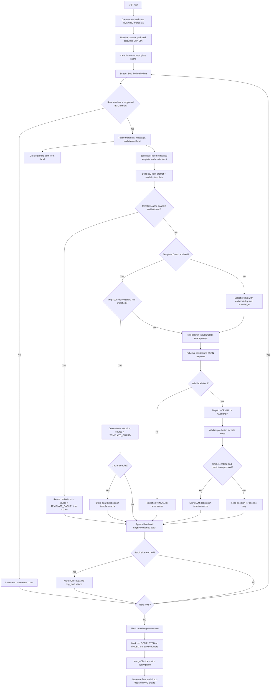
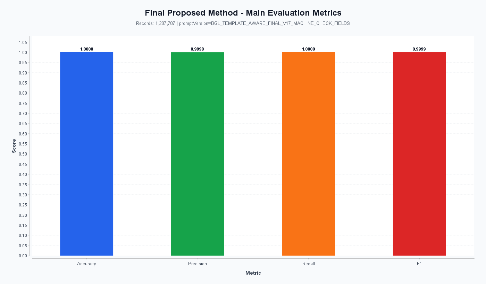
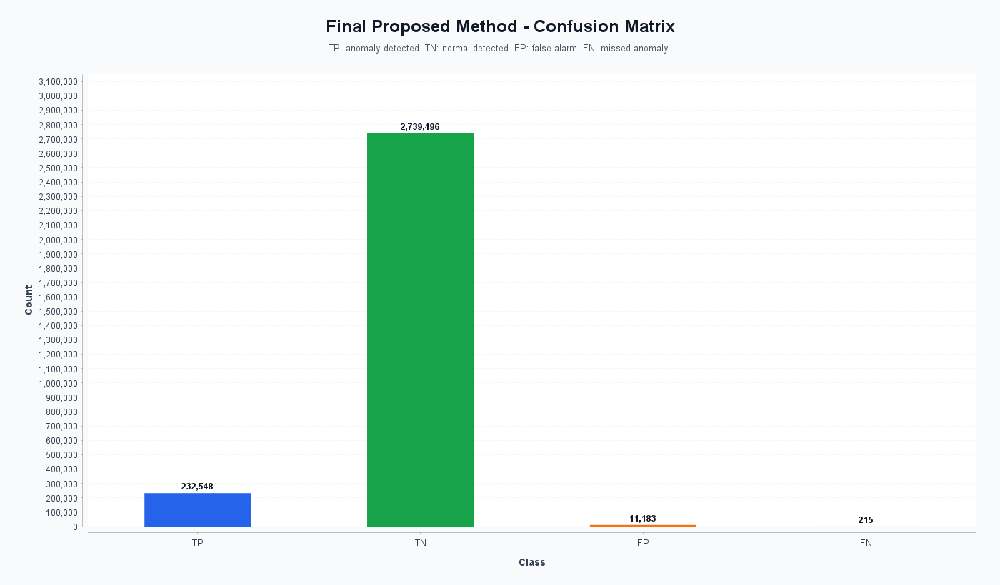
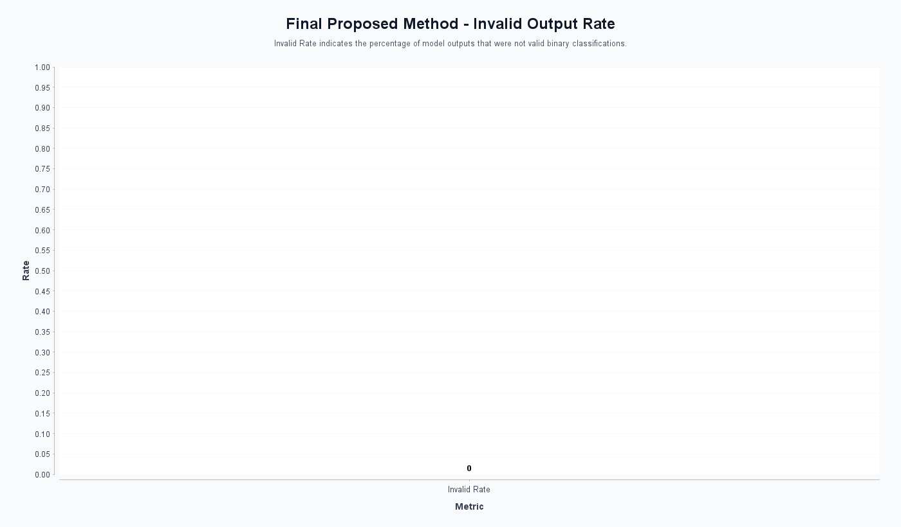
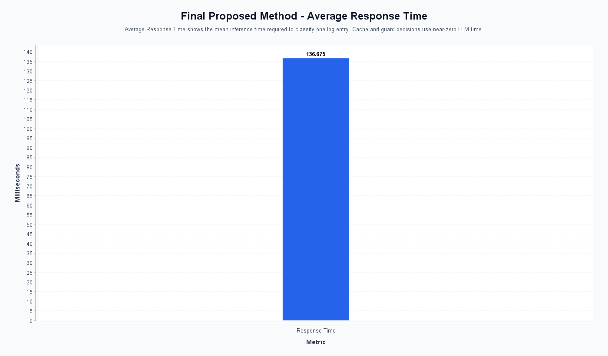
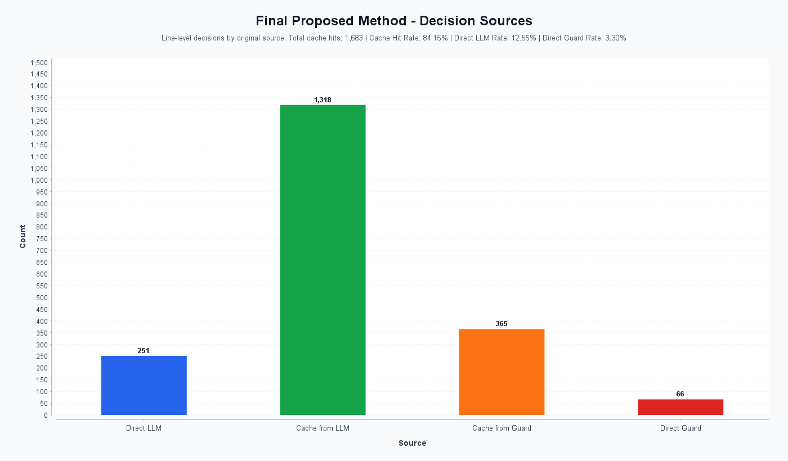
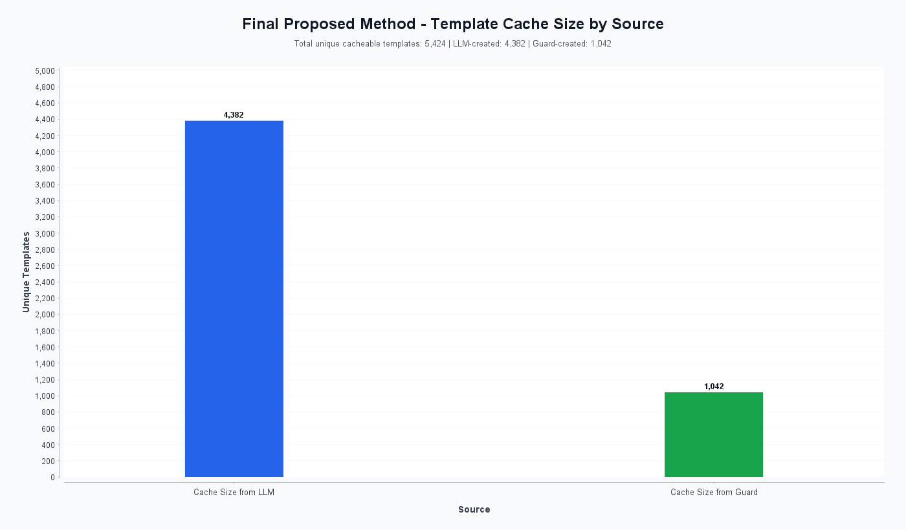

# LLMLogAnalyzer

**Template-aware anomaly detection for Blue Gene/L system logs using prompt-engineered large language models**

LLMLogAnalyzer is a research-oriented Spring Boot application developed to evaluate binary anomaly detection on the Blue Gene/L (BGL) log dataset. The project combines prompt engineering, privacy-safe input construction, semantic template normalization, a conservative deterministic guard, validated template-level caching, run-scoped persistence, and MongoDB-side evaluation.

The implementation is designed for reproducible thesis experiments rather than as a general-purpose production monitoring platform. Its primary question is whether a pretrained local LLM can identify anomalous BGL log entries without fine-tuning while remaining accurate, auditable, and computationally practical at full-dataset scale.

> **Current repository configuration:** hybrid `Template Guard + LLM` classification with validated template caching enabled, using `qwen2.5:7b-instruct` through Ollama.

## Contents

- [Research objective](#research-objective)
- [Dataset and task definition](#dataset-and-task-definition)
- [Proposed method](#proposed-method)
- [Complete log-analysis workflow](#complete-log-analysis-workflow)
- [Experimental modes](#experimental-modes)
- [System architecture](#system-architecture)
- [Persistence and reproducibility](#persistence-and-reproducibility)
- [Evaluation methodology](#evaluation-methodology)
- [Latest full-dataset results](#latest-full-dataset-results)
- [Generated charts](#generated-charts)
- [Installation and configuration](#installation-and-configuration)
- [Running an experiment](#running-an-experiment)
- [Generating charts](#generating-charts)
- [Testing](#testing)
- [Project structure](#project-structure)
- [Roadmap](#roadmap)
- [Scope and limitations](#scope-and-limitations)
- [Thesis](#thesis)

## Research objective

The project investigates how prompt engineering and log-template reuse can improve LLM-based system-log anomaly detection without training or fine-tuning the language model.

The implementation pursues the following objectives:

- classify every parseable BGL entry as `NORMAL`, `ANOMALY`, or `INVALID`;
- prevent ground-truth labels from leaking into the model input;
- preserve semantic meaning while replacing runtime-specific values with reusable placeholders;
- avoid unreliable keyword-only decisions based on words such as `FATAL`, `error`, `interrupt`, or `parity`;
- compare a hybrid deterministic/LLM pipeline with a prompt-only pipeline;
- reduce repeated LLM inference through template-level result reuse;
- prevent invalid or suspicious first predictions from contaminating the cache;
- retain line-level evidence and complete experiment metadata for auditability;
- calculate metrics using database-side aggregation so the complete dataset does not have to be loaded into JVM memory;
- generate publication-ready figures directly from persisted experiment results.

## Dataset and task definition

The project operates on the Blue Gene/L system-log dataset. Each original row starts with a dataset label:

| Original label | Ground truth | Binary class |
|---|---|---:|
| `-` | Normal | `0` |
| Any other value | Anomaly | `1` |

The parser reads the original label only to construct the evaluation ground truth. The label is never included in the text sent to Ollama.

The LLM receives label-free BGL metadata, a normalized message template, and one label-free concrete example. It must return exactly one schema-constrained JSON object:

```json
{"label":"0"}
```

or:

```json
{"label":"1"}
```

A null response, API failure, malformed JSON, or unsupported label becomes `INVALID`. Invalid predictions are persisted and reported separately; they are never silently interpreted as normal and never enter the template cache.

## Proposed method

The method has five central ideas.

### 1. Ground-truth isolation

`BglParser` extracts the dataset label before creating the model input. The complete raw row is retained in MongoDB for traceability, while only label-free fields are supplied to the classifier. This prevents evaluation leakage.

### 2. Semantic template normalization

`BglTemplateExtractor` replaces values that identify a particular runtime event but usually do not change its class:

- node and unit identifiers → `<NODE>` and `<UNIT>`;
- IPv4 addresses → `<IP>`;
- hexadecimal values → `<HEX>`;
- dates and timestamps → `<DATE>`;
- filesystem paths → `<PATH>`;
- generic numeric values → `<NUM>`.

When zero and non-zero values change the meaning of a status field or exit code, the extractor preserves that distinction using `<ZERO>` and `<NON_ZERO>`. This avoids merging a successful diagnostic status with a failure status.

For example:

```text
ciod: LOGIN chdir(/p/gb1/stella/RAPTOR/2183) failed: Input/output error
```

becomes:

```text
ciod: LOGIN chdir(<PATH>) failed: Input/output error
```

The cache key can include category, component, and severity in addition to the normalized message. In the active configuration it has this effective form:

```text
prompt version + model name + category + component + severity + normalized message
```

### 3. Conservative deterministic guard

`BglTemplateGuard` handles only narrow BGL patterns for which the intended class is encoded explicitly in project knowledge. It distinguishes, among other cases:

- actual machine-check interrupts from diagnostic machine-check fields;
- data-storage interrupts from zero-status data-store diagnostics;
- uncorrected failures from corrected error reports;
- kernel/control-stream failures from register dumps and continuation fields;
- node-map allocation failures from known user/environment conditions.

The guard is deliberately conservative: ambiguous or unmatched templates are delegated to the LLM.

### 4. Prompt-engineered local inference

`CallModelAi` sends the normalized input to Ollama through `WebClient`. Inference is deterministic by configuration (`temperature=0`, fixed seed, constrained prediction length), and Ollama receives a JSON schema that permits only labels `0` and `1`.

Two prompt variants are maintained:

- a template-aware prompt for the hybrid pipeline;
- a template-aware prompt containing the guard knowledge for the prompt-only experiment.

### 5. Validated template reuse

The in-memory cache stores the first reusable decision for each effective template key. A cache hit avoids another model call but still creates one `LogEvaluation` document for the current raw line, so reported classification metrics remain line-level.

In hybrid mode, `BglTemplateValidationService` blocks propagation when an LLM prediction conflicts with deterministic knowledge or when an unsupported cache-sensitive family—such as a machine-check, parity, or status-register template—should not be generalized from a single inference. The current result is still stored and evaluated; only reuse is denied.

The cache is cleared at the start of every `/bgl` request, ensuring that a run cannot inherit decisions from an earlier run in the same JVM.

## Complete log-analysis workflow


```mermaid
flowchart TD
    A["GET /bgl"] --> B["Create runId and save RUNNING metadata"]
    B --> C["Resolve dataset path and calculate SHA-256"]
    C --> D["Clear in-memory template cache"]
    D --> E["Stream BGL file line by line"]

    E --> F{"Row matches a supported BGL format?"}
    F -- "No" --> F1["Increment parse-error count"]
    F1 --> NEXT{"More rows?"}
    F -- "Yes" --> G["Parse metadata, message, and dataset label"]

    G --> H["Create ground truth from label"]
    G --> I["Build label-free normalized template and model input"]
    I --> J["Build key from prompt + model + template"]

    J --> K{"Template cache enabled and hit found?"}
    K -- "Yes" --> K1["Reuse cached class; source = TEMPLATE_CACHE; time = 0 ms"]
    K1 --> SAVE["Append line-level LogEvaluation to batch"]

    K -- "No" --> L{"Template Guard enabled?"}
    L -- "Yes" --> M{"High-confidence guard rule matched?"}
    M -- "Yes" --> M1["Deterministic decision; source = TEMPLATE_GUARD"]
    M1 --> M2{"Cache enabled?"}
    M2 -- "Yes" --> M3["Store guard decision in template cache"]
    M2 -- "No" --> SAVE
    M3 --> SAVE

    M -- "No" --> N["Call Ollama with template-aware prompt"]
    L -- "No" --> N0["Select prompt with embedded guard knowledge"]
    N0 --> N

    N --> O["Schema-constrained JSON response"]
    O --> P{"Valid label 0 or 1?"}
    P -- "No" --> P1["Prediction = INVALID; never cache"]
    P1 --> SAVE
    P -- "Yes" --> Q["Map to NORMAL or ANOMALY"]
    Q --> R["Validate prediction for safe reuse"]
    R --> S{"Cache enabled and prediction approved?"}
    S -- "Yes" --> S1["Store LLM decision in template cache"]
    S -- "No" --> S2["Keep decision for this line only"]
    S1 --> SAVE
    S2 --> SAVE

    SAVE --> T{"Batch size reached?"}
    T -- "Yes" --> T1["MongoDB saveAll to log_evaluations"]
    T -- "No" --> NEXT
    T1 --> NEXT
    NEXT -- "Yes" --> E
    NEXT -- "No" --> U["Flush remaining evaluations"]

    U --> V["Mark run COMPLETED or FAILED and save counters"]
    V --> W["MongoDB-side metric aggregation"]
    W --> X["Generate final and direct-decision PNG charts"]
```

The dataset label and the model input split immediately after parsing: the label goes only to evaluation, while the normalized label-free branch goes to the cache, guard, and LLM.

## Experimental modes

The property below selects the experiment:

```properties
bgl.classification.template-guard.enabled=true
```

| Guard setting | Mode | Decision path | Prompt |
|---:|---|---|---|
| `true` | Hybrid Guard + LLM | Cache → Guard → LLM fallback | Template-aware final prompt |
| `false` | Prompt-only | Cache → LLM | Template-aware prompt with guard knowledge embedded |

### Hybrid Guard + LLM — currently active

```properties
bgl.classification.template-guard.enabled=true
```

- high-confidence patterns can be classified without inference;
- unmatched patterns are sent to Ollama;
- cache-sensitive LLM decisions are validated before reuse;
- decisions may originate from `TEMPLATE_GUARD`, `LLM`, or `TEMPLATE_CACHE`.

The active hybrid prompt version is:

```text
BGL_TEMPLATE_AWARE_FINAL_V18_NODE_MAP_BLOCK_DEVICE
```

### Prompt-only

```properties
bgl.classification.template-guard.enabled=false
```

- the deterministic guard is skipped entirely during classification;
- the relevant domain rules are embedded in the system prompt;
- every new template is classified by the LLM;
- syntactically valid binary results can be cached without a deterministic guard comparison.

This mode is useful for an ablation experiment that separates prompt knowledge from executable deterministic rules.

## System architecture

| Component | Responsibility |
|---|---|
| `BglController` | Exposes the synchronous `GET /bgl` experiment endpoint |
| `BglParser` | Orchestrates parsing, run creation, classification, batching, counters, and run completion |
| `BglTemplateExtractor` | Produces the normalized message, model input, and template key |
| `BglTemplateClassificationCache` | Reuses cacheable decisions within one run |
| `BglTemplateGuard` | Applies narrow, high-confidence deterministic BGL rules |
| `PromptGenerator` | Selects the hybrid or prompt-only prompt and records its version |
| `CallModelAi` | Calls Ollama, constrains output, and parses the binary response |
| `BglTemplateValidationService` | Decides whether an LLM result is safe to propagate through the cache |
| `LogEvaluationRepository` | Persists line-level predictions in MongoDB |
| `BglExperimentRunRepository` | Persists run configuration, identity, counters, and timing metadata |
| `EvaluationMetricsService` | Computes counts and metrics with MongoDB-side queries and aggregations |
| `EvaluationChartService` | Produces 1400×820 PNG figures with JFreeChart |

### Decision-source semantics

| Source | Meaning | LLM wait for current line |
|---|---|---:|
| `LLM` | A new template was classified directly by Ollama | Measured |
| `TEMPLATE_GUARD` | A deterministic rule classified a new template | `0 ms` |
| `TEMPLATE_CACHE` | A previously approved decision was reused | `0 ms` |

For a cache hit, `cacheSource` records whether the reusable decision was originally created by the LLM or by the guard.

## Persistence and reproducibility

The application uses two MongoDB collections.

### `log_evaluations`

One document is stored for every successfully parsed dataset line. Important fields include:

- `runId`, raw log, and original dataset label;
- label-free `modelInput`;
- normalized template and template key;
- real and predicted classifications;
- decision source, cache source, and cache-hit state;
- matched deterministic rule, when applicable;
- validation status and reason;
- prompt experiment and prompt version;
- raw model output and validity flag;
- response time, correctness, and creation time.

Writes are buffered and persisted with `saveAll` using the configured batch size.

### `bgl_experiment_runs`

One document describes each `/bgl` execution:

- unique run ID and `RUNNING`, `COMPLETED`, or `FAILED` status;
- start/end times and failure message;
- classification mode, complete prompt, and prompt version;
- absolute dataset path and SHA-256 digest;
- model name, model digest, and inference options;
- cache, guard, validation, and template-key settings;
- raw, parsed, and rejected line counts;
- direct LLM calls, cache hits, guard decisions, and final cache size;
- processing duration and throughput;
- Git commit, Java version, operating system, CPU count, and JVM memory limit.

This run-level boundary prevents records from separate executions from being mixed accidentally when `charts.data.scope=latest-run` or an explicit `charts.run-id` is used.

## Evaluation methodology

`EvaluationMetricsService` calculates metrics using MongoDB-side counts and aggregation:

```text
Accuracy     = (TP + TN) / valid predictions
Precision    = TP / (TP + FP)
Recall       = TP / (TP + FN)
F1           = 2 × Precision × Recall / (Precision + Recall)
Invalid Rate = invalid predictions / all evaluated records
```

It additionally reports:

- total, valid, and invalid record counts;
- true positives, true negatives, false positives, and false negatives;
- average response time over all lines;
- average response time for direct LLM calls only;
- decision counts by LLM, guard, and cache origin;
- unique cacheable templates by original source;
- run processing time and throughput when run metadata is available.

`INVALID` outputs are excluded from the accuracy denominator and reported through the separate invalid-rate metric. Direct-decision metrics exclude `TEMPLATE_CACHE` records and therefore reveal the quality of the first classification made for each encountered template path.

## Latest full-dataset results

The PNG files currently tracked at the repository root represent a completed evaluation over **3,645,000 BGL records** with the hybrid prompt version `BGL_TEMPLATE_AWARE_FINAL_V18_NODE_MAP_BLOCK_DEVICE`.

### Classification quality

| Metric | Result |
|---|---:|
| Accuracy | `0.9991` |
| Precision | `0.9955` |
| Recall | `0.9931` |
| F1 score | `0.9943` |
| Invalid-output rate | `0.000000` |

### Confusion matrix

| Outcome | Count |
|---|---:|
| True positive | `297,324` |
| True negative | `3,344,250` |
| False positive | `1,348` |
| False negative | `2,078` |

### Efficiency and reuse

| Measurement | Result |
|---|---:|
| Direct LLM decisions | `50,347` |
| Direct guard decisions | `4,647` |
| Cache hits originating from LLM decisions | `2,843,650` |
| Cache hits originating from guard decisions | `746,356` |
| Total cache hits | `3,590,006` (`98.49%`) |
| Unique cacheable templates | `37,005` |
| Unique templates created by LLM decisions | `32,358` |
| Unique templates created by guard decisions | `4,647` |
| Average time per dataset line | `14.53 ms` |
| Average direct LLM response time | `1,051.70 ms` |

These values describe the checked-in result snapshot, not permanent constants. Regenerate the figures after any change to the dataset, model, prompt, normalization rules, guard, or cache policy.

## Generated charts

### Main evaluation metrics



### Confusion matrix



### Invalid-output rate



### Response time



### Decision sources



### Template-cache size by source



The chart profile can generate these root artifacts:

```text
final_metrics.png
final_confusion_matrix.png
final_invalid_rate.png
final_response_time.png
final_decision_sources.png
final_template_cache_size.png
```

When the selected data has a `runId`, it also generates:

```text
final_direct_metrics.png
final_direct_confusion_matrix.png
```

## Installation and configuration

### Requirements

- Java 17 or newer;
- Maven, or the included Maven wrapper;
- MongoDB;
- Ollama;
- the `qwen2.5:7b-instruct` model, or another explicitly recorded compatible model;
- a local copy of the BGL dataset.

### Clone the repository

```bash
git clone https://github.com/masoudd2159/LLMLogAnalyzer.git
cd LLMLogAnalyzer
```

### Prepare external services

Start MongoDB using the method appropriate for the host system. Then prepare Ollama:

```bash
ollama pull qwen2.5:7b-instruct
ollama serve
```

### Application properties

Configure `src/main/resources/application.properties`. The following example matches the current experiment design; replace the dataset path and record the exact Git commit before a final run:

```properties
# Application
spring.application.name=LLMLogAnalyzer
server.port=8081

# MongoDB
spring.data.mongodb.host=127.0.0.1
spring.data.mongodb.port=27017
spring.data.mongodb.database=LLMLogAnalyzer
spring.data.mongodb.auto-index-creation=true

# Ollama
model.api.ollama.url=http://localhost:11434/api/chat
model.api.ollama.model-name=qwen2.5:7b-instruct
model.api.ollama.model-digest=<digest-from-ollama-show>
model.api.ollama.options.temperature=0
model.api.ollama.options.top-p=0.1
model.api.ollama.options.repeat-penalty=1.0
model.api.ollama.options.seed=42
model.api.ollama.options.num-ctx=4096
model.api.ollama.options.num-predict=8

# BGL classification
bgl.classification.template-cache.enabled=true
bgl.classification.template-guard.enabled=true
bgl.classification.cache-only-validated-llm-results=true
bgl.classification.template-key.include-metadata=true
bgl.persistence.batch-size=1000

# Dataset
bgl.location=/absolute/path/to/BGL.log

# Charts
charts.data.scope=latest-run
charts.run-id=
charts.fail-on-empty=true
charts.output-dir=.

# Reproducibility
experiment.git-commit=<exact-git-commit>
```

OpenAI/GPT properties and `OpenAIConfig` remain as legacy scaffolding; the active BGL execution path uses Ollama. Do not commit real API keys.

### Important configuration switches

| Property | Effect |
|---|---|
| `bgl.classification.template-cache.enabled` | Enables template-level result reuse |
| `bgl.classification.template-guard.enabled` | Selects hybrid (`true`) or prompt-only (`false`) mode |
| `bgl.classification.cache-only-validated-llm-results` | Requires validation approval before caching an LLM result |
| `bgl.classification.template-key.include-metadata` | Adds category, component, and severity to the normalized-message key |
| `bgl.persistence.batch-size` | Controls buffered MongoDB write size |
| `charts.data.scope` | Selects `latest-run`, `current`, `latest`, `auto`, or `all` |
| `charts.run-id` | Overrides chart scope with one explicit run UUID |
| `charts.fail-on-empty` | Fails chart generation instead of producing misleading zero charts |

## Running an experiment

### 1. Record the experiment identity

Before a thesis run:

```bash
git rev-parse HEAD
ollama show qwen2.5:7b-instruct
```

Copy the exact commit and model digest into `application.properties`. Confirm the dataset path and keep a record of its expected SHA-256; the application calculates and stores the digest for every run.

### 2. Start the application

Linux/macOS:

```bash
./mvnw spring-boot:run
```

Windows PowerShell:

```powershell
.\mvnw.cmd spring-boot:run
```

### 3. Start BGL processing

```bash
curl http://localhost:8081/bgl
```

The endpoint is synchronous: the HTTP request remains open until the configured file has been processed or the run fails. `BglParser.logParser()` is synchronized, so the running application processes only one BGL experiment at a time.

During execution, progress logs report processed lines, direct LLM calls, cache hits by origin, direct guard decisions, cache size, and non-cached results. Every request receives a fresh `runId` and an empty in-memory cache; existing MongoDB records may remain because run-scoped queries keep experiments separate.

### 4. Reproducibility checklist

For a controlled comparison:

1. use exactly the same BGL file and verify the stored dataset SHA-256;
2. record the Git commit, model name, and Ollama model digest;
3. keep normalization, template-key, cache, and inference settings fixed unless one is the independent variable;
4. change only the intended factor, such as guard mode or prompt strategy;
5. confirm the run reaches `COMPLETED` and inspect parse-error and invalid-output counts;
6. generate charts from the specific `runId` rather than combining prompt versions;
7. archive the run metadata, line-level results, configuration, and generated figures together.

## Generating charts

After an evaluation, run the chart-only Spring profile.

Linux/macOS:

```bash
./mvnw spring-boot:run -Dspring-boot.run.profiles=charts
```

Windows PowerShell:

```powershell
.\mvnw.cmd spring-boot:run "-Dspring-boot.run.profiles=charts"
```

By default, `charts.data.scope=latest-run` selects the most recently completed experiment. To reproduce an archived run exactly, set:

```properties
charts.run-id=<run-uuid>
```

An explicit run ID takes precedence over `charts.data.scope`. If no matching evaluation data exists and `charts.fail-on-empty=true`, chart generation fails instead of overwriting the figures with zero-valued output.

## Testing

Run the automated suite with:

Linux/macOS:

```bash
./mvnw test
```

Windows PowerShell:

```powershell
.\mvnw.cmd test
```

The current tests cover:

- canonical and non-canonical BGL row parsing;
- malformed rows, empty messages, components with underscores, and damaged location fields;
- template normalization and template-key reuse;
- preservation of corrected versus uncorrected semantics;
- deterministic guard behavior for normal diagnostics and explicit anomalies;
- cache-validation conflict and sensitivity rules;
- cache clearing between experiment runs;
- Spring application-context startup.

## Project structure

```text
LLMLogAnalyzer/
├── src/
│   ├── main/
│   │   ├── java/masoud/dabbaghi/llmloganalyzer/
│   │   │   ├── config/          # WebClient and chart-profile startup
│   │   │   ├── controller/      # GET /bgl
│   │   │   ├── dto/             # Parsed BGL row
│   │   │   ├── entity/          # Model and log-type enums
│   │   │   ├── evaluation/      # Run/evaluation documents, repositories, metrics
│   │   │   ├── service/         # Parser, prompts, normalization, guard, LLM, cache
│   │   │   ├── visualization/   # JFreeChart figure generation
│   │   │   └── LlmLogAnalyzerApplication.java
│   │   └── resources/
│   │       └── application.properties
│   └── test/                    # Parser, template, guard, validation, cache tests
├── thesis/                      # Research papers, experiment notes, and archived results
├── documents/                   # Thesis/proposal working documents
├── final_*.png                  # Latest tracked evaluation figures
├── pom.xml
└── README.md
```

## Roadmap

The codebase has reached a stable research milestone: the full dataset can be parsed, classified, persisted, evaluated, and visualized through a reproducible pipeline. The remaining roadmap is focused mainly on experimental closure, thesis writing, and packaging rather than redesigning the core method.

| Phase | Status | Deliverable |
|---|---|---|
| 1. Research foundation | Complete | BGL task definition, no-label-leakage policy, Ollama integration, binary output contract |
| 2. Robust ingestion | Complete | Streaming parser, fallback BGL formats, parse-error tracking, batch persistence |
| 3. Template-aware prompting | Complete | Semantic normalization, metadata-aware keys, zero/non-zero preservation, versioned prompts |
| 4. Hybrid classification | Complete | Conservative guard, LLM fallback, decision-source audit trail |
| 5. Safe acceleration | Complete | Per-run cache isolation, validated reuse, cache-origin accounting |
| 6. Reproducible evaluation | Complete | Run metadata, dataset SHA-256, model/config capture, MongoDB-side metrics |
| 7. Visualization | Complete | Main, confusion-matrix, invalid-rate, latency, decision-source, cache-size, and direct-decision charts |
| 8. Thesis analysis and writing | In progress | Methodology, experimental setup, results, error analysis, discussion, and conclusion chapters |
| 9. Controlled comparisons | Planned | Hybrid vs prompt-only, cache ablation, baseline alignment, and sensitivity analysis |
| 10. Final research package | Planned | Frozen configuration, selected run IDs, database export, figures, checksums, and tagged source release |
| 11. Engineering hardening | Optional after thesis | Asynchronous jobs, cancellation/status API, persistent cache, broader datasets, and deployment packaging |

### Phase 8 — thesis analysis and writing

The next immediate work is to turn the stable implementation into a defensible research narrative:

- document the BGL label mapping and strict leakage boundary;
- explain why semantic normalization retains zero/non-zero distinctions;
- justify the narrow deterministic guard and its relationship to prompt engineering;
- report both final line-level metrics and direct-decision metrics;
- analyze representative false positives, false negatives, and non-cached sensitive templates;
- distinguish accuracy improvement from computational savings due to the cache;
- connect each claim to a stored run ID, configuration, and generated figure.

### Phase 9 — controlled comparisons

The final experiment matrix should change one variable at a time:

1. **Hybrid final method:** guard on, cache on;
2. **Prompt-only ablation:** guard off, guard knowledge embedded in the prompt, cache on;
3. **Cache ablation:** same classifier with cache off to measure inference cost and confirm classification-unit effects;
4. **Baseline comparison:** compare only against literature using compatible dataset scope, label definition, classification unit, and metric formulas;
5. **Error/sensitivity analysis:** group FP/FN cases by component, severity, normalized template, and decision source.

### Phase 10 — final research package

Before submission, freeze and archive:

- the exact BGL dataset checksum;
- the selected MongoDB run documents and line-level results;
- Git commit and Ollama model digest;
- prompt version and full prompt text;
- all inference, guard, cache, and template-key settings;
- generated charts and the numeric values behind them;
- automated test output and a concise reproduction guide.

### Optional post-thesis extensions

These improvements are useful for operational deployment but are not required to support the current thesis claims:

- replace the synchronous endpoint with a background experiment job and status API;
- persist or preload validated templates across application restarts;
- add retries, timeouts, back-pressure, cancellation, and model-health checks;
- support temporal windows and sequence-level anomaly detection;
- evaluate transfer to HDFS and other log datasets;
- add containerized MongoDB/Ollama orchestration and exportable experiment bundles;
- expand integration, load, mutation, and end-to-end reproducibility tests.

## Scope and limitations

- The current unit of classification is an individual log entry/template, not a temporal sequence or session window.
- Template caching greatly reduces repeated inference but can amplify the first wrong decision; conservative validation reduces this risk without eliminating it.
- The cache is in memory and exists only for one application run/request.
- Prompt-only mode contains explicit BGL guard knowledge and therefore is not a generic zero-shot baseline.
- Deterministic guard rules are dataset-specific and should not be assumed to transfer unchanged to another log source.
- Apparent severity words are not sufficient labels: BGL contains diagnostic and corrected messages with alarming vocabulary.
- Comparisons with published work are valid only when dataset subset, split, classification unit, anomaly definition, and metric denominator are aligned.
- The `/bgl` endpoint is synchronous and intended for controlled experiments, not concurrent production traffic.
- The current figures are derived artifacts. MongoDB run records and their configuration are the source of truth for reproducibility.

## Thesis

This project is part of the thesis of:

**Masoud Dabbaghi**

> **Improving Anomaly Detection in System Logs Based on Large Language Models Using Prompt Engineering**
