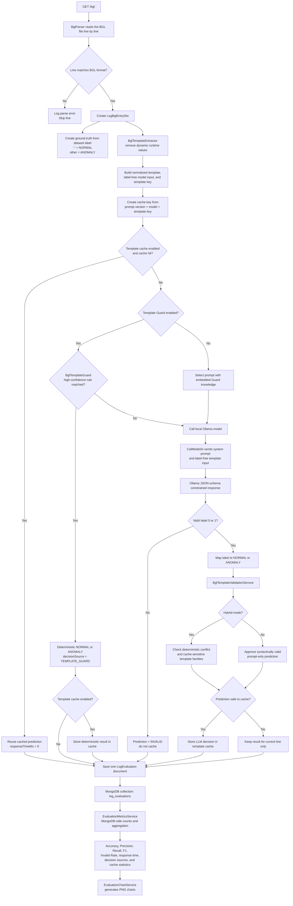

# LLMLogAnalyzer

**Template-Aware Anomaly Detection for Blue Gene/L System Logs Using Large Language Models**

LLMLogAnalyzer is a Spring Boot research project developed for a Master's thesis. It studies binary anomaly detection in the Blue Gene/L (BGL) system-log dataset using a local Large Language Model, prompt engineering, normalized log templates, deterministic rules, cache validation, and template-level result reuse.

The implementation supports two experimental modes:

1. **Hybrid mode:** deterministic template guard followed by LLM fallback.
2. **Prompt-only mode:** the deterministic guard is disabled and its domain rules are embedded in the LLM prompt.

The current repository configuration uses **prompt-only mode with template caching enabled**.

---

## Research Objective

The project evaluates whether a pretrained LLM can classify BGL log entries without model fine-tuning while preserving the meaning of the original message and reducing repeated inference.

The main objectives are to:

- classify each BGL entry as normal or anomalous;
- prevent the dataset label from reaching the model;
- normalize runtime-specific values into reusable templates;
- avoid keyword-only decisions based on terms such as `FATAL`, `error`, or `interrupt`;
- compare a hybrid deterministic/LLM pipeline with a prompt-only pipeline;
- reduce inference cost through template-level caching;
- prevent unsafe or invalid LLM decisions from entering the cache;
- store auditable line-level results in MongoDB;
- calculate classification and runtime metrics without loading the full dataset into JVM memory;
- generate thesis-ready evaluation charts.

---

## Dataset and Classification Task

The project uses the **Blue Gene/L (BGL)** system-log dataset.

Each original BGL row begins with a dataset label:

| Dataset label | Ground truth |
|---|---|
| `-` | Normal / non-alert |
| Any other value | Anomaly / alert |

The parser reads the label to create the ground truth, but the label is not included in `modelInput`. The LLM receives only label-free metadata, a normalized message template, and a label-free example.

The binary prediction format is:

```text
0 = normal
1 = anomaly
```

Ollama is required to return one strict JSON object:

```json
{"label":"0"}
```

or:

```json
{"label":"1"}
```

A missing, malformed, or unsupported response becomes `INVALID`. Invalid predictions are stored and reported separately; they are never treated as normal results or inserted into the template cache.

---

## End-to-End Log Classification Flow


```mermaid
flowchart TD
    A["GET /bgl"] --> B["BglParser reads the BGL file line by line"]
    B --> C{"Line matches BGL format?"}

    C -- "No" --> C1["Log parse error<br/>Skip line"]
    C -- "Yes" --> D["Create LogBglEntryDto"]

    D --> E["Create ground truth from dataset label<br/>'-' = NORMAL<br/>other = ANOMALY"]
    D --> F["BglTemplateExtractor<br/>remove dynamic runtime values"]
    F --> G["Build normalized template,<br/>label-free model input, and template key"]

    G --> H["Create cache key from<br/>prompt version + model + template key"]
    H --> I{"Template cache enabled<br/>and cache hit?"}

    I -- "Yes" --> J["Reuse cached prediction<br/>responseTimeMs = 0"]
    J --> Z["Save one LogEvaluation document"]

    I -- "No" --> K{"Template Guard enabled?"}

    K -- "Yes" --> L{"BglTemplateGuard<br/>high-confidence rule matched?"}
    L -- "Yes" --> M["Deterministic NORMAL or ANOMALY<br/>decisionSource = TEMPLATE_GUARD"]
    M --> N{"Template cache enabled?"}
    N -- "Yes" --> N1["Store deterministic result in cache"]
    N -- "No" --> Z
    N1 --> Z

    L -- "No" --> O["Call local Ollama model"]
    K -- "No" --> P["Select prompt with embedded Guard knowledge"]
    P --> O

    O --> Q["CallModelAi sends system prompt<br/>and label-free template input"]
    Q --> R["Ollama JSON-schema constrained response"]
    R --> S{"Valid label 0 or 1?"}

    S -- "No" --> T["Prediction = INVALID<br/>do not cache"]
    T --> Z

    S -- "Yes" --> U["Map label to NORMAL or ANOMALY"]
    U --> V["BglTemplateValidationService"]

    V --> W{"Hybrid mode?"}
    W -- "Yes" --> W1["Check deterministic conflict<br/>and cache-sensitive template families"]
    W -- "No" --> W2["Approve syntactically valid<br/>prompt-only prediction"]

    W1 --> X{"Prediction safe to cache?"}
    W2 --> X

    X -- "Yes" --> Y["Store LLM decision in template cache"]
    X -- "No" --> Y1["Keep result for current line only"]
    Y --> Z
    Y1 --> Z

    Z --> ZA["MongoDB collection: log_evaluations"]
    ZA --> ZB["EvaluationMetricsService<br/>MongoDB-side counts and aggregation"]
    ZB --> ZC["Accuracy, Precision, Recall, F1,<br/>Invalid Rate, response time,<br/>decision sources, and cache statistics"]
    ZC --> ZD["EvaluationChartService<br/>generates PNG charts"]
```

### What happens at each stage

#### 1. Parsing

`BglParser` reads the configured dataset with `Files.lines(...)` and applies a regular expression to extract:

- dataset label;
- timestamp and date;
- locations;
- category;
- component;
- severity;
- message.

Rows that do not match the expected BGL structure are logged and skipped.

#### 2. Ground-truth separation

The original label is converted to `ClassificationResult.NORMAL` or `ClassificationResult.ANOMALY`. It remains available for evaluation but is excluded from the LLM input.

#### 3. Template extraction

`BglTemplateExtractor` replaces dynamic values such as:

- node and unit identifiers;
- IP addresses;
- hexadecimal values;
- dates;
- paths;
- floating-point and integer values.

Semantic distinctions are preserved where the numeric value changes the meaning. For example, selected status values and exit codes become:

```text
<ZERO>
<NON_ZERO>
```

This prevents a zero-status diagnostic line from being merged with a non-zero failure line.

Example:

```text
ciod: LOGIN chdir(/p/gb1/stella/RAPTOR/2183) failed: Input/output error
```

becomes:

```text
ciod: LOGIN chdir(<PATH>) failed: Input/output error
```

#### 4. Template cache lookup

The cache is an in-memory `ConcurrentHashMap`. The effective cache key contains:

```text
prompt version + model name + normalized template key
```

The template key can optionally include category, component, and severity metadata.

A cache hit reuses the original prediction without calling the model. MongoDB still receives one `LogEvaluation` document for every raw log entry, so evaluation remains line-level.

#### 5. Optional deterministic Guard

When `bgl.classification.template-guard.enabled=true`, `BglTemplateGuard` handles only narrow, high-confidence BGL patterns.

It distinguishes primary failures from diagnostic or corrected fields. Examples include:

- machine-check interrupt versus machine-check register fields;
- data-storage interrupt versus zero-status data-store diagnostics;
- node-map allocation failures versus user/environment errors;
- kernel or control-stream failures;
- corrected errors and standalone register dumps.

Unmatched or ambiguous templates are delegated to the LLM.

#### 6. LLM inference

`CallModelAi` sends a chat request to the configured Ollama endpoint. The request includes:

- the selected system prompt;
- the label-free template and example;
- a JSON schema that permits only `"0"` or `"1"`;
- deterministic inference options from `application.properties`.

The response parser extracts the JSON object and rejects unsupported labels or malformed output.

#### 7. Cache validation

`BglTemplateValidationService` controls whether a direct LLM result may be reused.

In **hybrid mode**, it can:

- reject a result that conflicts with a deterministic Guard rule;
- avoid caching unsupported machine-check, parity, status-register, or similar cache-sensitive templates;
- approve predictions with no deterministic conflict.

In **prompt-only mode**, the deterministic Guard is not consulted. A syntactically valid binary LLM prediction is approved for caching.

A suspicious prediction is still saved and evaluated for the current line, but it is not propagated to later matching templates.

#### 8. Persistence and evaluation

Every processed row is stored in MongoDB collection:

```text
log_evaluations
```

The stored document includes:

- original log and dataset label;
- label-free model input;
- normalized template and template key;
- real and predicted classifications;
- decision source;
- cache source and cache-hit state;
- matched deterministic rule;
- validation status and reason;
- prompt experiment and version;
- raw model output;
- response time;
- correctness and creation time.

---

## Experimental Modes

The active mode is controlled by:

```properties
bgl.classification.template-guard.enabled=false
```

| Setting | Experiment | Decision pipeline | LLM prompt |
|---|---|---|---|
| `true` | Hybrid Guard + LLM | Cache → Guard → LLM fallback | Template-aware final prompt |
| `false` | Prompt-only | Cache → LLM | Template-aware prompt plus embedded Guard knowledge |

### Hybrid mode

```properties
bgl.classification.template-guard.enabled=true
```

- high-confidence templates may be classified without an LLM call;
- ambiguous templates are sent to Ollama;
- LLM predictions are checked against Guard knowledge before caching;
- decision sources can be `TEMPLATE_GUARD`, `LLM`, or `TEMPLATE_CACHE`.

### Prompt-only mode

```properties
bgl.classification.template-guard.enabled=false
```

- `BglTemplateGuard.classify(...)` is skipped during classification;
- deterministic Guard rules are appended to the selected prompt;
- valid LLM results may enter the cache without Guard comparison;
- direct decisions are produced by `LLM` and repeated templates by `TEMPLATE_CACHE`.

This is the mode currently configured in the repository.

---

## Decision Sources

Each stored prediction has one main source:

| Source | Meaning |
|---|---|
| `LLM` | The template was sent directly to Ollama |
| `TEMPLATE_GUARD` | A deterministic high-confidence rule produced the result |
| `TEMPLATE_CACHE` | A previous validated template-level result was reused |

For cache hits, `cacheSource` records whether the original cached decision came from the LLM or the deterministic Guard.

---

## Evaluation Metrics

`EvaluationMetricsService` calculates metrics through MongoDB-side counts and aggregations.

The main metrics are:

```text
Accuracy  = (TP + TN) / valid predictions
Precision = TP / (TP + FP)
Recall    = TP / (TP + FN)
F1        = 2 × Precision × Recall / (Precision + Recall)
Invalid Rate = invalid outputs / all evaluated records
```

It also calculates:

- TP, TN, FP, and FN;
- total, valid, and invalid record counts;
- average response time across all lines;
- average response time for direct LLM calls;
- direct LLM, Guard, and cache decision counts;
- cache hits split by original source;
- unique cacheable template counts.

Accuracy excludes `INVALID` predictions from its denominator. Invalid output behavior is reported through the separate invalid-rate metric.

---

## Result Charts

The chart profile generates the following files:

- `final_metrics.png`
- `final_confusion_matrix.png`
- `final_invalid_rate.png`
- `final_response_time.png`
- `final_decision_sources.png`
- `final_template_cache_size.png`
- `final_direct_metrics.png`
- `final_direct_confusion_matrix.png`

The repository keeps generated images in the README without hard-coding experiment values. Regenerate the charts after each clean run so the visual results remain synchronized with MongoDB.

### Main Evaluation Metrics


### Confusion Matrix


### Invalid Output Rate


### Average Response Time


### Decision Sources


### Template Cache Size by Source


---

## Project Structure

```text
src/main/java/masoud/dabbaghi/llmloganalyzer
│
├── config
│   ├── ChartRunner.java
│   ├── OpenAIConfig.java
│   └── WebClientConfiguration.java
│
├── controller
│   └── BglController.java
│
├── dto
│   └── LogBglEntryDto.java
│
├── entity
│   ├── AiModel.java
│   └── LogType.java
│
├── evaluation
│   ├── BglDecisionSource.java
│   ├── ClassificationResult.java
│   ├── EvaluationMetrics.java
│   ├── EvaluationMetricsService.java
│   ├── LogEvaluation.java
│   ├── LogEvaluationRepository.java
│   └── LogEvaluationService.java
│
├── service
│   ├── BglCachedClassification.java
│   ├── BglParser.java
│   ├── BglTemplate.java
│   ├── BglTemplateClassificationCache.java
│   ├── BglTemplateExtractor.java
│   ├── BglTemplateGuard.java
│   ├── BglTemplateValidationResult.java
│   ├── BglTemplateValidationService.java
│   ├── CallModelAi.java
│   ├── ModelClassificationResponse.java
│   ├── PromptExperiment.java
│   ├── PromptGenerator.java
│   └── PromptSpec.java
│
├── visualization
│   └── EvaluationChartService.java
│
└── LlmLogAnalyzerApplication.java
```

---

## Main Components

### `BglParser`

Coordinates the complete dataset run:

- reads and parses each line;
- creates ground truth;
- extracts the normalized template;
- checks the cache;
- optionally applies the Guard;
- calls Ollama when required;
- validates cache eligibility;
- persists one evaluation document per line;
- logs progress and decision-source statistics.

### `BglTemplateExtractor`

Builds the normalized template, cache key, and label-free model input while preserving semantically important zero/non-zero distinctions.

### `BglTemplateClassificationCache`

Stores cacheable template decisions in memory for the lifetime of the running JVM. Restarting the application resets this cache.

### `BglTemplateGuard`

Contains conservative deterministic rules for exact or narrow BGL patterns. It is active only in hybrid mode.

### `PromptGenerator`

Contains two prompt configurations:

- template-aware hybrid prompt;
- prompt-only prompt with embedded deterministic knowledge.

### `CallModelAi`

Creates the Ollama request, applies the structured JSON output schema, sends the request through `WebClient`, and validates the returned label.

### `BglTemplateValidationService`

Prevents invalid or suspicious LLM results from becoming reusable template decisions.

### `EvaluationMetricsService`

Calculates large-run metrics with MongoDB-side queries and aggregations instead of loading all evaluation rows into memory.

### `EvaluationChartService`

Creates thesis-ready PNG charts using JFreeChart.

---

## Technologies

- Java 17
- Spring Boot 3.5
- Maven
- Spring Web MVC
- Spring WebFlux `WebClient`
- Spring Data MongoDB
- MongoDB
- Ollama
- JFreeChart
- Lombok
- JUnit 5

The BGL execution path currently uses Ollama. OpenAI-related properties and the empty `OpenAIConfig` class remain in the project but are not part of the active `/bgl` classification flow.

---

## Prerequisites

Install and run:

- Java 17 or newer;
- Maven or the included Maven wrapper;
- MongoDB;
- Ollama;
- a compatible local model such as `qwen2.5:7b-instruct`;
- the BGL dataset.

---

## Configuration

Edit:

```text
src/main/resources/application.properties
```

Example:

```properties
# Application
spring.application.name=LLMLogAnalyzer
server.port=8081

# MongoDB
spring.data.mongodb.host=127.0.0.1
spring.data.mongodb.port=27017
spring.data.mongodb.database=LLMLogAnalyzer

# Ollama
model.api.ollama.url=http://localhost:11434/api/chat
model.api.ollama.model-name=qwen2.5:7b-instruct
model.api.ollama.model-digest=845dbda0ea48ed749caafd9e6037047aa19acfcfd82e704d7ca97d631a0b697e

model.api.ollama.options.temperature=0
model.api.ollama.options.top-p=0.1
model.api.ollama.options.repeat-penalty=1.0
model.api.ollama.options.seed=42
model.api.ollama.options.num-ctx=2048
model.api.ollama.options.num-predict=8

# BGL pipeline
bgl.classification.template-cache.enabled=true
bgl.classification.template-guard.enabled=false
bgl.classification.cache-only-validated-llm-results=true
bgl.classification.template-key.include-metadata=true
bgl.persistence.batch-size=1000

# Dataset
bgl.location=/absolute/path/to/BGL.log

# Charts
charts.data.scope=latest-run
charts.run-id=
charts.fail-on-empty=true
charts.output-dir=.

# Reproducibility
experiment.git-commit=UNRECORDED
```

### Configuration flags

| Property | Purpose |
|---|---|
| `template-cache.enabled` | Reuses cacheable decisions for repeated templates |
| `template-guard.enabled` | Selects hybrid or prompt-only mode |
| `cache-only-validated-llm-results` | Prevents unapproved LLM results from entering the cache |
| `template-key.include-metadata` | Adds category, component, and severity to the template key |
| `charts.data.scope` | Selects `latest-run`, `current`, `latest`, `auto`, or `all` records for chart generation |
| `charts.run-id` | Selects one explicit run UUID and overrides `charts.data.scope` |

---

## Running an Evaluation

### 1. Clone the repository

```bash
git clone https://github.com/masoudd2159/LLMLogAnalyzer.git
cd LLMLogAnalyzer
```

### 2. Start MongoDB

```bash
mongod
```

### 3. Start Ollama

```bash
ollama pull qwen2.5:7b-instruct
ollama serve
```

### 4. Prepare a reproducible experiment

Record the exact Ollama model digest and Git commit in `application.properties` before a final run. Each request receives a new `runId`, its cache is cleared automatically, and its execution metadata is stored in `bgl_experiment_runs`. Existing `log_evaluations` may therefore remain in MongoDB without being mixed into run-scoped metrics.

### 5. Run the application

Using Maven:

```bash
mvn spring-boot:run
```

or the Maven wrapper:

```bash
./mvnw spring-boot:run
```

On Windows:

```bat
mvnw.cmd spring-boot:run
```

### 6. Start BGL processing

```bash
curl http://localhost:8081/bgl
```

The endpoint processes the configured BGL file synchronously. Progress is logged periodically, including direct LLM calls, cache hits, direct Guard decisions, non-cached results, and current cache size.

---

## Generating Charts

Run the chart profile after an evaluation:

```bash
mvn spring-boot:run -Dspring-boot.run.profiles=charts
```

### Chart scope

The default `charts.data.scope=latest-run` selects the latest completed run and never combines separate executions. To reproduce charts for a specific archived run, set `charts.run-id` to its UUID. Prompt selection uses the same `template-guard.enabled` flag as the classifier.

---

## Reproducible Experiment Checklist

Before comparing two models or modes:

1. use the same BGL file;
2. set `model.api.ollama.model-digest` and `experiment.git-commit`;
3. verify that MongoDB and Ollama are available;
4. keep normalization and cache-key settings fixed;
5. change only the intended independent variable;
6. record the model name, prompt version, Guard mode, and inference options;
7. execute the complete dataset;
8. generate charts from that run's `runId` (or `latest-run`);
9. archive MongoDB results or export them before starting the next experiment.

For comparing hybrid and prompt-only modes, use separate clean runs:

```text
Run A: template-guard.enabled=true
Run B: template-guard.enabled=false
```

---

## Interpretation and Limitations

- The current task is primarily **individual log/template classification**, not temporal sequence anomaly detection.
- Template caching improves runtime but can amplify an incorrect first decision; validation reduces this risk but cannot eliminate it.
- The cache is in memory and is not restored from MongoDB after application restart.
- Prompt-only mode embeds deterministic knowledge in the prompt, so it is not equivalent to a generic zero-shot baseline.
- Results from papers should not be compared as direct percentage improvements unless dataset split, classification unit, sequence construction, and metric implementation are aligned.
- Severe-looking words are not sufficient evidence of an anomaly in BGL because many diagnostic and corrected lines contain such terms.
- Current automated tests only verify that the Spring context loads; additional unit tests for parsing, normalization, Guard rules, response parsing, and cache validation are recommended.

---

## Literature Comparison Strategy

The final thesis comparison should clearly distinguish among:

- prompt-based LLM methods without fine-tuning;
- trained sequential log models;
- supervised or instruction-tuned LLM approaches;
- this project's template-aware cached classification pipeline.

For every referenced method, report:

- dataset and subset;
- classification unit;
- model;
- training or fine-tuning requirements;
- prompt strategy;
- sequence/window construction;
- Precision, Recall, F1, and Accuracy when available;
- runtime or number of model calls when available.

The README intentionally avoids hard-coded result values. Generated charts and MongoDB records are the source of truth for each experiment.

---

## Author

**Masoud Dabbaghi**

Master's thesis project:

> Improving Anomaly Detection in System Logs Based on Large Language Models Using Prompt Engineering
