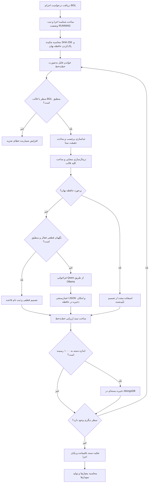

# فصل سوم: روش پژوهش و اجرای تحقیق

> **یادداشت تدوین:** این متن بر پایهٔ ساختار فصل سوم نمونه، کد واقعی پروژه، تنظیمات ثبت‌شدهٔ اجرا و منابع علمی فصل دوم نوشته شده است. شماره‌های ارجاع [1] تا [29] با فهرست منابع فصل دوم هماهنگ‌اند و منابع [30] و [31] در این فصل افزوده شده‌اند. معادل انگلیسی اصطلاحات تخصصی در نخستین کاربرد به‌صورت پاورقی Markdown آمده است تا هنگام انتقال متن به Word بتوان آن‌ها را به پاورقی استاندارد تبدیل کرد.

## ۳-۱ مقدمه

در این فصل، روش پژوهش و مراحل اجرای چارچوب پیشنهادی برای تشخیص ناهنجاری در لاگ‌های سیستمی به‌صورت گام‌به‌گام تشریح می‌شود. مسئلهٔ اصلی پژوهش، طبقه‌بندی دودویی هر رکورد از مجموعه‌دادهٔ Blue Gene/L و تعیین عادی یا ناهنجار بودن آن با استفاده از یک مدل زبانی بزرگ[^large-language-model] است؛ با این تفاوت که مدل زبانی در این پژوهش آموزش مجدد یا تنظیم دقیق[^fine-tuning] نمی‌شود و دانش موردنیاز از طریق مهندسی پرامپت[^prompt-engineering]، بازنمایی معنایی قالب لاگ و مجموعه‌ای محدود از قواعد قطعی به سامانه منتقل می‌گردد. این انتخاب با مسیر پژوهش‌های جدیدی هم‌راستا است که توانایی مدل‌های زبانی را برای تحلیل مستقیم یا کم‌نمونهٔ لاگ بررسی کرده‌اند [1، 2، 6، 12]، اما در این پژوهش مسئلهٔ هزینهٔ استنتاج، ممیزی‌پذیری تصمیم و جلوگیری از انتشار یک تصمیم اشتباه در میان لاگ‌های تکراری نیز به‌طور صریح وارد طراحی شده است.

چارچوب پیاده‌سازی‌شده یک خط لولهٔ چندمرحله‌ای است. در ابتدای خط لوله، هر سطر خام بدون بارگذاری کل فایل در حافظه خوانده و ساختار آن استخراج می‌شود. برچسب موجود در مجموعه‌داده فقط برای تولید حقیقت مبنا[^ground-truth] کنار گذاشته می‌شود و هرگز در ورودی مدل قرار نمی‌گیرد. سپس بخش‌های متغیر پیام مانند نشانی گره، مسیر فایل، نشانی شبکه، مقادیر شانزدهی و اعداد اجرایی با جانشین‌های معنایی جایگزین می‌شوند تا از هر پیام، یک قالب قابل استفادهٔ مجدد ساخته شود. تصمیم طبقه‌بندی ابتدا از حافظهٔ نهان قالب[^template-cache] جست‌وجو می‌شود؛ اگر نتیجه‌ای وجود نداشته باشد، نگهبان قطعی محافظه‌کار[^template-guard] تنها الگوهای بسیار مشخص و پر اطمینان را بررسی می‌کند و موارد مبهم را به مدل زبانی محلی می‌سپارد. پاسخ مدل نیز به یک ساختار JSON[^json] دودویی محدود و پیش از ورود به حافظهٔ نهان اعتبارسنجی می‌شود.

یکی از ملاحظات اساسی پژوهش آن است که کیفیت طبقه‌بندی با صرفه‌جویی محاسباتی مخلوط نشود. اگر یک قالب فقط یک‌بار توسط مدل طبقه‌بندی و سپس برای هزاران سطر تکراری استفاده شود، معیارهای نهایی در سطح سطر می‌توانند بسیار مناسب باشند، در حالی که کیفیت «تصمیم نخست» دربارهٔ قالب‌ها ضعیف‌تر باشد. به همین دلیل، افزون بر معیارهای خط‌به‌خط، معیارهای تصمیم مستقیم نیز محاسبه می‌شوند؛ یعنی رکوردهایی که نتیجهٔ آن‌ها از حافظهٔ نهان آمده است از یک تحلیل مکمل کنار گذاشته می‌شوند. همچنین پاسخ نامعتبر مدل به‌صورت کلاس مستقل `INVALID` ثبت می‌شود و به‌طور پنهان عادی یا ناهنجار فرض نمی‌گردد. این تفکیک، رفتار واقعی سامانه را شفاف‌تر می‌کند و با نیازهای ارزیابی عملیاتی مدل‌های زبانی در حوزهٔ عملیات فناوری اطلاعات هم‌خوان است [20، 25].

این فصل ابتدا نوع پژوهش، پرسش‌های عملیاتی و متغیرهای آزمایش را مشخص می‌کند. سپس مجموعه‌داده، واحد تحلیل، ساختار سطرها و سیاست جلوگیری از نشت برچسب توضیح داده می‌شود. در ادامه، معماری روش پیشنهادی و نقش هر مؤلفه شامل تجزیه‌کننده، استخراج‌کنندهٔ قالب، نگهبان قطعی، مولد پرامپت، مدل زبانی، اعتبارسنج حافظهٔ نهان، پایگاه داده و زیرسامانهٔ ارزیابی تشریح می‌شود. پس از آن، محیط سخت‌افزاری و نرم‌افزاری، تنظیمات استنتاج، سناریوهای آزمایش، مراحل اجرای برنامه، معیارهای سنجش، روش کنترل متغیرها، آزمون‌های صحت پیاده‌سازی، ملاحظات بازتولیدپذیری و تهدیدهای اعتبار پژوهش ارائه می‌گردد. در پایان نیز جمع‌بندی فصل آمده است.

## ۳-۲ طرح و روش پژوهش

### ۳-۲-۱ نوع پژوهش

پژوهش حاضر از نظر هدف، کاربردی ـ توسعه‌ای است؛ زیرا علاوه بر بررسی یک پرسش علمی دربارهٔ کارایی مهندسی پرامپت در تشخیص ناهنجاری لاگ، به طراحی و پیاده‌سازی یک سامانهٔ قابل اجرا منجر شده است. خروجی پژوهش تنها یک مدل مفهومی نیست، بلکه نرم‌افزاری است که فایل واقعی BGL را می‌خواند، هر سطر را طبقه‌بندی می‌کند، شواهد تصمیم را در پایگاه داده نگه می‌دارد، معیارها را محاسبه می‌کند و نمودارهای قابل استفاده در گزارش پژوهش تولید می‌نماید.

از نظر ماهیت، پژوهش کمی، آزمایشگاهی و مقایسه‌ای است. بخش کمی از شمارش خروجی‌های درست و نادرست، زمان پاسخ، نرخ استفاده از حافظهٔ نهان و توان عملیاتی[^throughput] به دست می‌آید. بخش آزمایشگاهی به اجرای کنترل‌شدهٔ مدل محلی و نرم‌افزار روی مجموعه‌دادهٔ عمومی مربوط است. جنبهٔ مقایسه‌ای نیز از مقایسهٔ دو شیوهٔ اعمال دانش دامنه حاصل می‌شود: در شیوهٔ نخست، قواعد قطعی بیرون از مدل و پیش از فراخوانی آن اجرا می‌شوند؛ در شیوهٔ دوم، همان دانش به متن پرامپت منتقل می‌شود و نگهبان قطعی از مسیر تصمیم حذف می‌گردد. این مقایسه یک مطالعهٔ حذف مؤلفه[^ablation-study] محسوب می‌شود، زیرا با ثابت نگه داشتن داده، مدل، تنظیمات تولید، قواعد نرمال‌سازی و سیاست حافظهٔ نهان، محل اعمال دانش دامنه تغییر می‌کند.

روش گردآوری داده ترکیبی از روش کتابخانه‌ای و آزمایشگاهی است. در بخش کتابخانه‌ای، مقالات مرتبط با تشخیص ناهنجاری لاگ، تجزیهٔ لاگ، تحلیل مبتنی بر پرامپت، مدل‌های زبانی محلی و ارزیابی عملیات فناوری اطلاعات مطالعه شده‌اند [1، 2، 4، 6، 12، 14، 20، 21، 23 تا 25، 27، 28]. در بخش آزمایشگاهی، دادهٔ واقعی و برچسب‌دار BGL از مجموعهٔ Loghub به‌صورت خط‌به‌خط پردازش شده است [30، 31]. هیچ پرسشنامه، مصاحبه یا نمونهٔ انسانی در این پژوهش وجود ندارد و جامعهٔ آماری عملیاتی آن را رکوردهای لاگ تشکیل می‌دهند.

### ۳-۲-۲ پرسش‌های اجرایی پژوهش

برای تبدیل اهداف کلی پژوهش به مراحل قابل اندازه‌گیری، پرسش‌های اجرایی زیر در طراحی آزمایش لحاظ شده‌اند:

1. آیا مدل `qwen2.5:7b-instruct` بدون تغییر وزن‌ها و صرفاً با پرامپت ساختاریافته می‌تواند رکوردهای BGL را در سطح سطر به عادی و ناهنجار تفکیک کند؟
2. آیا انتقال بخشی از دانش دامنه از پرامپت به یک نگهبان قطعی محافظه‌کار، کیفیت تصمیم و قابلیت ممیزی مسیر طبقه‌بندی را بهبود می‌دهد؟
3. آیا استخراج قالب معنایی و استفادهٔ مجدد از تصمیم‌های اعتبارسنجی‌شده می‌تواند تعداد فراخوانی‌های مستقیم مدل و زمان کل اجرا را کاهش دهد؟
4. آیا جداسازی برچسب مجموعه‌داده از ورودی مدل، همراه با ثبت کامل فرادادهٔ اجرا، امکان یک ارزیابی بدون نشت و بازتولیدپذیر را فراهم می‌کند؟
5. خطاهای مدل و حافظهٔ نهان در کدام خانواده‌های پیام بیشتر رخ می‌دهند و چگونه می‌توان اثر تکثیر یک تصمیم نادرست را محدود کرد؟

جدول ۳-۱ رابطهٔ میان پرسش‌ها، متغیرها و شواهد ثبت‌شده را نشان می‌دهد.

**جدول ۳-۱ ـ نگاشت پرسش‌های پژوهش به متغیرها و شواهد اندازه‌گیری**

| پرسش | متغیر یا مؤلفهٔ مورد بررسی | شاخص‌های اصلی | شواهد ذخیره‌شده |
|---|---|---|---|
| کارایی طبقه‌بندی بدون تنظیم دقیق | خروجی مدل زبانی محلی | صحت، دقت مثبت، فراخوانی، امتیاز F1، نرخ خروجی نامعتبر | برچسب واقعی، برچسب پیش‌بینی، خروجی خام مدل |
| اثر محل اعمال دانش دامنه | حالت ترکیبی در برابر حالت فقط‌پرامپت | ماتریس درهم‌ریختگی، معیارهای تصمیم مستقیم، منبع تصمیم | نسخهٔ پرامپت، حالت نگهبان، قاعدهٔ منطبق‌شده |
| اثر قالب و حافظهٔ نهان | فعال یا غیرفعال بودن استفادهٔ مجدد | نرخ برخورد، تعداد فراخوانی مدل، اندازهٔ نهایی حافظه، زمان اجرا | کلید قالب، منبع اصلی تصمیم، وضعیت برخورد |
| جلوگیری از نشت و بازتولیدپذیری | جداسازی برچسب و ثبت فراداده | خطای تجزیه، هش داده، شناسهٔ اجرا، نسخهٔ مدل و پرامپت | سند اجرای آزمایش و سند خط‌به‌خط |
| تحلیل خطا | نوع خطا و خانوادهٔ پیام | FP، FN، `INVALID`، نتیجهٔ غیرقابل ذخیره | قالب نرمال‌شده، دلیل اعتبارسنجی، مؤلفه و شدت |

### ۳-۲-۳ واحد تحلیل و واحد تصمیم

واحد تحلیل اصلی در این پژوهش «یک سطر لاگ» است. بنابراین هر سطر با برچسب مرجع خود مقایسه و یک سند مستقل برای آن در MongoDB ذخیره می‌شود. این انتخاب با برخی پژوهش‌های توالی‌محور مانند DeepLog تفاوت دارد؛ در آن روش‌ها، پنجره‌ای از رخدادها یا توالی کلیدهای لاگ به‌عنوان واحد تحلیل به کار می‌رود [21]. همچنین بعضی پژوهش‌ها BGL را در سطح گره، پنجرهٔ زمانی یا دنباله ارزیابی کرده‌اند و در نتیجه، اعداد آن‌ها بدون همسان‌سازی پروتکل قابل مقایسهٔ مستقیم با ارزیابی خط‌به‌خط نیستند [2، 4، 19، 21].

در کنار واحد تحلیل، مفهوم «واحد تصمیم مستقیم» نیز تعریف شده است. تصمیم مستقیم زمانی ایجاد می‌شود که یک قالب برای نخستین بار توسط نگهبان قطعی یا مدل زبانی طبقه‌بندی شود. تکرارهای بعدی همان قالب، در صورت تأیید قابلیت ذخیره، از حافظهٔ نهان پاسخ می‌گیرند. بنابراین یک تصمیم مستقیم ممکن است بر تعداد زیادی واحد تحلیل اثر بگذارد. گزارش هم‌زمان معیارهای خط‌به‌خط و تصمیم مستقیم باعث می‌شود کیفیت تشخیص و اثر تکثیر قالب‌های پرتکرار جداگانه دیده شوند.

### ۳-۲-۴ متغیرهای پژوهش

متغیر مستقل اصلی، روش اعمال دانش دامنه است. این متغیر دو سطح دارد:

- **روش ترکیبی:** حافظهٔ نهان، سپس نگهبان قطعی و در نهایت مدل زبانی به‌عنوان مسیر جایگزین؛
- **روش فقط‌پرامپت:** حافظهٔ نهان و سپس مدل زبانی، در حالی که قواعد نگهبان در متن پرامپت جاسازی شده‌اند.

فعال یا غیرفعال بودن حافظهٔ نهان نیز یک متغیر مستقل مکمل برای تحلیل هزینه است. در مقایسهٔ اصلی روش ترکیبی و فقط‌پرامپت، حافظهٔ نهان در هر دو حالت فعال نگه داشته می‌شود تا فقط محل اعمال دانش دامنه تغییر کند. آزمایش حذف حافظهٔ نهان باید جداگانه و با همان نسخهٔ مدل و پرامپت اجرا شود.

متغیرهای وابسته شامل صحت طبقه‌بندی، دقت مثبت[^precision]، فراخوانی[^recall]، امتیاز F1، نرخ پاسخ نامعتبر، میانگین زمان پاسخ مستقیم مدل، زمان کل پردازش، توان عملیاتی، تعداد فراخوانی مستقیم مدل، تعداد تصمیم نگهبان، تعداد برخورد حافظه و تعداد قالب‌های یکتای قابل ذخیره است.

متغیرهای کنترلی عبارت‌اند از فایل و ترتیب سطرهای داده، نگاشت برچسب، مدل و چکیدهٔ آن، نسخهٔ پرامپت، دما، احتمال تجمعی، جریمهٔ تکرار، بذر تصادفی، طول زمینه، سقف توکن خروجی، قواعد نرمال‌سازی، ترکیب فیلدهای کلید قالب، اندازهٔ دستهٔ ذخیره‌سازی و سخت‌افزار اجرا. ثبت این متغیرها ضروری است، زیرا تغییر هر یک می‌تواند هم کیفیت تصمیم و هم زمان اجرا را تحت تأثیر قرار دهد.

## ۳-۳ مجموعه‌داده و آماده‌سازی داده‌ها

### ۳-۳-۱ معرفی مجموعه‌دادهٔ BGL

مجموعه‌دادهٔ BGL شامل لاگ‌های گردآوری‌شده از ابررایانهٔ Blue Gene/L در آزمایشگاه ملی لارنس لیورمور است. این سامانه دارای ۱۳۱٬۰۷۲ پردازنده و ۳۲٬۷۶۸ گیگابایت حافظه بوده و لاگ منتشرشده، پیام‌های هشدار و غیرهشدار را در یک بازهٔ زمانی طولانی در بر می‌گیرد [31]. نسخهٔ ارائه‌شده در Loghub شامل ۴٬۷۴۷٬۹۶۳ سطر، حدود ۷۰۸٫۷۶ مگابایت داده و نزدیک به ۲۱۴٫۷ روز رخداد است [30]. عمومی و واقعی بودن داده، وجود برچسب در خود سطر و استفادهٔ گسترده از BGL در پژوهش‌های پیشین، آن را به گزینه‌ای مناسب برای ارزیابی روش پیشنهادی تبدیل کرده است [2، 4، 19، 21، 30].

در ستون نخست هر سطر، علامت خط تیره (`-`) بیانگر پیام غیرهشدار است و هر مقدار دیگر به‌عنوان هشدار در نظر گرفته می‌شود [30، 31]. در این پژوهش، برای تعریف مسئلهٔ دودویی، پیام غیرهشدار به کلاس عادی (`0`) و سایر برچسب‌ها به کلاس ناهنجار (`1`) نگاشت می‌شوند. این نگاشت، نگاشت رسمی مورد استفادهٔ فایل است؛ بااین‌حال باید توجه داشت که «هشدار» در BGL همیشه معادل خرابی قطعی در معنای عمومی نیست. بعضی سطرها فیلدهای تشخیصی، مقادیر ثبات یا رخدادهای اصلاح‌شده‌اند که واژگان شدیدی مانند `FATAL`، `parity error` یا `machine check` دارند. همین ویژگی، طبقه‌بندی صرفاً مبتنی بر کلیدواژه را نامطمئن می‌کند و دلیل اصلی استفاده از قواعد معنایی و تمایز میان «رخداد اصلی» و «فیلد تشخیصی» است.

### ۳-۳-۲ ساختار یک رکورد

تجزیه‌کنندهٔ پروژه دو الگوی ساختاری را برای پذیرش سطرهای BGL پشتیبانی می‌کند. الگوی نخست حالت رایج را پوشش می‌دهد که در آن محل اول و محل دوم یکسان‌اند. الگوی دوم برای سطرهای معتبری است که محل دوم را ندارند یا متن آن‌ها آسیب دیده و شامل فاصله است. در الگوی جایگزین، فیلدهای `RAS` یا `NULL` به‌عنوان نقطهٔ اتکا به کار می‌روند تا جابه‌جایی ستون‌ها رخ ندهد.

**جدول ۳-۲ ـ فیلدهای استخراج‌شده از هر سطر BGL**

| ردیف | فیلد | نقش در پژوهش | ارسال به مدل |
|---:|---|---|---|
| ۱ | برچسب مجموعه‌داده | ساخت حقیقت مبنا | خیر |
| ۲ | زمان عددی | ردیابی رخداد خام | خیر |
| ۳ | تاریخ | فرادادهٔ رخداد | خیر |
| ۴ | محل اول | فراداده و نگهداری سطر خام | به‌صورت مستقیم خیر |
| ۵ | تاریخ و زمان کامل | ردیابی رخداد خام | خیر |
| ۶ | محل دوم | کنترل ساختار سطر | خیر |
| ۷ | دسته | بخشی از ورودی و کلید قالب | بله |
| ۸ | مؤلفه | بخشی از ورودی و کلید قالب | بله |
| ۹ | شدت | بخشی از ورودی و کلید قالب، نه تصمیم قطعی | بله |
| ۱۰ | متن پیام | منبع اصلی استخراج معنا و قالب | بله، پس از حذف برچسب و نرمال‌سازی |

اگر سطر با هیچ‌یک از دو الگو منطبق نشود، نتیجه‌ای برای آن ساخته نمی‌شود و شمارندهٔ خطای تجزیه افزایش می‌یابد. تعداد سطرهای خام، سطرهای پذیرفته‌شده و سطرهای ردشده در سند اجرای آزمایش ثبت می‌شود. این تفکیک مانع آن است که کاهش پنهان حجم داده، به‌اشتباه به‌عنوان عملکرد مناسب طبقه‌بند گزارش شود.

### ۳-۳-۳ جداسازی برچسب و جلوگیری از نشت داده

مهم‌ترین کنترل اعتبار داخلی در مرحلهٔ آماده‌سازی، جلوگیری از نشت برچسب[^label-leakage] است. سطر خام BGL با برچسب آغاز می‌شود؛ بنابراین ارسال مستقیم آن به مدل می‌تواند پاسخ را به‌صورت مصنوعی ساده کند. در پیاده‌سازی، تابع تجزیه ابتدا برچسب را از سایر فیلدها جدا می‌کند. شاخهٔ برچسب فقط برای ساخت `NORMAL` یا `ANOMALY` و ارزیابی نهایی استفاده می‌شود. شاخهٔ ورودی مدل شامل دسته، مؤلفه، شدت، قالب نرمال‌شده و یک نمونهٔ عینی بدون برچسب است.

سطر خام برای ممیزی در پایگاه داده باقی می‌ماند، اما به تابع فراخوانی مدل تحویل داده نمی‌شود. به بیان دیگر، نگهداری داده برای ردیابی با استفاده از داده برای استنتاج تفکیک شده است. این مرز در طراحی کلاس `LogEvaluation` نیز مستند شده است: فیلد `log` سطر خام را نگه می‌دارد و فیلد `modelInput` ورودی پاک‌شدهٔ مدل را ثبت می‌کند. در تحلیل خطا می‌توان این دو را کنار هم دید، اما مدل فقط فیلد دوم را دریافت می‌کند.

### ۳-۳-۴ استخراج قالب معنایی

مقادیر زمان اجرا در لاگ‌ها موجب می‌شوند دو پیام با معنای یکسان از نظر رشته‌ای متفاوت به نظر برسند. پژوهش‌های تجزیهٔ لاگ، جداسازی بخش ثابت پیام از پارامترها را گام مهم آماده‌سازی می‌دانند [23، 24]. همچنین روش‌های مبتنی بر مدل زبانی نشان داده‌اند که حفظ معنای متن در کنار کاهش نویز ساختاری می‌تواند برای تشخیص مفید باشد [4، 6]. بر همین اساس، استخراج‌کنندهٔ قالب در این پژوهش مقادیر متغیر را با جانشین‌های نوع‌دار عوض می‌کند، ولی متن ثابت و دلالت عملیاتی پیام را نگه می‌دارد.

**جدول ۳-۳ ـ قواعد اصلی نرمال‌سازی پیام**

| نوع مقدار متغیر | جانشین | نمونهٔ پیش از نرمال‌سازی | نمونهٔ پس از نرمال‌سازی |
|---|---|---|---|
| شناسهٔ گره | `<NODE>` | `R02-M1-N0-J12` | `<NODE>` |
| شناسهٔ واحد | `<UNIT>` | `J03-U11` | `<UNIT>` |
| نشانی اینترنتی | `<IP>` | `10.1.2.3` | `<IP>` |
| مقدار شانزدهی دارای پیشوند | `<HEX>` | `0x0000A0FF` | `<HEX>` |
| تاریخ و زمان | `<DATE>` | `2005-06-14-10.22.31.123` | `<DATE>` |
| مسیر فایل | `<PATH>` | `/p/gb1/app/run42` | `<PATH>` |
| عدد عمومی | `<NUM>` | `2183` | `<NUM>` |
| وضعیت صفر معنادار | `<ZERO>` | `exit code 0` | `exit code <ZERO>` |
| وضعیت غیرصفر معنادار | `<NON_ZERO>` | `exit code 127` | `exit code <NON_ZERO>` |

ترتیب اعمال قواعد اهمیت دارد. برای نمونه، مسیر فایل پیش از اعداد عمومی جایگزین می‌شود تا شماره‌های داخل مسیر باعث چندپارگی قالب نشوند. همچنین کد خروج و برخی وضعیت‌های انتهایی پیش از جایگزینی عمومی اعداد بررسی می‌شوند. اگر مقدار وضعیت صفر باشد، نشانگر `<ZERO>` و در غیر این صورت `<NON_ZERO>` قرار می‌گیرد. علت این است که در بسیاری از پیام‌های BGL، تفاوت صفر و غیرصفر بخشی از معناست. ادغام این دو مقدار در `<NUM>` می‌تواند یک اجرای موفق را با شکست سرویس در یک قالب قرار دهد.

برای نمونه، پیام زیر:

```text
ciod: LOGIN chdir(/p/gb1/stella/RAPTOR/2183) failed: Input/output error
```

به قالب زیر تبدیل می‌شود:

```text
ciod: LOGIN chdir(<PATH>) failed: Input/output error
```

در این مثال، مسیر خاص برنامه برای تصمیم ناهنجاری اهمیت ندارد، اما عبارت `Input/output error` حفظ می‌شود؛ زیرا بیانگر شکست عملیاتی است. در مقابل، پیام `exit code 0` و `exit code 1` نباید در یک قالب ادغام شوند. این رویکرد را می‌توان «نرمال‌سازی حساس به معنا» نامید؛ زیرا هدف آن فقط کاهش تعداد رشته‌های یکتا نیست، بلکه حفظ مرزهای تصمیم نیز هست.

### ۳-۳-۵ ساخت کلید قالب

خروجی نرمال‌سازی هم برای ورودی مدل و هم برای حافظهٔ نهان استفاده می‌شود. کلید پایهٔ قالب از دسته، مؤلفه، شدت و پیام نرمال‌شده ساخته می‌شود:

\[
K_{template}=\operatorname{lower}(C \;\Vert\; P \;\Vert\; S \;\Vert\; M_n)
\]

که در آن، \(C\) دسته، \(P\) مؤلفه، \(S\) شدت، \(M_n\) پیام نرمال‌شده و \(\Vert\) عمل الحاق است. برای جلوگیری از استفادهٔ نتیجهٔ یک مدل یا پرامپت در اجرای متفاوت، نسخهٔ پرامپت و نام مدل نیز به کلید مؤثر افزوده می‌شوند:

\[
K_{effective}=V_{prompt}\;\Vert\;N_{model}\;\Vert\;K_{template}
\]

در نتیجه، تغییر پرامپت یا مدل به‌طور خودکار فضای کلید متفاوتی ایجاد می‌کند. گزینهٔ پیکربندی `include-metadata` تعیین می‌کند که دسته، مؤلفه و شدت در کلید وارد شوند یا فقط پیام نرمال‌شده مبنا باشد. در اجرای اصلی، این گزینه فعال است؛ زیرا یک متن مشابه ممکن است در مؤلفه یا سطح رخداد متفاوت، معنای عملیاتی دیگری داشته باشد.

### ۳-۳-۶ مجموعه‌های مورد استفاده در مراحل توسعه و ارزیابی

اجرای پژوهش در دو مقیاس تعریف شده است. مجموعهٔ `BGL_2k.log` با ۲٬۰۰۰ سطر برای کنترل سریع خط لوله، آزمون خطا و مقایسهٔ همسان روش‌ها به کار می‌رود. فایل کامل `BGL.log` شامل ۴٬۷۴۷٬۹۶۳ سطر برای سنجش مقیاس‌پذیری و رفتار حافظهٔ نهان استفاده می‌شود. چکیدهٔ SHA-256[^sha256] هر فایل پیش از طبقه‌بندی محاسبه و در سند اجرا ذخیره می‌گردد تا مشخص باشد نتایج دقیقاً از کدام نسخهٔ داده حاصل شده‌اند.

یک اجرای پایلوت روی مجموعهٔ ۲٬۰۰۰ سطری برای یافتن خطاهای پیاده‌سازی و اصلاح قواعد انجام شده است. چون مشاهدهٔ برچسب‌ها و خطاهای این اجرا به افزودن یک تمایز جدید در پرامپت و نگهبان منجر شد، نتایج آن نباید به‌عنوان ارزیابی نهایی گزارش شوند. پس از انجماد نسخهٔ جدید، مقایسهٔ نهایی باید در اجرای تازه و با شناسهٔ مستقل انجام شود. این جداسازی توسعه از ارزیابی، از خوش‌بینی ناشی از تنظیم روش بر اساس دادهٔ آزمون جلوگیری می‌کند.

اجرای مقیاس بزرگ روی فایل کامل نیز تا مرز ۳٬۶۴۵٬۰۰۰ رکورد پیش رفت و پس از یک دستهٔ کامل ۱٬۰۰۰ رکوردی به‌صورت دستی متوقف شد. ازاین‌رو، این اجرا در فصل نتایج باید «ارزیابی جزئی مقیاس‌پذیری» نامیده شود، نه اجرای کامل مجموعه‌داده. شمار دقیق رکوردهای پردازش‌شده و وضعیت توقف در گزارش اجرای پژوهش حفظ شده است.

## ۳-۴ معماری چارچوب پیشنهادی

### ۳-۴-۱ نمای کلی معماری

چارچوب پیشنهادی از هشت بخش اصلی تشکیل شده است: کنترل‌کنندهٔ اجرا، خواننده و تجزیه‌کنندهٔ BGL، استخراج‌کنندهٔ قالب، حافظهٔ نهان، نگهبان قطعی، مدل زبانی محلی، اعتبارسنج تصمیم و زیرسامانهٔ ثبت و ارزیابی. جریان کلی در شکل ۳-۱ نشان داده شده است.



**شکل ۳-۱ ـ جریان کلی پردازش، تصمیم‌گیری، ذخیره‌سازی و ارزیابی**

این معماری دو اصل را دنبال می‌کند. اصل نخست، جداسازی نقش‌هاست؛ هر مؤلفه مسئول یک مرحلهٔ مشخص است و می‌توان آن را مستقل آزمود. اصل دوم، حفظ ردپای تصمیم است؛ برای هر سطر معلوم است که تصمیم از مدل، نگهبان یا حافظهٔ نهان آمده، کدام نسخهٔ پرامپت استفاده شده، پاسخ مدل معتبر بوده یا نه و ذخیرهٔ آن در حافظه با چه دلیلی تأیید یا رد شده است.

### ۳-۴-۲ مؤلفه‌های نرم‌افزاری

**جدول ۳-۴ ـ اجزای اصلی نرم‌افزار و مسئولیت آن‌ها**

| مؤلفه | مسئولیت |
|---|---|
| `BglController` | ارائهٔ نقطهٔ آغاز همگام `GET /bgl` برای اجرای آزمایش |
| `BglParser` | هدایت خواندن فایل، تجزیه، طبقه‌بندی، شمارنده‌ها، ذخیرهٔ دسته‌ای و خاتمهٔ اجرا |
| `BglTemplateExtractor` | نرمال‌سازی معنایی پیام، تولید ورودی مدل و کلید قالب |
| `BglTemplateClassificationCache` | نگهداری تصمیم‌های قابل استفادهٔ مجدد در محدودهٔ یک اجرا |
| `BglTemplateGuard` | اعمال قواعد محدود و پر اطمینان BGL پیش از مدل زبانی |
| `PromptGenerator` | انتخاب پرامپت متناسب با حالت آزمایش و ثبت نسخهٔ آن |
| `CallModelAi` | ارسال درخواست به Ollama، محدودسازی خروجی و تفسیر برچسب |
| `BglTemplateValidationService` | تعیین امکان انتشار یک تصمیم مدل از طریق حافظهٔ نهان |
| `LogEvaluationRepository` | ذخیرهٔ یک سند برای هر سطر پذیرفته‌شده |
| `BglExperimentRunRepository` | ذخیرهٔ هویت، تنظیمات، زمان و شمارنده‌های هر اجرا |
| `EvaluationMetricsService` | شمارش و تجمیع معیارها در سمت MongoDB |
| `EvaluationChartService` | تولید نمودارهای نهایی و معیارهای تصمیم مستقیم |

ساختار ماژولار فوق باعث می‌شود تغییر یک بخش، مانند نسخهٔ پرامپت یا قواعد قالب، بدون بازنویسی کل خط لوله انجام شود. همچنین آزمون واحد برای تجزیه، نرمال‌سازی، قواعد نگهبان، اعتبارسنجی و حافظهٔ نهان قابل تعریف است.

## ۳-۵ تشریح فنی روش پیشنهادی

### ۳-۵-۱ آغاز و مرزبندی یک اجرای آزمایش

با فراخوانی مسیر `/bgl`، یک شناسهٔ یکتا برای اجرا ساخته می‌شود. پیش از پردازش نخستین سطر، سندی با وضعیت `RUNNING` در مجموعهٔ `bgl_experiment_runs` ذخیره می‌گردد. این سند شامل حالت طبقه‌بندی، متن و نسخهٔ پرامپت، مسیر مطلق داده، نام و چکیدهٔ مدل، تنظیمات استنتاج، وضعیت حافظه و نگهبان، نسخهٔ جاوا، سیستم‌عامل، تعداد پردازنده‌های منطقی و سقف حافظهٔ ماشین مجازی جاوا است.

سپس حافظهٔ نهان درون‌حافظه‌ای پاک می‌شود. این مرحله ضروری است، زیرا اگر برنامه بدون راه‌اندازی مجدد چند درخواست دریافت کند، اجرای جدید نباید از تصمیم‌های اجرای قبلی استفاده کند. پس از آن، چکیدهٔ فایل داده محاسبه و مدت محاسبهٔ چکیده جدا از زمان طبقه‌بندی ثبت می‌شود. با این تفکیک، زمان کنترل تمامیت فایل در اندازه‌گیری سرعت روش وارد نمی‌شود.

### ۳-۵-۲ خواندن جریانی و تجزیهٔ سطرها

فایل با سازوکار جریانی[^stream-processing] خوانده می‌شود و کل مجموعه‌داده به حافظه انتقال نمی‌یابد. این تصمیم برای فایل چندمیلیونی BGL اهمیت دارد و مصرف حافظه را تقریباً مستقل از تعداد کل سطرها نگه می‌دارد. برای هر سطر، شمارندهٔ سطر خام افزایش می‌یابد و دو الگوی منظم به‌ترتیب بررسی می‌شوند. اگر سطر معتبر باشد، یک شیء داده شامل برچسب، زمان، مکان، دسته، مؤلفه، شدت و متن پیام ساخته می‌شود. اگر معتبر نباشد، فقط شمارندهٔ خطای تجزیه افزایش می‌یابد و پردازش سطر بعد ادامه پیدا می‌کند.

تجزیهٔ ساختاری به معنای استفاده از برچسب در تصمیم مدل نیست. برچسب بلافاصله به شاخهٔ ارزیابی می‌رود و متن پاک‌شده به شاخهٔ استنتاج منتقل می‌شود. در نتیجه، حتی اگر سطر خام برای ممیزی ذخیره گردد، مدل به نشانهٔ صریح کلاس دسترسی ندارد.

### ۳-۵-۳ ساخت حقیقت مبنا

تابع حقیقت مبنا نگاشت زیر را اعمال می‌کند:

\[
y_i=
\begin{cases}
0 & \text{اگر برچسب سطر } - \text{ باشد}\\
1 & \text{در غیر این صورت}
\end{cases}
\]

در پیاده‌سازی، مقدار صفر به `NORMAL` و مقدار یک به `ANOMALY` تبدیل می‌شود. خروجی مدل نیز به همین دو کلاس نگاشت می‌گردد. تنها تفاوت آن است که پاسخ تهی، شکست ارتباط با Ollama، JSON خراب یا برچسبی غیر از صفر و یک، کلاس سوم `INVALID` را می‌سازد. بنابراین خطای ارتباطی یا نحوی با یک تصمیم معتبر اشتباه گرفته نمی‌شود.

### ۳-۵-۴ طراحی ورودی مدل

ورودی مدل دو بخش دارد. بخش نخست قالب نرمال‌شده را همراه با دسته، مؤلفه و شدت نشان می‌دهد. بخش دوم یک نمونهٔ عینی از همان سطر را بدون برچسب مجموعه‌داده ارائه می‌کند. ساختار مفهومی ورودی به شکل زیر است:

```text
BGL_TEMPLATE:
category=<CATEGORY>
component=<COMPONENT>
severity=<SEVERITY>
message_template=<NORMALIZED_MESSAGE>

EXAMPLE_WITHOUT_DATASET_LABEL:
category=<CATEGORY>
component=<COMPONENT>
severity=<SEVERITY>
message=<RAW_MESSAGE_WITHOUT_LABEL>
```

وجود قالب به مدل کمک می‌کند اجزای ثابت و معنایی را ببیند و وجود نمونهٔ عینی مانع از آن می‌شود که جزئیات مهمی که در نرمال‌سازی حذف شده‌اند کاملاً از دست بروند. بااین‌حال، چون کلید حافظه بر قالب نرمال‌شده بنا شده است، نرمال‌سازی بیش‌ازحد می‌تواند نمونه‌های ناهم‌معنا را ادغام کند. به همین دلیل تمایز صفر و غیرصفر و استفاده از فراداده در کلید حفظ شده است.

### ۳-۵-۵ طراحی پرامپت

پرامپت اصلی، مدل را به‌عنوان یک طبقه‌بند دودویی محافظه‌کار برای لاگ‌های BGL تعریف می‌کند. خروجی مجاز فقط `{"label":"0"}` یا `{"label":"1"}` است. تعریف کلاس‌ها در پرامپت به‌صورت زیر انجام می‌شود:

- کلاس صفر: پیام عادی، تشخیصی، اصلاح‌شده، قابل تلاش مجدد، مربوط به برنامهٔ کاربر یا محیط اجرا؛
- کلاس یک: شواهد صریح از خرابی در مؤلفهٔ سیستم، گره، هسته، زمان اجرا، ذخیره‌سازی، شبکه، نقطهٔ اتصال، کانال کنترل یا کار.

در طراحی پرامپت تأکید می‌شود که شدت و واژه‌های ظاهراً هشداردهنده به‌تنهایی دلیل ناهنجاری نیستند. این قاعده برای BGL حیاتی است؛ زیرا برخی گزارش‌های تشخیصی با سطح `FATAL` فقط مقدار یک ثبات یا پرچم را نمایش می‌دهند. مدل باید ابتدا تشخیص دهد سطر جاری یک رخداد اصلی است یا فیلد ادامهٔ گزارش. سپس وجود اثر عملیاتی صریح را بررسی کند و در پایان تمایزهای شناخته‌شدهٔ BGL را اعمال نماید.

نمونه‌هایی از تمایزهای مهم در پرامپت عبارت‌اند از:

- `data storage interrupt` ناهنجار است، اما `data store interrupt caused by dcbf ... 0` یک فیلد تشخیصی عادی است؛
- `machine check interrupt` رخداد ناهنجار است، اما `machine check status register` یا `machine check enable` صرفاً گزارش وضعیت است؛
- خطای ساخت نقشهٔ گره با `Cannot allocate memory` یا `No child processes` ناهنجار، ولی با `Bad file descriptor` یا `Block device required` طبق برچسب‌های BGL عادی است؛
- شکست ورود به مسیر با `Input/output error` ناهنجار، ولی `No such file or directory` به‌عنوان مسئلهٔ برنامه یا محیط کاربر عادی در نظر گرفته می‌شود؛
- خطای «شناسایی و اصلاح‌شده» عادی است، مگر آنکه همان سطر یک شکست اصلاح‌نشدهٔ جداگانه را نیز گزارش کند.

نسخهٔ پرامپت اصلی روش ترکیبی `BGL_TEMPLATE_AWARE_FINAL_V18_NODE_MAP_BLOCK_DEVICE` است. در حالت فقط‌پرامپت، مجموعهٔ قواعد نگهبان به انتهای همین دستور افزوده و نسخهٔ `BGL_PROMPT_ONLY_GUARD_RULES_EMBEDDED_V2_NODE_MAP_BLOCK_DEVICE` انتخاب می‌شود. نسخه‌گذاری باعث می‌شود نتیجهٔ پرامپت‌های متفاوت در پایگاه داده و حافظهٔ نهان با هم مخلوط نشوند.

پژوهش‌های LogPrompt و LogGPT نشان داده‌اند که دستوردهی هدفمند می‌تواند بدون آموزش درون‌دامنه‌ای گسترده برای تحلیل لاگ به کار رود [1، 2، 6]. RAGLog نیز استفاده از دانش بازیابی‌شده را برای جبران کمبود نمونه‌های ناهنجار بررسی کرده است [12]. تفاوت روش حاضر آن است که دانش دامنه به دو صورت قابل مقایسه ـ در پرامپت و در نگهبان بیرونی ـ پیاده شده و خروجی برای پردازش خودکار به یک قرارداد دودویی ساختاری محدود می‌شود.

### ۳-۵-۶ نگهبان قطعی محافظه‌کار

نگهبان قطعی مجموعه‌ای از قواعد محدود و نام‌گذاری‌شده است. هدف آن جایگزینی مدل زبانی یا طبقه‌بندی همهٔ پیام‌ها نیست؛ بلکه فقط الگوهایی را می‌پذیرد که تفسیر آن‌ها در دادهٔ BGL روشن و احتمال تعمیم نادرست پایین است. ترتیب بررسی قواعد نیز اهمیت دارد: قواعد صریح ناهنجاری پیش از قواعد تشخیصی عادی اجرا می‌شوند تا وجود یک عبارت عادی در یک رخداد شکست، نتیجه را نپوشاند.

خانواده‌های اصلی تصمیم نگهبان شامل موارد زیر است:

1. رخدادهای صریح ناهنجار مانند وقفهٔ ذخیره‌سازی، وقفهٔ وارسی ماشین، خطای TLB داده، خاتمهٔ هسته، شکستن لولهٔ ارتباطی، بسته‌شدن کانال کنترل، شکست Lustre و کد خروج غیرصفر؛
2. فیلدهای تشخیصی عادی مانند ثبات وضعیت وارسی ماشین، پرچم فعال‌سازی، مقادیر خطای parity، نشانی‌های ثبت‌شده و دنباله‌های ثبات؛
3. خطاهای اصلاح‌شده یا در حال تلاش مجدد؛
4. خطاهای برنامه و محیط کاربر مانند نبود فایل، مجوز ناکافی، قالب اجرایی نامعتبر یا بزرگ بودن تصویر برنامه؛
5. تمایزهای خاص ساخت نقشهٔ گره که در پایلوت توسعه شناسایی شده‌اند.

هر تصمیم نگهبان نام قاعدهٔ منطبق‌شده را ذخیره می‌کند؛ برای نمونه `ANOMALY_NON_ZERO_EXIT_CODE` یا `NORMAL_MACHINE_CHECK_STATUS_REGISTER`. در نتیجه، تبیین تصمیم به‌صورت ساختاری و قابل جست‌وجو در دسترس است. اگر هیچ قاعده‌ای منطبق نشود، نگهبان تصمیمی تولید نمی‌کند و پیام به مدل زبانی می‌رود. این امتناع از تصمیم‌گیری برای موارد مبهم، بخش مهم محافظه‌کار بودن نگهبان است.

### ۳-۵-۷ استنتاج محلی با Qwen و Ollama

مدل مورد استفاده `qwen2.5:7b-instruct` است. این مدل از خانوادهٔ Qwen2.5 و برای پیروی از دستور تنظیم شده است. گزارش فنی Qwen2.5 بهبود داده‌های پیش‌آموزش، آموزش پس از پیش‌آموزش و توانایی پیروی از دستور و پردازش دادهٔ ساختاری را برای این خانواده شرح می‌دهد [28]. نسخهٔ محلی مورد استفاده ۷٫۶ میلیارد پارامتر و کوانتیزاسیون[^quantization] `Q4_K_M` دارد و از طریق Ollama اجرا می‌شود. انتخاب استنتاج محلی باعث می‌شود متن لاگ از سامانه خارج نشود و وابستگی به یک خدمت تجاری و تغییرپذیر کاهش یابد.

فراخوانی مدل با درخواست `POST` به مسیر محلی `/api/chat` انجام می‌شود. درخواست شامل نام مدل، پیام سیستمی، پیام کاربر، گزینهٔ `stream=false`، طرح‌وارهٔ JSON و تنظیمات تولید است. Ollama اجازه می‌دهد طرح‌وارهٔ JSON در فیلد `format` قرار گیرد و پاسخ به ساختار مشخص محدود شود [29]. طرح‌وارهٔ مورد استفاده فقط یک شیء با فیلد اجباری `label` و مقادیر مجاز رشته‌ای `0` و `1` را می‌پذیرد و ویژگی اضافی را مجاز نمی‌داند.

**جدول ۳-۵ ـ تنظیمات استنتاج مدل در اجرای اصلی**

| پارامتر | مقدار | دلیل انتخاب |
|---|---:|---|
| دما | `0` | کاهش تصادفی بودن پاسخ |
| احتمال تجمعی | `0.1` | محدود کردن انتخاب توکن به ناحیهٔ محتمل‌تر |
| جریمهٔ تکرار | `1.0` | جلوگیری از تغییر اضافی در توزیع پاسخ کوتاه |
| بذر | `42` | افزایش تکرارپذیری در شرایط ثابت |
| طول زمینه | `4096` | پوشش پرامپت و پیام بدون استفاده از کل ظرفیت مدل |
| سقف توکن خروجی | `8` | کافی برای JSON دودویی و جلوگیری از متن اضافی |
| جریان پاسخ | `false` | دریافت یک پاسخ کامل و ساده‌سازی اندازه‌گیری زمان |

هرچند دمای صفر و بذر ثابت تغییرپذیری را کاهش می‌دهند، تکرارپذیری مطلق فقط در صورت ثابت بودن نسخهٔ مدل، چکیدهٔ وزن‌ها، نسخهٔ Ollama، سخت‌افزار و سایر تنظیمات قابل انتظار است. به همین دلیل نام مدل و چکیدهٔ ثبت‌شدهٔ آن در سند اجرا نگهداری می‌شود.

### ۳-۵-۸ پردازش و اعتبارسنجی خروجی مدل

پس از دریافت پاسخ، متن داخل فیلد `message.content` خوانده می‌شود. اگر پاسخ تهی باشد، ارتباط با خدمت شکست بخورد یا محتوا خالی باشد، نتیجه نامعتبر است. در حالت عادی، نخستین شیء JSON موجود در متن جدا و تجزیه می‌شود. فقط برچسب `0` یا `1` معتبر است. هر مقدار دیگر به `INVALID` تبدیل می‌شود.

خروجی ساختاری[^structured-output] دو فایده دارد. نخست، ابهام‌هایی مانند `normal`، `probably anomaly` یا توضیح طولانی از مسیر خودکار حذف می‌شوند. دوم، نرخ پاسخ نامعتبر قابل اندازه‌گیری است. اگر پاسخ نامعتبر به‌طور پیش‌فرض عادی در نظر گرفته می‌شد، صحت ظاهری در دادهٔ نامتوازن افزایش می‌یافت. در روش حاضر، این موارد نه وارد مخرج صحت معتبر می‌شوند و نه پنهان می‌مانند؛ تعداد و نرخ آن‌ها جداگانه گزارش می‌گردد.

### ۳-۵-۹ اعتبارسنجی پیش از حافظهٔ نهان

ذخیرهٔ نخستین تصمیم مدل برای یک قالب می‌تواند هزینه را به‌شدت کاهش دهد، اما همان سازوکار قادر است یک خطای منفرد را در هزاران سطر تکرار کند. برای کنترل این خطر، هر نتیجهٔ مستقیم مدل پیش از ورود به حافظه اعتبارسنجی می‌شود.

در حالت ترکیبی، اگر نگهبان برای پیام خام یا قالب نرمال‌شده نتیجه‌ای داشته باشد، برچسب مدل با آن مقایسه می‌شود. اختلاف میان دو نتیجه، وضعیت `SUSPICIOUS` ایجاد می‌کند و تصمیم فقط برای همان سطر ذخیره می‌شود. افزون بر این، خانواده‌های حساس شامل عبارت‌هایی مانند `machine check`، `parity error`، `uncorrectable error`، `status register` و `capture first` در صورتی که قاعدهٔ قطعی پشتیبان نداشته باشند، پس از یک مشاهده در حافظه ذخیره نمی‌شوند. پیام خالی نیز قابل ذخیره نیست.

در حالت فقط‌پرامپت، نگهبان باید واقعاً از آزمایش حذف شود؛ بنابراین اعتبارسنج تصمیم مدل را با قواعد نگهبان مقایسه نمی‌کند. هر خروجی نحوی معتبر صفر یا یک، به‌جز پیام خالی، قابل تأیید است. این تفاوت ضروری است، زیرا استفادهٔ پنهانی از نگهبان در مرحلهٔ اعتبارسنجی، مقایسهٔ فقط‌پرامپت را مخدوش می‌کرد.

### ۳-۵-۱۰ حافظهٔ نهان سطح قالب

حافظهٔ نهان با یک نگاشت هم‌روند در حافظهٔ برنامه پیاده‌سازی شده است. هر ورودی شامل کلید مؤثر، قالب نرمال‌شده، برچسب، منبع اصلی تصمیم، نام قاعده در صورت وجود، نسخهٔ پرامپت، خروجی خام و وضعیت اعتبارسنجی است. نخستین تصمیم قابل ذخیره با عملیات `putIfAbsent` وارد می‌شود؛ بنابراین در صورت اجرای هم‌روند نیز مقدار موجود بدون کنترل جایگزین نمی‌گردد.

در برخورد حافظه، مدل و نگهبان فراخوانی نمی‌شوند، زمان پاسخ سطر صفر ثبت و منبع تصمیم `TEMPLATE_CACHE` تعیین می‌شود. بااین‌حال منبع اصلی تصمیم در فیلد جداگانه باقی می‌ماند تا مشخص باشد نتیجهٔ ذخیره‌شده ابتدا توسط مدل یا نگهبان ساخته شده است. برای هر سطر تکراری نیز یک سند مستقل نوشته می‌شود؛ بنابراین معیارهای نهایی همچنان در سطح سطر محاسبه می‌شوند.

نرخ برخورد حافظه از رابطهٔ زیر محاسبه می‌شود:

\[
CacheHitRate=\frac{N_{cache}}{N_{evaluated}}
\]

و کاهش نسبی فراخوانی مدل را می‌توان به‌صورت زیر بیان کرد:

\[
LLMCallRatio=\frac{N_{LLM}}{N_{evaluated}}
\]

این دو شاخص باید در کنار کیفیت تصمیم مستقیم گزارش شوند. نرخ برخورد بالا به‌تنهایی نشانهٔ یک طبقه‌بند بهتر نیست؛ ممکن است فقط تکرار زیاد قالب‌ها را نشان دهد.

### ۳-۵-۱۱ ثبت خط‌به‌خط نتایج

برای هر سطر پذیرفته‌شده، یک سند `LogEvaluation` ساخته می‌شود. این سند هم دادهٔ لازم برای محاسبهٔ معیارها و هم شواهد لازم برای ممیزی را نگه می‌دارد. نگهداری همهٔ این فیلدها ممکن است نسبت به ذخیرهٔ صرف برچسب فضای بیشتری مصرف کند، اما امکان بازسازی مسیر تصمیم و تحلیل ریشهٔ خطا را فراهم می‌سازد.

فیلدهای اصلی سند خط‌به‌خط عبارت‌اند از:

- شناسهٔ اجرا برای جلوگیری از آمیختگی رکوردهای اجرای مختلف؛
- سطر خام و برچسب اصلی مجموعه‌داده؛
- ورودی بدون برچسب مدل و قالب نرمال‌شده؛
- حقیقت مبنا و نتیجهٔ نهایی شامل عادی، ناهنجار یا نامعتبر؛
- منبع تصمیم شامل مدل، نگهبان یا حافظهٔ نهان؛
- منبع اصلی نتیجه در صورت برخورد حافظه؛
- نام قاعدهٔ قطعی در صورت انطباق؛
- کلید قالب، وضعیت برخورد و قابلیت ذخیره؛
- وضعیت و دلیل اعتبارسنجی؛
- نوع آزمایش و نسخهٔ پرامپت؛
- خروجی خام مدل، اعتبار نحوی، درست یا نادرست بودن تصمیم و زمان پاسخ.

در تصمیم نگهبان و حافظهٔ نهان، زمان پاسخ مدل صفر ثبت می‌شود؛ زیرا در همان سطر فراخوانی مدل انجام نشده است. برای برخورد حافظه، خروجی ثبت‌شده با پیشوند منبع اصلی مشخص می‌شود. این سیاست اجازه می‌دهد میانگین زمان کل سطرها و میانگین زمان فراخوانی مستقیم مدل جداگانه محاسبه شوند.

### ۳-۵-۱۲ ذخیره‌سازی دسته‌ای در MongoDB

اگر هر یک از میلیون‌ها سطر با یک درخواست مستقل در پایگاه داده نوشته شود، سربار رفت‌وبرگشت شبکه و ثبت دیسک می‌تواند بخش بزرگی از زمان کل را مصرف کند. به همین دلیل، اسناد در یک بافر موقت جمع و پس از رسیدن تعداد آن‌ها به ۱٬۰۰۰، با عملیات `saveAll` ذخیره می‌شوند. در پایان عادی یا هنگام بروز خطا نیز باقیماندهٔ بافر تخلیه می‌گردد.

اندازهٔ دسته[^batch-write] یک مصالحه است. دستهٔ کوچک‌تر داده را سریع‌تر پایدار می‌کند ولی تعداد عملیات پایگاه داده را افزایش می‌دهد. دستهٔ بزرگ‌تر سربار نوشتن را کاهش می‌دهد ولی در صورت توقف ناگهانی، تعداد بیشتری رکورد در حافظهٔ برنامه باقی می‌ماند. مقدار ۱٬۰۰۰ در این پژوهش هم با شمارندهٔ گزارش پیشرفت هماهنگ است و هم امکان توقف در مرز کامل دسته را فراهم می‌کند.

دو مجموعه در MongoDB استفاده می‌شود:

1. مجموعهٔ `log_evaluations` برای اسناد خط‌به‌خط؛
2. مجموعهٔ `bgl_experiment_runs` برای فراداده و شمارنده‌های سطح اجرا.

روی شناسهٔ اجرا در مجموعهٔ نخست نمایه ایجاد شده است تا انتخاب تمام نتایج یک اجرا کارآمد باشد. در مجموعهٔ دوم نیز ترکیب وضعیت و زمان پایان برای یافتن آخرین اجرای کامل نمایه‌گذاری شده است. این مرزبندی مانع محاسبهٔ ناخواستهٔ معیارها روی ترکیبی از پرامپت‌ها یا اجراهای مختلف می‌شود.

### ۳-۵-۱۳ خاتمهٔ عادی و مدیریت شکست

پس از پایان فایل، بافر باقی‌مانده نوشته و سند اجرا با وضعیت `COMPLETED` به‌روزرسانی می‌شود. شمار سطرهای خام، تجزیه‌شده و ردشده، تعداد فراخوانی مدل، تعداد برخورد حافظه، تعداد تصمیم نگهبان، اندازهٔ نهایی حافظه، مدت پردازش و توان عملیاتی در همان سند ذخیره می‌شوند. توان عملیاتی از رابطهٔ زیر به دست می‌آید:

\[
Throughput=\frac{N_{parsed}}{T_{processing}/1000}
\]

که در آن \(N_{parsed}\) تعداد سطرهای پذیرفته‌شده و \(T_{processing}\) زمان پردازش بر حسب میلی‌ثانیه است.

اگر خطای خواندن فایل یا خطای زمان اجرا رخ دهد، برنامه تلاش می‌کند بافر باقی‌مانده را ذخیره کند و سپس وضعیت اجرا را `FAILED` قرار دهد. نوع استثنا و پیام خطا نیز ثبت می‌شود. در اجرای مقیاس‌پذیری که با درخواست کاربر متوقف شد، آخرین درخواست ناتمام مدل در مجموعهٔ نتایج وارد نشد و توقف پس از یک مرز کامل دسته ثبت گردید. این رفتار برای آن مهم است که شمار اسناد پایگاه داده با شمار رکوردهای گزارش‌شده سازگار بماند.

### ۳-۵-۱۴ محاسبهٔ معیارها در سمت پایگاه داده

محاسبهٔ معیارها از طریق شمارش و تجمیع MongoDB انجام می‌شود و لازم نیست میلیون‌ها سند در حافظهٔ ماشین مجازی جاوا بارگذاری شوند. خدمت ارزیابی ابتدا دامنهٔ انتخاب را با شناسهٔ اجرا، نوع لاگ، مدل و نسخهٔ پرامپت محدود می‌کند. سپس شمار کل، نامعتبر، TP، TN، FP و FN را با پرس‌وجوهای مستقل به دست می‌آورد. میانگین زمان پاسخ نیز با عملگر تجمیع محاسبه می‌شود.

برای تولید نمودار، حالت پیش‌فرض `latest-run` آخرین اجرای کامل را انتخاب می‌کند. همچنین می‌توان یک شناسهٔ صریح در تنظیم `charts.run-id` قرار داد. شناسهٔ صریح بر سایر حالت‌ها اولویت دارد و گزینهٔ `charts.fail-on-empty=true` از تولید نمودارهای صفر و گمراه‌کننده برای انتخابی بدون داده جلوگیری می‌کند.

### ۳-۵-۱۵ تولید خروجی‌های تصویری

زیرسامانهٔ مصورسازی با استفاده از JFreeChart نمودارهای PNG با ابعاد ۱۴۰۰ در ۸۲۰ پیکسل تولید می‌کند. خروجی‌ها شامل معیارهای اصلی، ماتریس درهم‌ریختگی، نرخ پاسخ نامعتبر، زمان پاسخ، سهم منابع تصمیم، اندازهٔ حافظهٔ نهان و دو نمودار جداگانه برای معیارها و ماتریس تصمیم‌های مستقیم است. اعداد نمودار از پایگاه داده به دست می‌آیند و فایل‌های تصویر صرفاً خروجی مشتق‌شده‌اند؛ بنابراین سندهای اجرا و ارزیابی منبع اصلی حقیقت باقی می‌مانند.

## ۳-۶ محیط پیاده‌سازی و ابزارهای مورد استفاده

### ۳-۶-۱ محیط سخت‌افزاری

پیاده‌سازی و اجرای محلی پژوهش روی یک رایانهٔ شخصی انجام شده است. مشخصات مشاهده‌شدهٔ سامانهٔ اجرای فعلی در جدول ۳-۶ آمده است. ثبت مشخصات سخت‌افزاری اهمیت دارد، زیرا زمان پاسخ مدل محلی به حافظهٔ گرافیکی، حافظهٔ اصلی، توان پردازنده و نحوهٔ بارگذاری وزن‌ها وابسته است.

**جدول ۳-۶ ـ مشخصات سخت‌افزاری محیط اجرا**

| مؤلفه | مشخصات |
|---|---|
| رایانه | ASUS ROG Strix G513QC |
| پردازنده | AMD Ryzen 7 5800H، دارای ۸ هسته و ۱۶ پردازندهٔ منطقی |
| حافظهٔ اصلی | حدود ۳۱٫۴۱ گیگابایت قابل شناسایی |
| پردازندهٔ گرافیکی مجزا | NVIDIA GeForce RTX 3050 Laptop GPU با ۴ گیگابایت حافظه |
| پردازندهٔ گرافیکی مجتمع | AMD Radeon Graphics |
| معماری سیستم‌عامل | ۶۴ بیتی، `amd64` |

مدل ۷٫۶ میلیارد پارامتری با کوانتیزاسیون چهار بیتی اجرا شده است. با توجه به ظرفیت ۴ گیگابایتی حافظهٔ گرافیکی، امکان واگذاری بخشی از محاسبات یا حافظه به پردازنده و حافظهٔ اصلی وجود دارد؛ ازاین‌رو زمان گزارش‌شده ویژگی همین محیط و پیکربندی است و نباید بدون کنترل سخت‌افزار به سامانه‌های دیگر تعمیم داده شود.

### ۳-۶-۲ محیط نرم‌افزاری

**جدول ۳-۷ ـ ابزارها و نسخه‌های اصلی پیاده‌سازی**

| ابزار یا چارچوب | نسخه یا تنظیم | کاربرد |
|---|---|---|
| سیستم‌عامل | Windows 11 Pro، ۶۴ بیتی | محیط اجرای برنامه، پایگاه داده و مدل |
| زبان و سکوی جاوا | هدف سازگاری Java 17؛ اجرای مشاهده‌شده با Java 25.0.2 | پیاده‌سازی برنامه |
| Spring Boot | 3.5.0 | ساخت برنامهٔ وب و مدیریت مؤلفه‌ها |
| Maven Wrapper | Maven 3.9.9 | ساخت و اجرای آزمون‌ها |
| Spring Data MongoDB | وابستهٔ مدیریت‌شده توسط Spring Boot؛ درایور 5.4.0 | ثبت و بازیابی نتایج |
| MongoDB | نمونهٔ مستقل محلی در `127.0.0.1:27017` | پایگاه دادهٔ آزمایش |
| Ollama | 0.31.1 در محیط بررسی‌شده | اجرای محلی مدل و ارائهٔ رابط برنامه‌نویسی[^api] |
| مدل | `qwen2.5:7b-instruct`، 7.6B، `Q4_K_M` | طبقه‌بندی دودویی لاگ |
| JFreeChart | 1.5.3 | تولید نمودارهای پژوهش |
| JUnit و Spring Boot Test | نسخه‌های مدیریت‌شده توسط Spring Boot | آزمون واحد و آزمون بارگذاری زمینه |

نسخهٔ دقیق سرور MongoDB در سند اجرای فعلی ذخیره نشده است و پیش از بسته‌بندی نهایی پژوهش باید به فرادادهٔ بازتولیدپذیری افزوده شود. در مقابل، نام مدل، چکیدهٔ مدل، نسخهٔ پرامپت، گزینه‌های استنتاج، نسخهٔ جاوا و سیستم‌عامل برای هر اجرا ثبت می‌شوند.

### ۳-۶-۳ دلیل انتخاب فناوری‌ها

جاوا و Spring Boot به دلیل ساختار ماژولار، تزریق وابستگی، پشتیبانی از وب و یکپارچگی مناسب با MongoDB انتخاب شده‌اند. WebClient امکان ارسال درخواست JSON به Ollama را فراهم می‌کند. MongoDB برای ذخیرهٔ اسناد ناهمگون و حجیم خط‌به‌خط مناسب است و تجمیع سمت پایگاه داده مانع بارگذاری کل نتایج در حافظه می‌شود. Ollama نیز اجرای محلی و برنامه‌پذیر مدل را با رابط `api/chat` و خروجی ساختاری فراهم می‌سازد [29]. Qwen2.5 به دلیل دسترسی به وزن باز، اندازهٔ قابل اجرا روی ایستگاه کاری و توانایی پیروی از دستور انتخاب شده است [28].

## ۳-۷ مراحل کامل اجرای تحقیق

### ۳-۷-۱ آماده‌سازی پیش‌نیازها

پیش از اجرای آزمایش، وجود چهار پیش‌نیاز کنترل می‌شود: فایل داده، MongoDB، Ollama و مدل محلی. فایل BGL در مسیر مشخص قرار می‌گیرد و مسیر آن در `application.properties` ثبت می‌شود. MongoDB باید روی درگاه ۲۷۰۱۷ در دسترس باشد. Ollama باید رابط محلی خود را روی درگاه ۱۱۴۳۴ ارائه دهد و مدل مورد استفاده از پیش دریافت شده باشد.

فرمان‌های زیر نمونهٔ کنترل محیط در PowerShell هستند:

```powershell
ollama --version
ollama show qwen2.5:7b-instruct
java -version
.\mvnw.cmd -version
```

خروجی `ollama show` باید معماری `qwen2`، اندازهٔ ۷٫۶ میلیارد پارامتر و کوانتیزاسیون `Q4_K_M` را نشان دهد. همچنین چکیدهٔ مدل باید با مقدار ثبت‌شده در پیکربندی پژوهش تطابق داشته باشد.

### ۳-۷-۲ تنظیم پیکربندی آزمایش

پیکربندی فعال روش ترکیبی به‌طور خلاصه به شکل زیر است:

```properties
model.api.ollama.url=http://localhost:11434/api/chat
model.api.ollama.model-name=qwen2.5:7b-instruct
model.api.ollama.options.temperature=0
model.api.ollama.options.top-p=0.1
model.api.ollama.options.repeat-penalty=1.0
model.api.ollama.options.seed=42
model.api.ollama.options.num-ctx=4096
model.api.ollama.options.num-predict=8

bgl.classification.template-cache.enabled=true
bgl.classification.template-guard.enabled=true
bgl.classification.cache-only-validated-llm-results=true
bgl.classification.template-key.include-metadata=true
bgl.persistence.batch-size=1000
```

برای اجرای فقط‌پرامپت فقط مقدار `template-guard.enabled` به `false` تغییر می‌کند. برنامه بر اساس این مقدار، هم مسیر تصمیم و هم نسخهٔ پرامپت را انتخاب می‌کند. برای آزمایش حذف حافظهٔ نهان، مقدار `template-cache.enabled` به `false` تغییر می‌یابد، ولی این تغییر نباید هم‌زمان با مقایسهٔ اصلی روش ترکیبی و فقط‌پرامپت اعمال شود.

پیش از اجرای نهایی، مقدار `experiment.git-commit` باید برابر شناسهٔ دقیق نسخهٔ کد باشد. در تنظیم فعلی این مقدار `UNRECORDED` است و ثبت نشدن آن یک محدودیت بازتولیدپذیری محسوب می‌شود. شناسهٔ نسخهٔ بررسی‌شدهٔ مخزن `6a3ba2ded0094eddf93e2dabc88268d46040ba13` است، اما برای گزارش نهایی باید شناسهٔ همان تعهدی ثبت شود که واقعاً آزمایش نهایی از روی آن اجرا شده است.

### ۳-۷-۳ اجرای آزمون‌های نرم‌افزار

پیش از پردازش داده، آزمون‌های خودکار با فرمان زیر اجرا می‌شوند:

```powershell
.\mvnw.cmd test
```

در بازبینی این فصل، ۳۳ آزمون اجرا شد و هیچ شکست، خطا یا آزمون ردشده‌ای وجود نداشت. این آزمون‌ها شامل بارگذاری زمینهٔ Spring، شش آزمون تجزیهٔ BGL، دو آزمون استخراج قالب، بیست آزمون نگهبان قطعی، سه آزمون اعتبارسنجی و یک آزمون حافظهٔ نهان بودند. موفقیت آزمون‌ها صحت کل پژوهش را اثبات نمی‌کند، اما احتمال خطاهای شناخته‌شده در ساختار سطر، قواعد کلیدی و انتشار نتیجه از حافظه را کاهش می‌دهد.

### ۳-۷-۴ راه‌اندازی برنامه و شروع آزمایش

برنامه با فرمان زیر اجرا می‌شود:

```powershell
.\mvnw.cmd spring-boot:run
```

پس از آماده‌شدن برنامه روی درگاه ۸۰۸۱، درخواست زیر آزمایش را آغاز می‌کند:

```powershell
Invoke-WebRequest -Method Get -Uri http://localhost:8081/bgl
```

درخواست همگام است؛ بنابراین اتصال تا پایان پردازش باز می‌ماند. این رفتار برای آزمایش کنترل‌شده مناسب است، ولی برای استفادهٔ عملیاتی طولانی یک محدودیت مهندسی به شمار می‌رود. در آغاز، شناسهٔ اجرا، حالت روش، نسخهٔ پرامپت، نام مدل، وضعیت حافظه و نگهبان و مسیر داده در گزارش برنامه نوشته می‌شود.

### ۳-۷-۵ الگوریتم اجرایی

شبه‌کد ۳-۱ منطق کامل طبقه‌بندی یک اجرا را نشان می‌دهد.

```text
ورودی: فایل BGL، تنظیمات مدل، حالت نگهبان، وضعیت حافظه نهان
خروجی: اسناد خط‌به‌خط، سند اجرای آزمایش و معیارها

۱. یک runId یکتا بساز و سند اجرا را با وضعیت RUNNING ذخیره کن.
۲. حافظه نهان را پاک کن و SHA-256 فایل داده را محاسبه کن.
۳. فایل را خط‌به‌خط بخوان.
۴. برای هر سطر:
   ۴-۱. سطر را با الگوی اصلی و سپس الگوی جایگزین تجزیه کن.
   ۴-۲. اگر تجزیه ناموفق بود، شمارنده خطا را افزایش بده و ادامه بده.
   ۴-۳. برچسب مجموعه‌داده را جدا و حقیقت مبنا را تولید کن.
   ۴-۴. پیام را نرمال و کلید مؤثر قالب را ایجاد کن.
   ۴-۵. اگر حافظه فعال و کلید موجود بود:
        نتیجه ذخیره‌شده را استفاده و منبع را TEMPLATE_CACHE ثبت کن.
   ۴-۶. در غیر این صورت، اگر نگهبان فعال و قاعده منطبق بود:
        تصمیم قطعی را ثبت و در صورت فعال بودن حافظه ذخیره کن.
   ۴-۷. در غیر این صورت:
        ورودی بدون برچسب را به Ollama بفرست.
        پاسخ را به NORMAL، ANOMALY یا INVALID نگاشت کن.
        امکان ذخیره پاسخ را اعتبارسنجی کن.
        فقط نتیجه معتبر و تأییدشده را وارد حافظه کن.
   ۴-۸. سند LogEvaluation را به بافر اضافه کن.
   ۴-۹. اگر اندازه بافر به ۱۰۰۰ رسید، آن را در MongoDB ذخیره کن.
۵. بافر باقیمانده را ذخیره کن.
۶. شمارنده‌ها، زمان، توان عملیاتی و اندازه حافظه را در سند اجرا بنویس.
۷. وضعیت اجرا را COMPLETED کن؛ در صورت خطا، FAILED و پیام خطا را ثبت کن.
۸. معیارهای خط‌به‌خط و تصمیم مستقیم را برای runId محاسبه کن.
۹. نمودارهای مربوط به همان runId را تولید کن.
```

**شبه‌کد ۳-۱ ـ الگوریتم اجرای روش پیشنهادی**

### ۳-۷-۶ پایش اجرای طولانی

در هر ۱٬۰۰۰ سطر پذیرفته‌شده، برنامه تعداد پردازش‌شده، فراخوانی مدل، برخورد حافظه بر حسب منبع، تصمیم مستقیم نگهبان، اندازهٔ فعلی حافظه و نتایج غیرقابل ذخیره را در گزارش اجرا چاپ می‌کند. این اطلاعات برای تشخیص توقف مدل، رشد غیرعادی قالب‌های یکتا یا افزایش پیام‌های حساس مفید است. بااین‌حال، معیار نهایی از شمارنده‌های پایدارشده در سند اجرا و اسناد پایگاه داده به دست می‌آید، نه از متن کنسول.

### ۳-۷-۷ تولید نمودارهای یک اجرای مشخص

پس از اتمام آزمایش، شناسهٔ اجرا در تنظیم `charts.run-id` قرار می‌گیرد و نمایهٔ `charts` فعال می‌شود:

```powershell
.\mvnw.cmd spring-boot:run "-Dspring-boot.run.profiles=charts"
```

اگر شناسه تعیین نشده باشد، آخرین اجرای کامل انتخاب می‌شود. برای پایان‌نامه بهتر است شناسه صریح استفاده شود تا اجرای جدیدتر یا پایلوت به‌طور اتفاقی جایگزین دادهٔ موردنظر نگردد. فایل‌های عددی یا خروجی پایگاه داده باید همراه تصاویر آرشیو شوند تا امکان بررسی اعداد پشت هر نمودار وجود داشته باشد.

## ۳-۸ طراحی سناریوهای آزمایشی

### ۳-۸-۱ پایلوت توسعه

هدف پایلوت، اعتبارسنجی خط لوله و یافتن موارد مرزی بود، نه برآورد بی‌طرفانهٔ عملکرد نهایی. پایلوت با نسخهٔ `V17` پرامپت ترکیبی روی ۲٬۰۰۰ سطر اجرا شد. تحلیل یک مثبت کاذب نشان داد پیام ساخت نقشهٔ گره با عبارت `Block device required` در BGL عادی برچسب خورده است. چون همین الگو در فایل بزرگ تکرار می‌شود، ذخیرهٔ تصمیم اشتباه می‌توانست خطا را تکثیر کند. پس از این مشاهده، قاعدهٔ دقیق عادی به نگهبان و متن روش فقط‌پرامپت افزوده و نسخه‌ها به `V18` و `V2` ارتقا یافتند.

این تغییر از دادهٔ پایلوت مشتق شده است؛ بنابراین معیارهای پایلوت فقط شواهد توسعه‌اند. رویهٔ صحیح آن است که پس از انجماد نسخه‌ها، هر دو روش روی یک فایل همسان و در اجراهای جدید مقایسه شوند. این موضوع در گزارش فصل چهارم باید به‌صراحت ذکر شود تا پایلوت با آزمون نهایی اشتباه نشود.

### ۳-۸-۲ مقایسهٔ کنترل‌شدهٔ روش ترکیبی و فقط‌پرامپت

در این سناریو، فایل BGL، ترتیب سطرها، مدل، چکیدهٔ وزن‌ها، قواعد نرمال‌سازی، کلید قالب، حافظهٔ نهان، اندازهٔ دسته و گزینه‌های تولید ثابت‌اند. در روش ترکیبی، نگهبان فعال و پرامپت `V18` استفاده می‌شود. در روش فقط‌پرامپت، نگهبان غیرفعال و نسخهٔ `V2` که دانش قواعد را در متن دارد انتخاب می‌شود.

**جدول ۳-۸ ـ عوامل ثابت و متغیر در مقایسهٔ اصلی**

| عامل | روش ترکیبی | روش فقط‌پرامپت | وضعیت کنترل |
|---|---|---|---|
| فایل و چکیدهٔ داده | یکسان | یکسان | ثابت |
| مدل Qwen و چکیدهٔ آن | یکسان | یکسان | ثابت |
| دما، بذر، طول زمینه و سقف خروجی | یکسان | یکسان | ثابت |
| نرمال‌سازی و کلید قالب | یکسان | یکسان | ثابت |
| حافظهٔ نهان | فعال | فعال | ثابت |
| نگهبان قطعی | فعال | غیرفعال | متغیر مستقل |
| محل دانش قواعد | کد نگهبان + پرامپت پایه | درون پرامپت | متغیر مستقل |
| نسخهٔ پرامپت | `V18` | `V2` | متناسب با روش |

این مقایسه نشان می‌دهد که آیا اجرای صریح قواعد بیرون از مدل نسبت به قرار دادن همان دانش در پرامپت مزیتی دارد. روش فقط‌پرامپت یک مبنای صفرنمونهٔ عمومی[^zero-shot] نیست؛ زیرا حاوی دانش ویژهٔ BGL است. بنابراین نام‌گذاری درست آن «فقط‌پرامپت با قواعد جاسازی‌شده» است.

### ۳-۸-۳ آزمایش حذف حافظهٔ نهان

در این سناریو، طبقه‌بند ثابت می‌ماند و فقط حافظه غیرفعال می‌شود. هدف اصلی سنجش هزینه و بررسی اثر واحد تصمیم است. انتظار می‌رود تعداد فراخوانی مدل به تعداد سطرهایی نزدیک شود که نگهبان آن‌ها را پوشش نمی‌دهد. مقایسهٔ زمان کل، تعداد فراخوانی و معیارهای خط‌به‌خط نشان می‌دهد چه مقدار از صرفه‌جویی ناشی از استفادهٔ مجدد از قالب است.

اجرای حذف حافظه روی کل فایل می‌تواند بسیار زمان‌بر باشد؛ بنابراین باید ابتدا روی مجموعهٔ کوچک کنترل‌شده اجرا و سپس در صورت فراهم بودن منابع به مقیاس بزرگ تعمیم داده شود. هر ادعای سرعت باید اندازهٔ داده و وضعیت حافظه را همراه خود داشته باشد.

### ۳-۸-۴ ارزیابی جزئی مقیاس‌پذیری

این سناریو رفتار روش ترکیبی را روی بخش بزرگی از فایل کامل بررسی می‌کند. اجرای ثبت‌شده ۳٬۶۴۵٬۰۰۰ سطر از ۴٬۷۴۷٬۹۶۳ سطر را پردازش کرده است. هدف آن مشاهدهٔ نرخ استفادهٔ مجدد، رشد تعداد قالب‌های یکتا، زمان مستقیم مدل و توان عملیاتی در مقیاس میلیون‌سطر است. چون اجرا کامل نشده، نتیجهٔ آن برای توصیف مقیاس‌پذیری همان بخش معتبر است و نباید به کل فایل تعمیم داده شود.

در این اجرا چند گلوگاه نیز آشکار شد: نشانی‌های شانزدهی بدون پیشوند `0x` نرمال نمی‌شدند و قالب‌های یک‌بارمصرف زیادی می‌ساختند؛ پیام‌های خالی عمداً از حافظه رد می‌شدند؛ و برخی عبارت‌های خطای توازن با قواعد نگهبان منطبق نبودند و به علت حساس بودن، هر بار به مدل ارسال می‌شدند. این موارد بخشی از تحلیل محدودیت روش هستند، نه دلیل تغییر نتایج اجرای متوقف‌شده.

## ۳-۹ معیارهای ارزیابی

### ۳-۹-۱ ماتریس درهم‌ریختگی

برای پیش‌بینی‌های معتبر، چهار حالت تعریف می‌شود:

- **مثبت واقعی (TP):** سطر واقعاً ناهنجار و پیش‌بینی نیز ناهنجار است؛
- **منفی واقعی (TN):** سطر واقعاً عادی و پیش‌بینی نیز عادی است؛
- **مثبت کاذب (FP):** سطر عادی است ولی ناهنجار پیش‌بینی شده است؛
- **منفی کاذب (FN):** سطر ناهنجار است ولی عادی پیش‌بینی شده است.

در کاربرد پایش، مثبت کاذب موجب هشدار اضافی و خستگی اپراتور می‌شود، در حالی که منفی کاذب می‌تواند یک رخداد واقعی را پنهان کند. به همین دلیل، گزارش تنها صحت کافی نیست.

### ۳-۹-۲ صحت

صحت[^accuracy] سهم پیش‌بینی‌های درست از همهٔ پیش‌بینی‌های معتبر است:

\[
Accuracy=\frac{TP+TN}{TP+TN+FP+FN}
\]

پاسخ‌های `INVALID` از مخرج این رابطه حذف و نرخ آن‌ها جدا گزارش می‌شود. در دادهٔ نامتوازن، صحت می‌تواند تحت سلطهٔ کلاس عادی قرار گیرد؛ بنابراین باید همراه دقت مثبت، فراخوانی و F1 تفسیر شود.

### ۳-۹-۳ دقت مثبت و فراخوانی

دقت مثبت نشان می‌دهد چه سهمی از هشدارهای تولیدشده واقعاً ناهنجار بوده‌اند:

\[
Precision=\frac{TP}{TP+FP}
\]

فراخوانی نشان می‌دهد چه سهمی از ناهنجاری‌های واقعی شناسایی شده‌اند:

\[
Recall=\frac{TP}{TP+FN}
\]

کاهش مثبت کاذب دقت مثبت را افزایش می‌دهد و کاهش منفی کاذب فراخوانی را بهتر می‌کند. انتخاب میان این دو به هزینهٔ عملیاتی خطا وابسته است.

### ۳-۹-۴ امتیاز F1

امتیاز F1 میانگین هماهنگ دقت مثبت و فراخوانی است:

\[
F1=\frac{2\times Precision\times Recall}{Precision+Recall}
\]

این معیار برای دادهٔ نامتوازن از صحت به‌تنهایی گویاتر است، اما باز هم باید شمار خام چهار خانهٔ ماتریس همراه آن گزارش شود.

### ۳-۹-۵ نرخ خروجی نامعتبر

\[
InvalidRate=\frac{N_{invalid}}{N_{evaluated}}
\]

این شاخص قابلیت اتکای قرارداد خروجی مدل را می‌سنجد. نرخ صفر به این معناست که همهٔ پاسخ‌ها به صفر یا یک نگاشت شده‌اند، نه اینکه همهٔ تصمیم‌ها درست بوده‌اند. نرخ بالا ممکن است از خرابی خدمت، پایان زودهنگام تولید، تغییر قالب پاسخ یا محدودیت نامناسب توکن ناشی شود.

### ۳-۹-۶ معیارهای زمان و مقیاس‌پذیری

دو میانگین زمان محاسبه می‌شود. میانگین زمان خط‌به‌خط شامل صفرهای نگهبان و حافظه است و هزینهٔ مستهلک‌شدهٔ کل خط لوله را نشان می‌دهد. میانگین زمان مستقیم مدل فقط اسنادی را در نظر می‌گیرد که منبع آن‌ها `LLM` و زمانشان بیشتر از صفر است. افزون بر این، مدت کل پردازش و تعداد سطر بر ثانیه از سند اجرا خوانده می‌شود.

برای تحلیل کامل هزینه، شاخص‌های زیر نیز گزارش می‌شوند:

- تعداد و نسبت فراخوانی مستقیم مدل؛
- تعداد تصمیم مستقیم نگهبان؛
- تعداد برخورد حافظه با منشأ مدل و منشأ نگهبان؛
- تعداد نتایج مستقیم مدل که اجازهٔ ورود به حافظه نیافته‌اند؛
- تعداد قالب‌های یکتای قابل ذخیره؛
- زمان تجمعی انتظار مستقیم مدل؛
- زمان مستهلک‌شدهٔ مدل برای هر سطر ارزیابی‌شده.

### ۳-۹-۷ معیارهای تصمیم مستقیم

برای محاسبهٔ معیارهای تصمیم مستقیم، اسناد با منبع `TEMPLATE_CACHE` حذف می‌شوند. سپس همان TP، TN، FP، FN و معیارهای مشتق روی تصمیم‌های اولیهٔ مدل و نگهبان محاسبه می‌گردند. تفاوت زیاد میان F1 خط‌به‌خط و F1 مستقیم می‌تواند نشان دهد چند قالب پرتکرار و آسان بر نتیجهٔ نهایی غالب شده‌اند یا یک خطای قالبی در تعداد زیادی سطر تکثیر شده است.

## ۳-۱۰ کنترل صحت پیاده‌سازی

### ۳-۱۰-۱ آزمون تجزیه‌کننده

آزمون‌های تجزیه‌کننده سطر استاندارد، پیام خالی، نبود محل دوم، محل دوم آسیب‌دیده و سطر نامعتبر را پوشش می‌دهند. هدف آن است که فیلدهای دسته، مؤلفه، شدت و پیام جابه‌جا نشوند و سطرهای ردشده به‌طور آشکار شمارش شوند.

### ۳-۱۰-۲ آزمون نرمال‌سازی

آزمون استخراج قالب بررسی می‌کند که مسیرها و مقادیر متغیر با جانشین مناسب جایگزین شوند و تمایز صفر و غیرصفر باقی بماند. همچنین ترکیب فراداده در کلید و حذف برچسب از ورودی مدل کنترل می‌شود. این آزمون‌ها مستقیماً با خطر ادغام قالب‌های ناهم‌معنا و نشت برچسب ارتباط دارند.

### ۳-۱۰-۳ آزمون نگهبان و اعتبارسنجی

بیست آزمون نگهبان، تمایزهای حساس BGL را بررسی می‌کنند: رخداد اصلی در برابر فیلد تشخیصی، کد خروج صفر و غیرصفر، خطای اصلاح‌شده، شکست کانال کنترل، ساخت نقشهٔ گره و پیام‌های برنامه یا محیط کاربر. آزمون‌های اعتبارسنجی نیز اختلاف مدل و نگهبان، خانوادهٔ حساس بدون قاعده، پیام خالی و رفتار حالت فقط‌پرامپت را پوشش می‌دهند.

### ۳-۱۰-۴ آزمون حافظهٔ نهان و زمینهٔ برنامه

آزمون حافظه تأیید می‌کند فقط تصمیم قابل ذخیره وارد نگاشت شود و برخورد بعدی شمارنده را افزایش دهد. آزمون زمینه نیز راه‌اندازی مؤلفه‌های Spring و اتصال پیکربندی را بررسی می‌کند. نتیجهٔ اجرای ۳۳ آزمون در زمان تدوین فصل، موفق و بدون خطا بود.

## ۳-۱۱ بازتولیدپذیری و قابلیت ممیزی

بازتولیدپذیری یک اجرای مدل زبانی فقط با ذکر نام مدل حاصل نمی‌شود. فایل داده، نسخهٔ کد، چکیدهٔ وزن‌ها، متن پرامپت، نسخهٔ پرامپت، گزینه‌های تولید، ترتیب داده، سیاست حافظه و محیط اجرا باید مشخص باشند. OpsEval نیز بر اهمیت ارزیابی نظام‌مند و سناریوهای روشن برای کاربرد مدل‌های زبانی در عملیات فناوری اطلاعات تأکید می‌کند [25].

در این پروژه برای هر اجرا موارد زیر نگهداری می‌شود:

- شناسهٔ یکتای اجرا و وضعیت آغاز و پایان؛
- مسیر مطلق و SHA-256 مجموعه‌داده؛
- حالت طبقه‌بندی و متن کامل پرامپت؛
- نسخهٔ پرامپت، نام مدل و چکیدهٔ مدل؛
- دما، احتمال تجمعی، جریمهٔ تکرار، بذر، طول زمینه و سقف خروجی؛
- وضعیت حافظه، نگهبان، اعتبارسنجی و فرادادهٔ کلید؛
- تعداد سطرهای خام، پذیرفته و ردشده؛
- شمار تصمیم‌ها بر حسب منبع و اندازهٔ نهایی حافظه؛
- زمان پردازش، توان عملیاتی، نسخهٔ جاوا و ویژگی‌های سیستم‌عامل.

برای بستهٔ نهایی پژوهش باید سند اجرای انتخاب‌شده، اسناد خط‌به‌خط یا خروجی قابل بازیابی آن‌ها، فایل تنظیمات بدون اطلاعات حساس، چکیدهٔ داده، چکیدهٔ مدل، تصاویر و اعداد پشت تصاویر، نتیجهٔ آزمون‌ها و راهنمای اجرای مجدد در کنار هم آرشیو شوند. همچنین مقدار `experiment.git-commit` و نسخهٔ دقیق MongoDB باید پیش از اجرای نهایی تکمیل شوند.

## ۳-۱۲ ملاحظات محرمانگی و اخلاق پژوهش

دادهٔ BGL یک مجموعهٔ عمومی پژوهشی است و از Loghub دریافت شده است [30]. بااین‌حال، معماری روش به‌گونه‌ای انتخاب شده که متن لاگ به خدمت ابری ارسال نشود. مدل و رابط استنتاج روی همان رایانه اجرا می‌شوند و داده فقط میان برنامه، Ollama و MongoDB محلی جابه‌جا می‌شود. این ویژگی برای کاربرد آینده روی لاگ‌های سازمانی که ممکن است شامل مسیر فایل، نام کاربر، نشانی شبکه یا اطلاعات عملیاتی باشند اهمیت دارد.

نرمال‌سازی مسیر، نشانی شبکه و شناسه‌های اجرایی افزون بر کاهش تکرار، بخشی از داده‌های شناسه‌پذیر را نیز از ورودی قالب حذف می‌کند. بااین‌حال سطر خام برای ممیزی در پایگاه داده نگه داشته می‌شود؛ بنابراین در کاربرد واقعی باید کنترل دسترسی، رمزنگاری دیسک، سیاست نگهداری و حذف داده رعایت شود. در این پژوهش هیچ دادهٔ انسانی، مداخله روی سامانهٔ عملیاتی یا تصمیم خودکار مؤثر بر فرد وجود ندارد.

## ۳-۱۳ تهدیدهای اعتبار و محدودیت‌های روش

### ۳-۱۳-۱ اعتبار درونی

مهم‌ترین تهدید درونی، نشت برچسب بود که با جداسازی صریح شاخهٔ حقیقت مبنا و شاخهٔ ورودی مدل کنترل شد. تهدید دوم، تنظیم روش بر اساس خطاهای پایلوت است. برای کاهش آن، پایلوت از ارزیابی نهایی جدا و نسخهٔ روش پس از اصلاح منجمد می‌شود. تهدید سوم، آمیختگی اجراهاست که با شناسهٔ اجرا و انتخاب صریح داده برای نمودار کنترل می‌گردد.

حافظهٔ نهان می‌تواند تصمیم اشتباه را تکثیر کند. اعتبارسنجی محافظه‌کار و گزارش معیارهای تصمیم مستقیم این خطر را کاهش می‌دهند، ولی از بین نمی‌برند. قواعد نگهبان نیز ممکن است خطا داشته باشند؛ ازاین‌رو محدود، نام‌گذاری‌شده و آزمون‌شده‌اند و موارد مبهم را به مدل واگذار می‌کنند.

### ۳-۱۳-۲ اعتبار بیرونی

قواعد نگهبان و تمایزهای پرامپت به BGL وابسته‌اند و انتقال مستقیم آن‌ها به HDFS، Thunderbird یا لاگ سازمانی معتبر نیست. برای انتقال، الگوهای پیام، تعریف ناهنجاری و شیوهٔ برچسب‌گذاری باید دوباره بررسی شوند. همچنین واحد تحلیل این پژوهش سطر است؛ بنابراین نتیجه به‌طور مستقیم دربارهٔ ناهنجاری توالی، جلسه، گره یا پنجرهٔ زمانی ادعا نمی‌کند.

مدل روی یک سخت‌افزار محلی و با کوانتیزاسیون مشخص اجرا شده است. زمان پاسخ و توان عملیاتی به سخت‌افزار دیگر، نسخهٔ دیگر Ollama یا مدل بزرگ‌تر قابل تعمیم مستقیم نیستند. بااین‌حال ثبت تنظیمات امکان مقایسهٔ منصفانه‌تر را فراهم می‌کند.

### ۳-۱۳-۳ اعتبار سازه

برچسب BGL «هشدار یا غیرهشدار» است و لزوماً با همهٔ تعاریف عملیاتی ناهنجاری یکسان نیست [31]. در پژوهش حاضر این برچسب به‌عنوان حقیقت مبنای مجموعه‌داده پذیرفته شده است. بنابراین معیارها میزان تطابق با همین تعریف را می‌سنجند، نه لزوماً شدت واقعی خرابی یا نیاز قطعی به اقدام اپراتور.

همچنین صحت و F1 کیفیت طبقه‌بندی را می‌سنجند، ولی کیفیت توضیح انسانی را اندازه نمی‌گیرند. در این پروژه، تبیین ساختاری از طریق منبع تصمیم، نام قاعده و دلیل اعتبارسنجی فراهم شده است؛ ارزیابی کیفی توضیح آزاد مدل در دامنهٔ فصل حاضر نیست.

### ۳-۱۳-۴ محدودیت‌های فنی مشاهده‌شده

1. نشانی‌های شانزدهی بدون پیشوند `0x` در نسخهٔ جاری به‌طور کامل نرمال نمی‌شوند و قالب‌های یکتای اضافی می‌سازند.
2. پیام‌های خالی برای جلوگیری از انتشار یک تصمیم بی‌پشتوانه در حافظه ذخیره نمی‌شوند و در صورت تکرار موجب فراخوانی مجدد مدل می‌گردند.
3. برخی خانواده‌های حساس مانند parity یا machine check بدون قاعدهٔ دقیق عمداً غیرقابل ذخیره‌اند؛ این سیاست ایمنی را افزایش ولی سرعت را کاهش می‌دهد.
4. حافظه فقط درون یک اجرا و در RAM وجود دارد و پس از راه‌اندازی مجدد یا درخواست بعدی حفظ نمی‌شود.
5. مسیر `/bgl` همگام است و سازوکار داخلی توقف، ادامه از نقطهٔ میانی یا گزارش وضعیت از طریق کار پس‌زمینه ندارد.
6. اجرای مقیاس بزرگ کامل نشده و فقط ۳٬۶۴۵٬۰۰۰ سطر آن برای تحلیل مقیاس‌پذیری قابل استفاده است.
7. مقدار دقیق نسخهٔ MongoDB و تعهد گیت در فرادادهٔ اجرای موجود کامل ثبت نشده‌اند.
8. روش جاری هر سطر را مستقل طبقه‌بندی می‌کند و زمینهٔ زمانی یا وابستگی میان رخدادهای مجاور را وارد مدل نمی‌سازد.

این محدودیت‌ها باید در تفسیر فصل چهارم و پیشنهادهای پژوهش آینده لحاظ شوند. بهبود نرمال‌سازی نشانی‌های بدون پیشوند، افزودن حافظهٔ پایدار، اجرای پس‌زمینه، ثبت نسخهٔ کامل زیرساخت و آزمایش روی مجموعه‌داده‌های دیگر از مسیرهای توسعهٔ بعدی هستند.

## ۳-۱۴ جمع‌بندی و نتیجه‌گیری فصل

در این فصل، روش پژوهش و نحوهٔ اجرای چارچوب تشخیص ناهنجاری لاگ مبتنی بر مهندسی پرامپت تشریح شد. پژوهش از نوع کاربردی ـ توسعه‌ای، کمی، آزمایشگاهی و مقایسه‌ای است و واحد تحلیل آن یک سطر از مجموعه‌دادهٔ BGL در نظر گرفته شده است. دادهٔ BGL از ابررایانهٔ Blue Gene/L و مجموعهٔ Loghub به دست آمده و برچسب ستون نخست آن فقط برای ساخت حقیقت مبنا استفاده می‌شود [30، 31]. جداسازی صریح برچسب از ورودی مدل، یکی از کنترل‌های اصلی اعتبار پژوهش است.

روش پیشنهادی با خواندن جریانی فایل آغاز می‌شود. پس از تجزیهٔ سطر، پیام با قواعد حساس به معنا نرمال و کلیدی شامل فراداده، قالب، نسخهٔ پرامپت و نام مدل ساخته می‌شود. حافظهٔ نهان نخست بررسی می‌گردد؛ در صورت نبود نتیجه، نگهبان قطعی فقط الگوهای روشن را طبقه‌بندی می‌کند و موارد مبهم به مدل محلی `qwen2.5:7b-instruct` از طریق Ollama سپرده می‌شوند. خروجی مدل به JSON دودویی محدود است و پاسخ نامعتبر به کلاس مستقل `INVALID` می‌رود. تصمیم مدل فقط پس از اعتبارسنجی وارد حافظه می‌شود تا خطر تکثیر یک خطای نخستین کاهش یابد.

برای هر سطر یک سند ممیزی‌پذیر در MongoDB ذخیره می‌شود و برای هر اجرا نیز سندی شامل چکیدهٔ داده، مدل، پرامپت، تنظیمات، شمارنده‌ها و زمان وجود دارد. ذخیره‌سازی در دسته‌های ۱٬۰۰۰تایی و محاسبهٔ معیارها در سمت پایگاه داده، اجرای چندمیلیونی را ممکن می‌سازد. معیارهای صحت، دقت مثبت، فراخوانی، F1 و نرخ پاسخ نامعتبر همراه با زمان، توان عملیاتی، نرخ حافظه و معیارهای تصمیم مستقیم محاسبه می‌شوند.

دو مسیر آزمایشی اصلی تعریف شد: روش ترکیبی با نگهبان بیرونی و روش فقط‌پرامپت با قواعد جاسازی‌شده. برای مقایسهٔ معتبر، همهٔ عوامل به‌جز محل اعمال دانش دامنه ثابت می‌مانند. پایلوت توسعه از ارزیابی نهایی جدا شده و اجرای ۳٬۶۴۵٬۰۰۰ سطری نیز صادقانه به‌عنوان ارزیابی جزئی مقیاس‌پذیری در نظر گرفته می‌شود. در نهایت، اجرای موفق ۳۳ آزمون خودکار، ثبت ردپای تصمیم، جداسازی اجراها و بیان محدودیت‌ها، پایهٔ تحلیل نتایج در فصل بعد را فراهم می‌کند.

## پاورقی‌های پیشنهادی برای انتقال به Word

[^large-language-model]: Large Language Model (LLM)
[^fine-tuning]: Fine-tuning
[^prompt-engineering]: Prompt Engineering
[^ground-truth]: Ground Truth
[^template-cache]: Template Cache
[^template-guard]: Template Guard
[^throughput]: Throughput
[^ablation-study]: Ablation Study
[^precision]: Precision
[^recall]: Recall
[^label-leakage]: Label Leakage
[^sha256]: Secure Hash Algorithm 256 (SHA-256)
[^stream-processing]: Stream Processing
[^structured-output]: Structured Output
[^json]: JavaScript Object Notation (JSON)
[^quantization]: Quantization
[^batch-write]: Batch Write
[^api]: Application Programming Interface (API)
[^zero-shot]: Zero-shot
[^accuracy]: Accuracy

## منابع مورد استناد در فصل سوم

[1] Liu, Y.; Tao, S.; Meng, W.; Wang, J.; Ma, W.; Chen, Y.; Zhao, Y.; Yang, H.; Jiang, Y. *Interpretable Online Log Analysis Using Large Language Models with Prompt Strategies*. 2023. [arXiv:2308.07610](https://arxiv.org/abs/2308.07610).

[2] Qi, J.; Huang, S.; Luan, Z.; Fung, C.; Yang, H.; Qian, D. *LogGPT: Exploring ChatGPT for Log-Based Anomaly Detection*. 2023. [arXiv:2309.01189](https://arxiv.org/abs/2309.01189).

[4] Guan, W.; Cao, J.; Qian, S.; Gao, J.; Ouyang, C. *LogLLM: Log-based Anomaly Detection Using Large Language Models*. 2024. [arXiv:2411.08561](https://arxiv.org/abs/2411.08561).

[6] Liu, Y.; Tao, S.; Meng, W.; Wang, J.; Ma, W.; Chen, Y.; Zhao, Y.; Yang, H.; Jiang, Y. *Prompt Engineering Towards Zero-Shot and Interpretable Log Analysis*. 2024.

[12] Pan, J.; Wong, S. L.; Yuan, Y. *RAGLog: Log Anomaly Detection using Retrieval Augmented Generation*. 2023–2024.

[14] De la Cruz Cabello, M.; Prince Sales, T.; Machado, M. R. *AIOps for Log Anomaly Detection in the Era of LLMs: A Systematic Literature Review*. Intelligent Systems with Applications, 28, Article 200608, 2025.

[19] Guo, H.; Yuan, S.; Wu, X. *LogBERT: Log Anomaly Detection via BERT*. 2021. [arXiv:2103.04475](https://arxiv.org/abs/2103.04475).

[20] De la Cruz Cabello, M.; Prince Sales, T.; Machado, M. R. *Log Anomaly Detection in AIOps: A Real-world Implementation Using Large Language Models*. Systems and Soft Computing, 8, Article 200475, 2026.

[21] Du, M.; Li, F.; Zheng, G.; Srikumar, V. *DeepLog: Anomaly Detection and Diagnosis from System Logs through Deep Learning*. Proceedings of ACM CCS, 2017. DOI: [10.1145/3133956.3134015](https://doi.org/10.1145/3133956.3134015).

[23] Zhong, A.; Mo, D.; Liu, G.; Liu, J.; Lu, Q.; Zhou, Q.; Wu, J.; Li, Q.; Wen, Q. *LogParser-LLM: Advancing Efficient Log Parsing with Large Language Models*. 2024. [arXiv:2408.13727](https://arxiv.org/abs/2408.13727).

[24] Le, V.-H.; Zhang, H. *Log Parsing with Prompt-based Few-shot Learning*. 2023. [arXiv:2302.07435](https://arxiv.org/abs/2302.07435).

[25] Liu, Y.; Pei, C.; Xu, L.; et al. *OpsEval: A Comprehensive Benchmark Suite for Evaluating Large Language Models’ Capability in IT Operations Domain*. FSE Companion, 2025. DOI: [10.1145/3696630.3728572](https://doi.org/10.1145/3696630.3728572).

[27] Xu, R.; Ding, K. *Large Language Models for Anomaly and Out-of-Distribution Detection: A Survey*. 2025. [arXiv:2409.01980](https://arxiv.org/abs/2409.01980).

[28] Qwen Team. *Qwen2.5 Technical Report*. 2024. [arXiv:2412.15115](https://arxiv.org/abs/2412.15115).

[29] Ollama. *API Introduction; Chat API; Structured Outputs; Usage Metrics; Modelfile Reference*. [مستندات رسمی](https://docs.ollama.com/api/introduction)، تاریخ دسترسی: ۱۴ اوت ۲۰۲۶.

[30] Zhu, J.; He, S.; He, P.; Liu, J.; Lyu, M. R. *Loghub: A Large Collection of System Log Datasets for AI-driven Log Analytics*. Proceedings of the 34th IEEE International Symposium on Software Reliability Engineering, pp. 355–366, 2023. DOI: [10.1109/ISSRE59848.2023.00071](https://doi.org/10.1109/ISSRE59848.2023.00071).

[31] Oliner, A. J.; Stearley, J. *What Supercomputers Say: A Study of Five System Logs*. Proceedings of the 37th Annual IEEE/IFIP International Conference on Dependable Systems and Networks, pp. 575–584, 2007. DOI: [10.1109/DSN.2007.103](https://doi.org/10.1109/DSN.2007.103).
